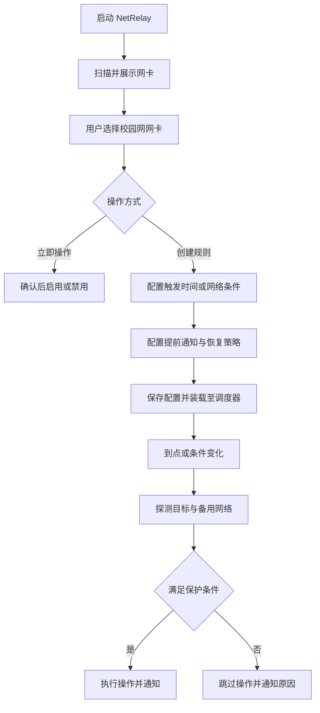

# 当前状态与产品定义

[返回索引](README.md) | [下一篇：架构与数据流](02-architecture-and-data-flow.md)

## 1. 现状审计

### 已确认

当前已经完成第四阶段开发。所有的核心逻辑、交互、配置、调度与日志均已完美实现并通过编译和测试。

当前已实现：

- C#、.NET 8、WPF 与 XAML 原生桌面工程。
- `NetworkInterface` API 读取网卡名称、描述、类型、链路状态、速度、MAC 和 IP 地址。
- WPF 液态玻璃概览页面支持扫描、刷新、选择网卡和查看基础详情。
- 网卡列表每秒采样系统累计收发字节，显示实时收发速率和最近约 30 秒流量波形，帮助区分真正承载流量的接口。
- 根据接口类型和名称/描述关键词显示“物理候选”“疑似虚拟”“系统环回”或“隧道 / VPN”启发式标签。
- 通过 Windows Network Connections COM 接口按 GUID 启用或禁用网卡，不调用 PowerShell 或 `netsh`。
- 禁用前显示原生确认对话框，操作期间防止重复点击，完成后刷新状态并展示结果或 Windows HRESULT。
- 禁用后即使 `.NET NetworkInterface` 不再返回该接口，也会从 Windows Network Connections 原生枚举补回列表，保持当前选择并允许重新启用。
- 应用清单声明 `requireAdministrator`。
- Windows 11 使用 DWM Mica 和原生圆角；Windows 10 使用 WPF 半透明降级。
- 已验证生成原生 `NetRelay.exe`，且启动期间不会创建 WebView2 进程。
- 程序设置界面增加了开机自启复选框，通过 Windows 任务计划程序创建当前用户登录时以最高权限运行的固定启动任务。
- 主程序在通过 `--startup` 命令行参数自启动时，能够无闪烁地直接启动并隐藏至系统托盘运行。
- 倒计时预警悬浮卡片的延迟按钮文本已完成格式化优化，能正确且清晰地显示为“延迟 10 分钟”。
- **扁平磨砂玻璃控件重塑**：重构并统一了全局按钮样式（`SoftButtonStyle`/`PrimaryButtonStyle`/`DangerButtonStyle`），实现了基于半透明渐变、白色反射边缘和有色外发光环境光影的高通透度毛玻璃质感，配合局部隐式 `TextBlock` 穿透重载，彻底消除了 WPF 默认字体颜色样式覆盖导致的视觉混乱；同时对 `CheckBox`、`ComboBox`、彩色图标底框进行了全面的磨砂玻璃扁平化升级，确保了界面视觉风格的 100% 连贯性。

本机开发环境检查结果：

| 工具 | 状态 |
| --- | --- |
| Node.js | 已安装，`v24.15.0` |
| .NET SDK | 已安装，`8.0.422` |
| Git | 已安装，`2.45.2.windows.1` |
| Rust / Cargo | 已安装但当前项目不使用 |
| .NET SDK | 未安装 |
| .NET Runtime | 已安装 6.0 和 8.0 运行时 |

### 当前不存在

所有核心设计中规划的网络切换、后台调度、规则引擎、历史日志和系统通知都已经完美实现，已不存在关键缺失。

## 2. 项目定位

**计划实现。** NetRelay 是面向 Windows 10/11 x64 用户的本地网络适配器管理工具，解决以下场景：

- 校园有线网络在固定时间断网，但 Windows 仍认为有线链路有效，导致已连接的手机热点无法正常承担互联网流量。
- 用户不希望每晚进入控制面板手动禁用有线网卡。
- 用户需要在禁用、恢复和自动切换前得到明确通知，并能够撤销、延迟或取消操作。
- 用户需要在本来已经断网的情况下继续管理网卡，而不是因联网探测失败而阻止操作。

目标用户是能理解“网卡启用/禁用”含义、但不希望编写 PowerShell 或操作任务计划程序的 Windows 用户。

## 3. 产品目标与边界

### 首版目标

- 展示电脑上的网卡及其启用、链路、IP、默认路由和互联网状态。
- 允许用户选择目标网卡并一键启用或禁用。
- 支持一次性、每日、每周和网络状态变化自动化规则。
- 为每条规则配置多个提前通知时间。
- 通过连续探测识别“网线仍连接但实际无法访问互联网”。
- 自动切换前验证备用网卡可用，避免让电脑彻底离线。
- 记录规则执行、跳过、失败和恢复历史。

### 首版不包含

- Windows 服务、远程控制、云同步、账号系统或多用户协作。
- macOS、Linux、Windows ARM64 支持。
- VPN 配置、路由表编辑器、代理设置或校园网认证客户端。
- 以 `ping` 结果作为自动切换的唯一判断。
- 自动绕过学校网络政策或认证限制。

## 4. 主要用户流程

## 5. 成功标准

- 用户能在两次点击内对已选网卡执行启用或禁用。
- 即使目标网卡已经没有互联网，手动操作仍可执行。
- 自动化规则与自动恢复动作在主窗口关闭（隐藏至托盘）后仍能正常由后台服务监听并执行。
- 条件变化规则不会因短暂网络抖动（防抖延时）反复切换。
- 自动禁用前能验证存在可用的备用互联网连接。
- 每次自动化行为及被拦截原因都能从结构化执行日志中解释。

## 6. 待真机确认

- 不同 Windows 10/11 版本上原生网卡 API 的权限和兼容性差异。
- Windows 通知按钮在始终管理员运行模式下的激活行为。
- 系统休眠唤醒后，内联时间调度器对错过时间的规则的补偿执行逻辑。
- 校园网、热点、VPN 和虚拟网卡共存时的默认路由判断。
