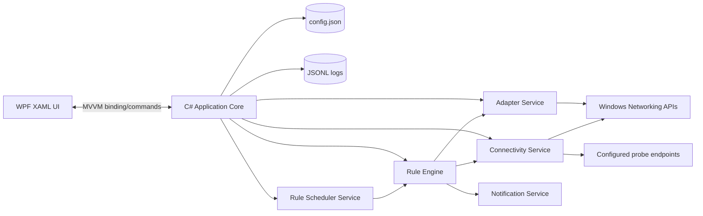
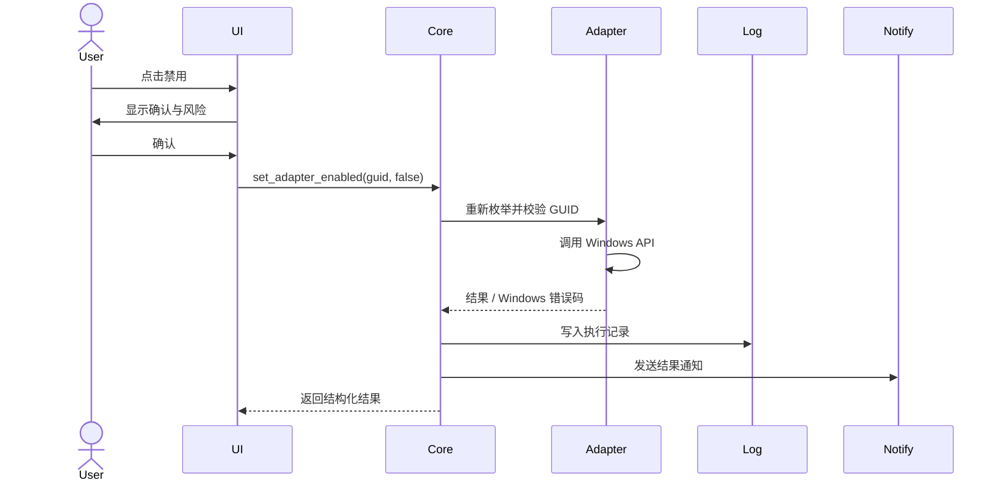
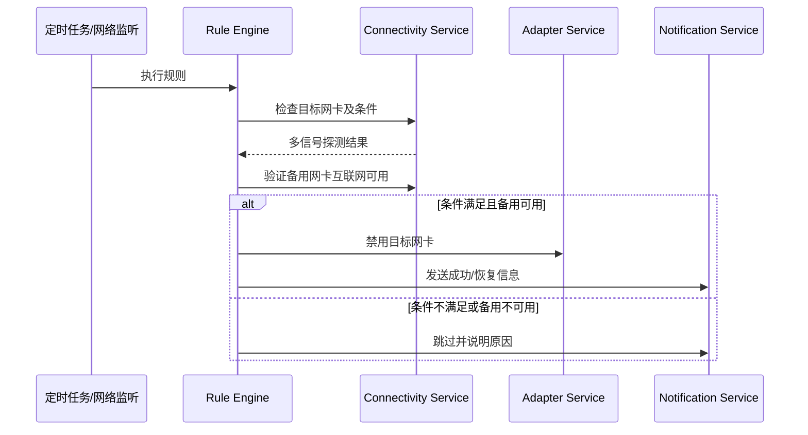

# 架构与数据流

[上一篇：当前状态与产品定义](01-current-state-and-product.md) | [返回索引](README.md) | [下一篇：功能与 UI 规格](03-functional-and-ui-spec.md)

> 项目已完成第四阶段的主要界面与自动化功能。本文明确区分当前实现与后续设计；NLM/NCSI、独立通知服务和应用诊断日志尚未实现。

## 1. 技术栈

| 层 | 技术 | 职责 |
| --- | --- | --- |
| UI | WPF + XAML | 原生窗口、页面、状态展示和液态玻璃 UI |
| 应用层 | C# + MVVM | 用户意图、状态管理、规则执行和服务编排 |
| Windows 集成 | .NET + P/Invoke/COM | 网卡、DWM 与托盘气泡通知 |
| 持久化 | JSON + JSONL | 配置、规则和执行历史 |
| 调度 | 纯内联调度器 (System.Threading.Timer) | 定时规则与网络变化监听 |

## 2. 进程与模块边界

计划由单一的主可执行程序提供图形界面与内联后台服务：

```text
NetRelay.exe
└── 默认启动：主窗口 + 托盘 + 内联调度服务 (时间规则、网络变化监听与内存延迟恢复)
```

程序使用当前用户会话范围内的命名 Mutex 保证单实例运行。第二个实例不会启动新的调度器，而是通知现有实例显示主窗口后退出。

计划模块：

| 模块 | 主要职责 | 不应承担 |
| --- | --- | --- |
| UI / ViewModel | 展示状态、收集用户意图、调用应用服务 | 直接执行 PowerShell 或 Windows API |
| Adapter Service | **已实现**枚举、识别和通过 GUID 启用/禁用网卡 | 判断完整自动化规则 |
| Connectivity Service | 汇总链路、IP 与绑定源 IP 的 HTTP 探测 | 直接切换网卡 |
| Rule Engine | 评估触发、条件、保护和冷却策略 | 绕过安全校验 |
| Scheduler Service | 运行 Timer 扫描时间规则并在网络变化时触发检测 | 执行网络探测 |
| 托盘通知（当前内联于主窗口） | 发送提前提醒、结果和失败气泡通知 | 在未验证参数时执行高权限操作 |
| Config Repository | 原子读写配置、迁移版本 | 保存密钥或任意命令 |
| Execution Logger | 记录按日结构化执行结果 | 存储敏感请求内容 |

`MainWindow`、`MainViewModel` 与 `RuleSchedulerService` 共享同一个 `RuleEngine` 实例。规则引擎按规则 ID 和目标网卡 GUID 串行执行，避免手动立即执行、定时触发和网络变化触发并发操作同一网卡。

## 3. 总体架构



## 4. 权限模型

- 应用清单声明 `requireAdministrator`，所有入口均以管理员权限运行。
- 高权限用于启用/禁用网卡。
- UI 传入的网卡 GUID、规则 ID 必须在本地配置中重新查找和校验。
- 不接受用户提供的可执行路径、Shell 命令或任意参数。

该模型实现简单，但每次启动会触发 UAC，并使 UI 也处于高权限进程中。长期改进方向见[安全、测试与风险](07-security-testing-and-risks.md)。

## 5. 数据流

### 手动禁用



### 自动切换



## 6. 配置与文件

| 路径 | 内容 |
| --- | --- |
| `%APPDATA%\NetRelay\config.json` | 设置、网卡引用、规则、探测策略和模式版本 |
| `%LOCALAPPDATA%\NetRelay\logs\execution-YYYY-MM-DD.jsonl` | 结构化执行历史 |
| `%LOCALAPPDATA%\NetRelay\logs\app-YYYY-MM-DD.log` | 计划中的应用诊断日志，当前未实现 |

配置采用临时文件写入、刷新后原子替换，避免崩溃导致半写文件。执行日志按天写入；自动滚动清理尚未实现。

## 7. 依赖方向与错误边界

- ViewModel 只能依赖应用服务接口，不依赖 Windows API 细节。
- Rule Engine 依赖抽象的 Adapter 与 Connectivity 接口，便于测试替身。
- Windows 错误必须转换为稳定的应用错误码，同时保留原始错误码供诊断。
- 探测端点失败、配置损坏或任务同步失败不能导致应用崩溃；应进入可恢复错误状态并通知用户。
