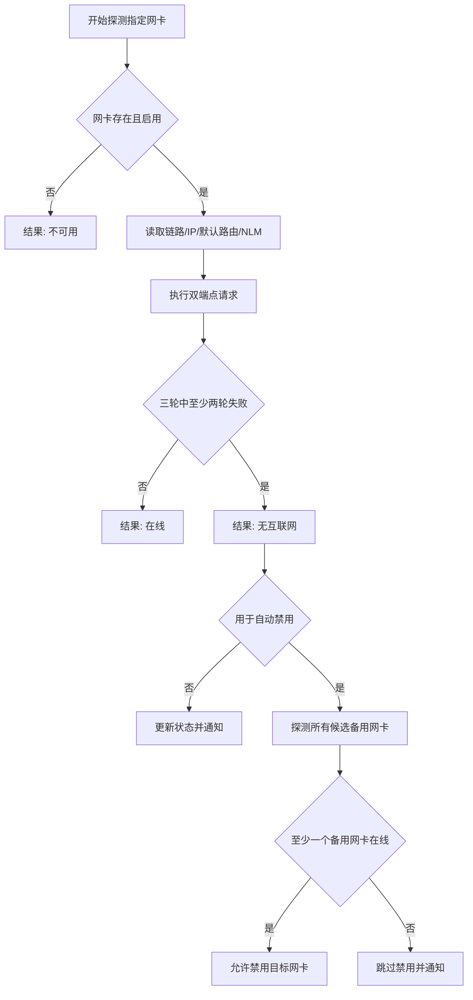

# 网络检测与自动化

[上一篇：接口与数据模型](04-interfaces-and-data-model.md) | [返回索引](README.md) | [下一篇：开发与运维](06-development-and-operations.md)

> 本文全部为计划实现；算法参数需要在校园网与热点环境中真机验证。

## 1. 检测目标

NetRelay 必须区分以下状态：

| 状态 | 链路 | 默认路由 | HTTP 探测 | 处理 |
| --- | --- | --- | --- | --- |
| 正常联网 | 已连接 | 存在 | 成功 | 不切换 |
| 校园网断网但网线仍连接 | 已连接 | 通常存在 | 连续失败 | 可触发自动切换 |
| 网线拔出 | 未连接 | 通常不存在 | 失败 | 可触发规则，但需验证备用网络 |
| 仅局域网可用 | 已连接 | 可能存在 | 失败 | 视为无互联网 |
| 瞬时抖动 | 短暂变化 | 不稳定 | 单次失败 | 防抖并继续观察 |
| 所有网络不可用 | 不定 | 不定 | 全部失败 | 只通知，不自动禁用 |

手动启用或禁用不依赖联网检测结果。检测只用于状态展示、条件规则和自动切换保护。

## 2. 多信号探测

### 2.1 本地网卡与路由

对指定网卡收集：

- 网卡是否存在且启用。
- 物理链路是否连接。
- 单播 IP 地址。
- 是否存在可用默认路由。
- 接口跃点数及路由优先级。

缺少链路、IP 或默认路由可快速判断不可用，但不能单独证明互联网可用。

### 2.2 Windows NLM/NCSI

读取 Windows 报告的互联网、局域网或无连接状态，用于：

- UI 的快速初始状态。
- 触发进一步主动探测。
- 作为执行日志中的辅助证据。

NLM/NCSI 可能受缓存、组策略、校园网登录页或 Windows 设置影响，因此不能作为最终判定。

### 2.3 双端点 HTTP/HTTPS

- 从目标网卡的本地 IP 发起请求，并验证实际出口接口。
- 默认访问两个独立轻量端点，避免单个服务故障造成误判。
- 每次请求使用短超时，不下载大文件，不发送用户数据。
- 校验 HTTP 状态码；对已知内容端点同时校验响应内容。
- 捕获 DNS、连接、TLS、超时、代理和内容不匹配等结果。

计划默认端点：

| 端点 | 校验 | 说明 |
| --- | --- | --- |
| `http://www.msftconnecttest.com/connecttest.txt` | 200 且包含 `Microsoft Connect Test` | 与 Windows 联网检测生态接近（修正：仅支持 HTTP 协议） |
| `https://www.baidu.com` | 200 | 国内直连高可用端点（替换原高延迟的 Cloudflare） |

默认端点在正式发布前必须验证。某些校园网、地区网络、代理或防火墙可能屏蔽其中一个，因此允许用户配置端点，并允许企业通过策略禁用主动探测。

### 2.4 Ping

`ping` 只作为可选诊断：

- ICMP 可能被禁止，失败不代表不能上网。
- 网关可响应 ping，不代表互联网可用。
- ping 结果不参与最终自动切换决策。

## 3. 判定算法

默认参数：

| 参数 | 默认值 |
| --- | --- |
| 每轮端点数 | 2 |
| 请求超时 | 3 秒 |
| 判定轮数 | 3 |
| 断网阈值 | 3 轮中至少 2 轮未满足成功条件 |
| 单轮成功条件 | 至少 1 个端点成功 |
| 网络变化防抖 | 10 秒 |
| 同一规则冷却 | 5 分钟 |

### 指定网卡探测的实现注意事项

仅绑定源 IP 仍可能受 Windows 路由选择影响。实现必须记录请求实际使用的本地地址和接口，并在结果中验证其与目标 GUID 对应。无法可靠约束出口时，结果标记为 `PROBE_ROUTE_UNAVAILABLE`，不能据此自动禁用。

### 多网卡并发探测调度机制

为了避免因仅探测当前选中网卡而导致非选中网卡在界面上长期显示未检测（未联网）的状态，客户端采用了多网卡并发探测的后台调度机制：
1. **触发时机**：
   - **初始化与手动刷新**：在网卡列表加载或用户点击手动刷新时，会立即触发一次全局网卡并发检测。
   - **选中变更触发**：用户改变主界面的选中网卡时，将立即取消上一轮未完成的探测（如果有），并对所有网卡启动一次全新并发检测，以确保最新选中的网卡能最快刷新出真实联网数据。
   - **后台轮询检测**：由后台每 5 秒流量更新循环（每 5 次 Tick，每次 1 秒）自动触发周期性的全局网卡并发检测。
2. **并发设计**：
   - 调度逻辑收集当前网卡列表的快照，针对每个网卡单独启动一个异步任务，通过 `Task.WhenAll` 在线程池中并发执行 `ProbeAdapterAsync`。
   - 检测在后台执行，单卡超时（默认 3 秒）或请求异常被局部捕获，不会阻塞其他网卡的检测。
   - 检测完成后，结果统一调度回 WPF UI 线程的 Dispatcher 上写入，保证 ObservableCollection 视图模型的线程安全。

## 4. 备用网络保护

自动禁用目标网卡前：

1. 枚举除目标网卡外的候选网卡。
2. 排除已禁用、未连接和不允许作为备用的网卡。
3. 对候选网卡执行相同 HTTP/HTTPS 联网探测。
4. 至少一个候选网卡通过后，才允许自动禁用。
5. 执行后再次探测当前互联网；失败则尝试立即重新启用目标网卡并通知。
6. **虚拟网卡特例过滤**：如果被禁用的目标网卡本身就是虚拟网卡（例如由 VMware、VirtualBox 等虚拟化软件或 VPN 客户端创建的网卡），程序在执行禁用操作时将自动忽略备用网络保护的在线约束。因为禁用虚拟网卡并不存在切断真实物理外网的风险，此项例外设计可大幅提升局域网与自动化测试场景下的规则执行顺畅度。

用户可将特定网卡标记为“允许作为备用”，避免把 VPN、虚拟交换机或容器网卡误当作热点。

## 5. 规则触发语义

### 时间规则

- 一次性、每日和每周时间规则完全由主程序运行周期内的 `RuleSchedulerService` 后台线程（每 5 秒轮询）触发。
- 时间规则触发后，重新读取最新配置，检查规则是否启用以及附加条件是否满足。
- 只有在程序保持运行或最小化常驻至系统托盘时，时间规则才会生效和被触发。

### 网络变化规则

- 主程序后台调度服务监听系统的网络连接变化事件（`NetworkChange.NetworkAddressChanged`）。
- 状态变化发生后，为每条规则开启防抖计数延时，再执行连通性探测。
- 只在条件从“不满足”变成“满足”的边沿（如从 Up 变成 Down）触发执行。
- 同一规则在配置的 `CooldownSeconds` 冷却期内不重复执行。

### 错过触发与休眠唤眠

- 当系统休眠唤醒或程序重新启动后，调度器会根据当前本地时间评估是否立即执行有必要的定时触发（如一次性规则），并清除已过期的执行标记。

## 6. 自动恢复

- 目标网卡被成功禁用后，如果配置了 `RecoveryPolicy`（如 10 分钟后自动重新启用），规则引擎将在内存中开启一个一次性的 `Task.Delay` 定时任务。
- 倒计时结束后，该任务自动调用网卡启用指令，将网卡重新接通，并且整个过程不需要同步到系统的任务计划程序。
- 自动恢复动作会产生一条来源为 `Recovery` 的执行日志以供审计。
- 如果用户在此期间手动启用了网卡，自动恢复计时到点后仅执行幂等性检查，不产生重复操作。

## 8. 隐私与可观测性

- 主动探测会向端点运营方暴露公网 IP、请求时间和常规连接元数据。
- 不发送网卡名称、GUID、规则名称或执行日志。
- 日志默认不记录响应正文和完整 IP 地址；诊断导出前应提示用户检查敏感信息。
- UI 必须明确显示最近探测端点、时间、耗时和失败原因。

