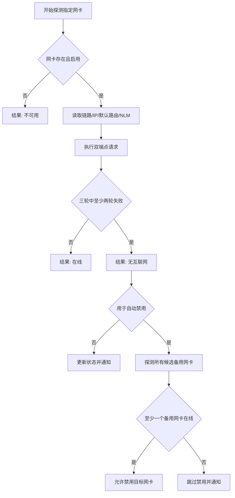

# 网络检测与自动化

[上一篇：接口与数据模型](04-interfaces-and-data-model.md) | [返回索引](README.md) | [下一篇：开发与运维](06-development-and-operations.md)

> 本文全部为计划实现；算法参数需要在校园网与热点环境中真机验证。

## 1. 检测目标

NetRelay 必须区分以下状态：

| 状态 | 链路 | 默认路由 | HTTP 探测 | 处理 |
| --- | --- | --- | --- | --- |
| 正常联网 | 已连接 | 存在 | 成功 | 不切换 |
| 校园网断网但网线仍连接 | 已连接 | 通常存在 | 连续失败 | 可触发自动切换 |
| 网线拔出 | 未连接 | 通常不存在 | 失败 | 可触发规则，但需验证备用网络 |
| 仅局域网可用 | 已连接 | 可能存在 | 失败 | 视为无互联网 |
| 瞬时抖动 | 短暂变化 | 不稳定 | 单次失败 | 防抖并继续观察 |
| 所有网络不可用 | 不定 | 不定 | 全部失败 | 只通知，不自动禁用 |

手动启用或禁用不依赖联网检测结果。检测只用于状态展示、条件规则和自动切换保护。

## 2. 多信号探测

### 2.1 本地网卡与路由

对指定网卡收集：

- 网卡是否存在且启用。
- 物理链路是否连接。
- 单播 IP 地址。
- 是否存在可用默认路由。
- 接口跃点数及路由优先级。

缺少链路、IP 或默认路由可快速判断不可用，但不能单独证明互联网可用。

### 2.2 Windows NLM/NCSI

读取 Windows 报告的互联网、局域网或无连接状态，用于：

- UI 的快速初始状态。
- 触发进一步主动探测。
- 作为执行日志中的辅助证据。

NLM/NCSI 可能受缓存、组策略、校园网登录页或 Windows 设置影响，因此不能作为最终判定。

### 2.3 双端点 HTTP/HTTPS

- 从目标网卡的本地 IP 发起请求，并验证实际出口接口。
- 默认访问两个独立轻量端点，避免单个服务故障造成误判。
- 每次请求使用短超时，不下载大文件，不发送用户数据。
- 校验 HTTP 状态码；对已知内容端点同时校验响应内容。
- 捕获 DNS、连接、TLS、超时、代理和内容不匹配等结果。

计划默认端点：

| 端点 | 校验 | 说明 |
| --- | --- | --- |
| `https://www.msftconnecttest.com/connecttest.txt` | 200 且包含 `Microsoft Connect Test` | 与 Windows 联网检测生态接近 |
| `https://www.cloudflare.com/cdn-cgi/trace` | 200 | 独立备用端点 |

默认端点在正式发布前必须验证。某些校园网、地区网络、代理或防火墙可能屏蔽其中一个，因此允许用户配置端点，并允许企业通过策略禁用主动探测。

### 2.4 Ping

`ping` 只作为可选诊断：

- ICMP 可能被禁止，失败不代表不能上网。
- 网关可响应 ping，不代表互联网可用。
- ping 结果不参与最终自动切换决策。

## 3. 判定算法

默认参数：

| 参数 | 默认值 |
| --- | --- |
| 每轮端点数 | 2 |
| 请求超时 | 3 秒 |
| 判定轮数 | 3 |
| 断网阈值 | 3 轮中至少 2 轮未满足成功条件 |
| 单轮成功条件 | 至少 1 个端点成功 |
| 网络变化防抖 | 10 秒 |
| 同一规则冷却 | 5 分钟 |



### 指定网卡探测的实现注意事项

仅绑定源 IP 仍可能受 Windows 路由选择影响。实现必须记录请求实际使用的本地地址和接口，并在结果中验证其与目标 GUID 对应。无法可靠约束出口时，结果标记为 `PROBE_ROUTE_UNAVAILABLE`，不能据此自动禁用。

## 4. 备用网络保护

自动禁用目标网卡前：

1. 枚举除目标网卡外的候选网卡。
2. 排除已禁用、未连接和不允许作为备用的网卡。
3. 对候选网卡执行相同 HTTP/HTTPS 联网探测。
4. 至少一个候选网卡通过后，才允许自动禁用。
5. 执行后再次探测当前互联网；失败则尝试立即重新启用目标网卡并通知。

用户可将特定网卡标记为“允许作为备用”，避免把 VPN、虚拟交换机或容器网卡误当作热点。

## 5. 规则触发语义

### 时间规则

- 一次性、每日和每周规则由 Windows 任务计划程序触发。
- 到点后重新读取最新配置，检查规则是否启用、是否已取消本次以及附加条件是否满足。
- 条件不满足则跳过，不延后自动重试，除非用户明确配置延迟。
- 时间规则不要求托盘进程正在运行。

### 网络变化规则

- 依赖登录后运行的托盘进程监听 Windows 网络变化事件。
- 启动时只建立状态基线，不把当前断网状态当作新的变化立即执行。
- 变化发生后等待防抖时间，再执行连续探测。
- 只在条件从“不满足”变成“满足”的边沿执行。
- 同一规则在冷却期内不重复执行。

### 错过触发

任务计划应启用“错过计划后尽快运行”，但执行时检查最大允许迟到时间。默认超过 30 分钟则跳过并记录，避免电脑早晨开机后执行昨晚的禁用动作。该默认值应允许按规则配置。

## 6. 提前通知、延迟与取消

每个提前提醒对应独立任务计划项：

```text
NetRelay/<rule-id>/notify/<notification-id>
NetRelay/<rule-id>/execute
NetRelay/<rule-id>/restore
```

- 规则保存时根据提醒时间生成通知任务。
- 修改或删除规则时进行幂等同步，清理不再需要的任务。
- 用户选择“延迟”时，为本次执行创建带过期时间的覆盖记录和一次性任务。
- 用户选择“取消本次”时，写入 occurrence ID；执行入口发现该 ID 已取消后跳过。
- 修改规则本身会重新生成后续 occurrence，不依赖旧通知任务参数。

## 7. 自动恢复

- 禁用成功后才创建恢复任务。
- 恢复任务以网卡 GUID 为目标，不依赖原规则仍然存在。
- 若网卡已启用，恢复操作视为幂等成功。
- 若网卡被移除或 GUID 失效，记录失败并通知。
- 自动切换后的联网复检失败时，不等待恢复计时，立即尝试回滚启用。

## 8. 隐私与可观测性

- 主动探测会向端点运营方暴露公网 IP、请求时间和常规连接元数据。
- 不发送网卡名称、GUID、规则名称或执行日志。
- 日志默认不记录响应正文和完整 IP 地址；诊断导出前应提示用户检查敏感信息。
- UI 必须明确显示最近探测端点、时间、耗时和失败原因。

