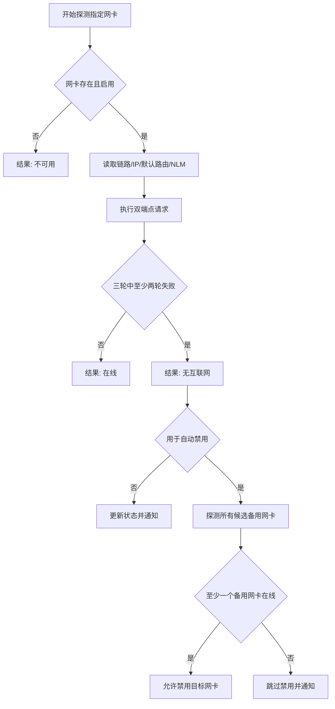

# 网络检测与自动化

[上一篇：接口与数据模型](04-interfaces-and-data-model.md) | [返回索引](README.md) | [下一篇：开发与运维](06-development-and-operations.md)

> 当前已实现网卡状态检查、多协议探测（支持 HTTP/HTTPS/PING/DNS 协议）、连续失败判定、网络离线边沿触发、备用网络保护、切换后回滚以及 Windows 原生 NLM/NCSI COM 状态实时监测与 UI 联动。全部算法参数已在多种网络环境下完成自动化回归测试覆盖。

## 1. 检测目标

NetRelay 必须区分以下状态：

| 状态 | 链路 | 默认路由 | HTTP 探测 | 处理 |
| --- | --- | --- | --- | --- |
| 正常联网 | 已连接 | 存在 | 成功 | 不切换 |
| 校园网断网但网线仍连接 | 已连接 | 通常存在 | 连续失败 | 可触发自动切换 |
| 网线拔出 | 未连接 | 通常不存在 | 失败 | 可触发规则，但需验证备用网络 |
| 仅局域网可用 | 已连接 | 可能存在 | 失败 | 视为无互联网 |
| 瞬时抖动 | 短暂变化 | 不稳定 | 单次失败 | 防抖并继续观察 |
| 所有网络不可用 | 不定 | 不定 | 全部失败 | 只通知，不自动禁用 |

手动启用或禁用默认受首页“安全保护”开关拦截（默认开启时依赖备用网络连通性探测结果）。该开关关闭后，手动操作才不依赖联网检测结果直接强制执行。检测亦用于状态展示、条件规则和自动切换保护。

## 2. 多信号探测

### 2.1 本地网卡与路由

对指定网卡收集：

- 网卡是否存在且启用。
- 物理链路是否连接。
- 单播 IP 地址。
- 是否存在可用默认路由。
- 接口跃点数及路由优先级。

缺少链路、IP 或默认路由可快速判断不可用，但不能单独证明互联网可用。

### 2.2 Windows NLM/NCSI (COM 互操作)

利用 Windows 原生的 Network List Manager (NLM) COM 接口，针对每个网卡读取操作系统所记录的底层连接状态：

- **COM 接口调用**：通过声明 `INetworkListManager`、`IEnumNetworkConnections` 及 `INetworkConnection`，基于网卡的 GUID 获取其底层的连接状态。
- **状态转换**：将 NLM 反馈的状态标志映射为 `Internet`（可访问互联网）、`LocalNetwork`（仅局域网网络）、`Subnet`（仅本地子网）、`NoTraffic`（链路建立但无流量）及 `Disconnected`（未连接）。
- **UI 联动**：在网络详情面板直接展示对应的“系统 (NLM) 状态”行，随探测刷新进行实时双向更新。
- NLM/NCSI 可能受缓存、组策略影响，因此它仅作为辅助判断和 UI 展示，不作为切换决策的唯一决定性因子。

### 2.3 多协议探测 (HTTP/HTTPS/PING/DNS)

为了避免校园网、企业防火墙或代理解析环境下单一 HTTP 探测失效或被劫持的问题，NetRelay 支持在配置的探测端点 URL 中使用多种协议 scheme：

- **HTTP/HTTPS 协议**（`http://` 或 `https://`）：从目标网卡的本地单播 IP 发起套接字 TCP 握手并验证 HTTP 响应状态码及响应内容。
- **ICMP Ping 协议**（`ping://<IP/域名>`）：由于 .NET 默认的 `Ping` 类不支持源 IP 绑定，系统将通过异步调用底层的 `ping.exe -S <LocalIp> <TargetIp>` 进程完成发送出口锁定。退出码为 `0` 代表 Ping 成功。
- **DNS UDP 协议**（`dns://<待解析域名>`）：通过本地单播 IP 绑定 UDP 端口 53 构造标准的 DNS 主机 A 记录或 AAAA 记录查询（支持 IPv4/IPv6），发送到网卡所配 of DNS 服务器（若为空则使用公共 DNS 服务器 `223.5.5.5` 或 `2400:3200::1`）。
- **防劫持后端辅助验证**：当前尚未实现后端握手校验。DNS 探测只在事务 ID、响应码和 A/AAAA 答案均有效时判定成功；未来接入后端服务时再增加端到端劫持校验。

默认探测端点示例：

| 端点 | 协议 | 校验说明 |
| --- | --- | --- |
| `http://www.msftconnecttest.com/connecttest.txt` | HTTP | 200 且包含 `Microsoft Connect Test` |
| `https://www.baidu.com` | HTTPS | 200 状态码 |
| `ping://223.5.5.5` | PING | ICMP 回显响应成功 |
| `dns://www.baidu.com` | DNS | UDP 53 解析成功并得到有效的 IP 响应 |

默认端点和探测协议允许用户在 `config.json` 中自行配置。

## 3. 判定算法

默认参数：

| 参数 | 默认值 |
| --- | --- |
| 每轮端点数 | 2 |
| 请求超时 | 3 秒 |
| 判定轮数 | 3 |
| 断网阈值 | 3 轮中至少 2 轮未满足成功条件 |
| 单轮成功条件 | 至少 1 个端点成功 |
| 网络变化防抖 | 10 秒 |
| 同一规则冷却 | 5 分钟 |

探测策略会在加载和保存时进行严格校验：端点至少一个且必须为 HTTP/HTTPS/PING/DNS 绝对地址，超时限制为 0.5 到 30 秒，探测轮数限制为 1 到 10，失败轮数与单轮成功端点数必须处于有效范围。无效策略不会被解释为在线，并会暂停依赖探测的自动规则执行；手动操作（在关闭“安全保护”开关或存在可用备用网卡时）与已排队的安全恢复仍可执行。

### 指定网卡探测的实现注意事项

仅绑定源 IP 仍可能受 Windows 路由选择影响。实现必须记录请求实际使用的本地地址和接口，并在结果中验证其与目标 GUID 对应。无法可靠约束出口时，结果标记为 `PROBE_ROUTE_UNAVAILABLE`，不能据此自动禁用。

### 多网卡并发探测调度机制

为了避免因仅探测当前选中网卡而导致非选中网卡在界面上长期显示未检测（未联网）的状态，客户端采用了多网卡并发探测的后台调度机制：
1. **触发时机**：
   - **初始化与手动刷新**：在网卡列表加载或用户点击手动刷新时，会立即触发一次全局网卡并发检测。
   - **选中变更触发**：用户改变主界面的选中网卡时，将立即取消上一轮未完成的探测（如果有），并对所有网卡启动一次全新并发检测，以确保最新选中的网卡能最快刷新出真实联网数据。
   - **后台轮询检测**：由后台每 5 秒流量更新循环（每 5 次 Tick，每次 1 秒）自动触发周期性的全局网卡并发检测。
2. **并发设计**：
   - 调度逻辑收集当前网卡列表的快照，针对每个网卡单独启动一个异步任务，通过 `Task.WhenAll` 在线程池中并发执行 `ProbeAdapterAsync`。
   - 检测在后台执行，单卡超时（默认 3 秒）或请求异常被局部捕获，不会阻塞其他网卡的检测。
   - 检测完成后，结果统一调度回 WPF UI 线程的 Dispatcher 上写入，保证 ObservableCollection 视图模型的线程安全。

## 4. 备用网络保护

自动禁用目标网卡前：

1. 枚举除目标网卡外的候选网卡。
2. 排除已禁用、未连接和不允许作为备用的网卡。
3. 对候选网卡执行相同 HTTP/HTTPS 联网探测。
4. 至少一个候选网卡通过后，才允许自动禁用。
5. 执行后再次探测当前互联网；失败则尝试立即重新启用目标网卡并通知。
6. **虚拟网卡特例过滤**：如果被禁用的目标网卡本身就是虚拟网卡（例如由 VMware、VirtualBox 等虚拟化软件或 VPN 客户端创建的网卡），程序在执行禁用操作时将自动忽略备用网络保护的在线约束。因为禁用虚拟网卡并不存在切断真实物理外网的风险，此项例外设计可大幅提升局域网与自动化测试场景下的规则执行顺畅度。

当前实现会保存禁用前已通过探测的备用物理网卡，禁用目标网卡后等待 3 秒重新探测这些备用网卡。如果全部失效，立即请求重新启用目标网卡，并分别写入 `POST_SWITCH_VALIDATION_FAILED` 与 `ROLLBACK_SUCCEEDED` / `ROLLBACK_FAILED` 执行记录。

用户可将特定网卡标记为“允许作为备用”，避免把 VPN、虚拟交换机或容器网卡误当作热点。

## 5. 规则触发语义

### 时间规则

- 一次性、每日和每周时间规则完全由主程序运行周期内的 `RuleSchedulerService` 后台线程（每 5 秒轮询）触发。
- 时间规则触发后，重新读取最新配置，检查规则是否启用以及附加条件是否满足。
- 只有在程序保持运行或最小化常驻至系统托盘时，时间规则才会生效和被触发。

### 网络变化规则

- 主程序后台调度服务监听系统的网络连接变化事件（`NetworkChange.NetworkAddressChanged`）。
- 调度器同时每 5 秒对网络变化规则监听的网卡执行绑定源 IP 的 HTTP/HTTPS 联网探测，能够识别链路仍为 `Up` 但已经无法访问互联网的校园网断网场景。
- 状态变化发生后，为每条规则开启防抖计数延时，再次执行连通性探测确认仍离线。
- 只在互联网状态从在线变为离线的边沿触发执行；首次观察到网卡已经离线时只建立基线，不立即执行。
- 同一规则在配置的 `CooldownSeconds` 冷却期内不重复执行。

### 错过触发与休眠唤醒

- 当系统休眠唤醒或程序重新启动后，调度器会根据当前本地时间评估是否立即执行有必要的定时触发。为防止“迟到太久依然强行补跑”（例如用户大半天没开电脑，启动时不再有补跑的必要），系统设定了最大触发允许偏离窗口（默认为 2 分钟）。只有当当前时间与计划时间相差不超过 2 分钟时才会进行补跑，否则将直接标记为过期并跳过（日志记录为 TRIGGER_EXPIRED）。
- **重启去重机制**：为了防止由于关闭并重启应用，导致已在今日执行完毕的定时规则（Daily/Weekly）在启动时因内存状态丢失而再次误触发，调度器在启动（`Start`）时扫描当天的本地结构化日志文件（`execution-YYYY-MM-DD.jsonl`）。只有来源为 `Schedule` 且当前规则类型为 Daily/Weekly 的记录会参与当日去重；手动执行、网络变化与恢复记录不会阻止后续定时触发。

## 6. 自动恢复

- **无状态设计与日志扫描**：系统摒弃了容易因程序关闭、重启或休眠丢失的内存 `Task.Delay` 机制，采用基于本地历史日志的**无状态恢复评估**。调度服务在轮询（每秒一次）时，会自动载入并扫描最近 2 天（今天与昨天）的本地结构化执行日志（`execution-YYYY-MM-DD.jsonl`）。
- **执行依据判定**：
  - 调度器通过日志，查找各启用规则最近一次成功的 `Disable` 禁用记录（要求 `Outcome == "SUCCESS"`）。
  - 检查此禁用时间点之后是否发生过后续操作（如：该规则自身的 Recovery 恢复尝试，或针对该网卡任何成功的 `Manual` 手动 `Enable` 启用日志）。若存在任何后续操作，说明此次禁用已被处理，自动跳过恢复。
- **时间校验与延迟恢复**：
  - 恢复触发的时间点计算为：`recoveryTime = lastDisableRecord.StartedAt + DelayMinutes`。
  - 当当前时间 `now >= recoveryTime` 时，根据时间偏差进行评估：
    - **容差内补偿**：如果当前时间相比计划恢复时间偏差在 **2 分钟以内**（`TriggerToleranceMinutes`），则立即执行自动恢复，发送来源为 `Recovery` 的网卡启用操作。
    - **超时过期跳过**：若当前时间已超过计划时间 **2 分钟以上**（例如系统在此期间关机或长期处于睡眠状态，开机唤醒时发现早已错过触发点），为防止“迟到太久依然强行接通网络”，程序会直接将其判定为过期，写入一条结果为 `Outcome: SKIPPED`、原因码为 `ReasonCode: TRIGGER_EXPIRED` 的审计日志，不再执行实质性网卡启用。
- **幂等保护机制**：
  - 在执行恢复操作时，规则引擎会做网卡状态的幂等检查。如果目标网卡在此期间已经被其他方式启用，自动恢复将直接记录结果为 `Outcome: SUCCESS`、原因码为 `ReasonCode: RECOVERY_ALREADY_ENABLED`，不会对底层 Windows API 进行重复调用，从而提升性能并避免状态闪烁。
- **调度隔离性**：
  - 自动恢复动作会产生一条来源为 `Recovery` 的执行日志以供审计。
  - 恢复动作不受原禁用规则冷却时间（`Cooldown`）和任何附加启动条件的门禁限制，且恢复执行成功后不会重置或更新原规则的最后禁用执行时间，保障常规规则的下一次周期性触发逻辑完全独立。

## 8. 隐私与可观测性

- 主动探测会向端点运营方暴露公网 IP、请求时间和常规连接元数据。
- 不发送网卡名称、GUID、规则名称或执行日志。
- 日志默认不记录响应正文和完整 IP 地址；诊断导出前应提示用户检查敏感信息。
- UI 必须明确显示最近探测端点、时间、耗时和失败原因。
