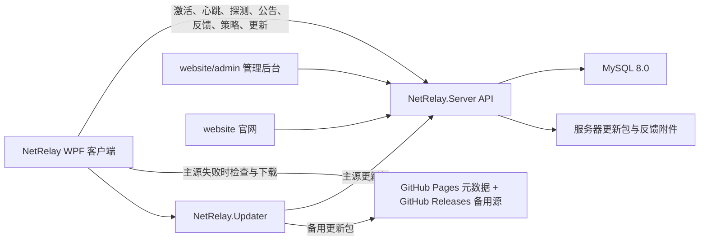
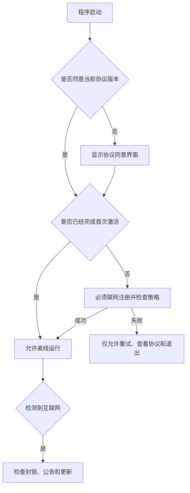
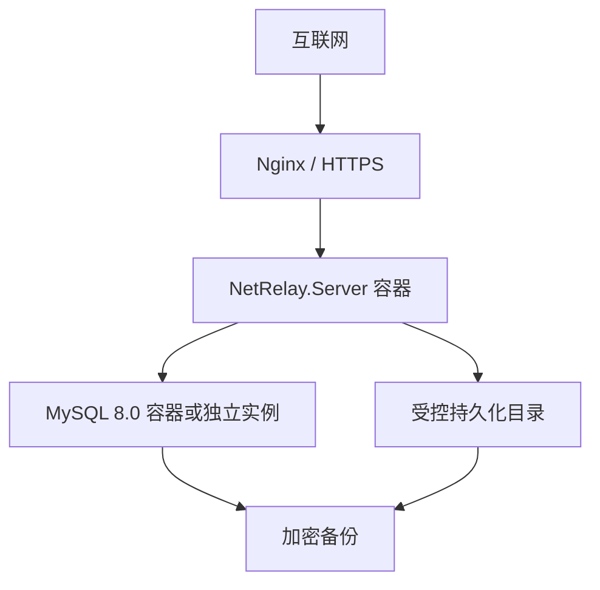

# 后端平台总体实施规范

> **历史文档提示（2026-07-30）**：本文记录旧 NetRelay Server 的总体方案，不再定义当前 Omnexa 接入语义。当前以 [NetRelay 接入 Omnexa](21-omnexa-client-integration.md) 为准：后台只管理设备；历史协议字段 `installationId` 现在表示按程序目录持久化的内部运行槽位，同目录升级复用、不同目录隔离，槽位不展示也不作为封禁目标。

[上一篇：未来开发阶段与里程碑规划](09-future-stages-and-milestones.md) | [下一篇：后端平台分阶段开发与验收计划](11-backend-staged-development-and-acceptance-plan.md) | [返回索引](README.md)

> 本文是 NetRelay 后端、客户端在线能力、更新系统和管理后台的总体开发基线。除标记为“待验证”或“待确认”的内容外，后续实现不得偏离本文已经确定的产品与安全边界。当前仓库尚未实现本文描述的后端功能。

> B0-B6 的具体任务、当前状态、验收证据和开发过程维护要求统一记录在 [后端平台分阶段开发与验收计划](11-backend-staged-development-and-acceptance-plan.md)。未在该文档中记录并通过验收的阶段，不得标记为完成。

## 1. 状态与目标

### 1.1 当前状态

- 原生 WPF 客户端、官网和本地自动化功能已经存在。
- 客户端“检查更新”和“建议与反馈”按钮目前仅为占位行为。
- 当前联网探测未接入 NetRelay 自有后端。
- `website/` 当前是零依赖静态官网，不包含管理后台。
- 当前没有服务器项目、数据库、设备注册、公告、封锁或在线更新实现。

### 1.2 建设目标

后端平台需要提供：

1. 经过签名验证的后端联网探测。
2. 主服务器独立托管的更新检查与更新包下载。
3. GitHub Releases 完整备用更新源。
4. 建议与反馈提交，以及由用户主动授权的日志上传。
5. 公告发布、撤回、每次展示和仅展示一次策略。
6. 全局、版本范围和指定设备封锁。
7. 首次联网激活、匿名设备指纹和活跃度统计。
8. 封锁状态下仍可使用的更新入口。
9. 部署于 Ubuntu 的 API、官网和单管理员管理后台。

## 2. 已确定决策

| 主题 | 已确定方案 |
| --- | --- |
| 服务器 | 用户自有 Ubuntu 服务器 |
| 后端 | ASP.NET Core Web API |
| 数据库 | MySQL 8.0 |
| ORM | Entity Framework Core + `Pomelo.EntityFrameworkCore.MySql` |
| 部署 | Docker Compose + Nginx + HTTPS |
| 桌面端 | 保持原生 WPF，不使用 WebView |
| 管理后台 | 位于 `website/admin/`，随官网和后端统一部署 |
| 管理员 | 首版仅一个管理员账号 |
| 主更新源 | NetRelay 后端独立保存并提供更新文件，不依赖 GitHub |
| 备用更新源 | 后端不可用时，客户端通过 GitHub Pages 元数据检查版本，并从 GitHub Release Assets 下载固定资源文件 |
| 更新安装 | 独立 `NetRelay.Updater.exe`，验证、替换和失败回滚 |
| 首次运行 | 必须联网验证并同意用户协议与隐私政策 |
| 后续离线 | 首次激活成功后允许离线运行 |
| 设备指纹 | `DeviceId` 核心硬件证据 + NetRelay 物理候选网卡辅助证据，通过可替换供应器组合 |
| 网络扫描 | 禁止设备指纹组件扫描附近 Wi-Fi、邻居端点和局域网其他设备 |
| 日志上传 | 默认不上传，仅在用户提交反馈时主动勾选后上传 |
| 封锁 | 支持设备、版本范围和全局封锁；可撤销、可过期、有审计 |

## 3. 总体架构



### 3.1 计划目录结构

```text
NetRelay/
├── src/
│   ├── NetRelay/                    # 当前原生 WPF 客户端
│   ├── NetRelay.Contracts/          # 客户端与后端共享 DTO、签名格式和错误码
│   └── NetRelay.Updater/            # 独立更新器
├── server/
│   ├── NetRelay.Server/             # ASP.NET Core API、后台静态文件托管
│   └── NetRelay.Server.Tests/       # 后端单元与集成测试
├── website/
│   ├── index.html                   # 产品官网
│   ├── assets/
│   └── admin/                       # 单管理员管理后台
├── deploy/
│   ├── docker-compose.yml
│   ├── nginx/
│   └── scripts/                     # 发布、迁移、备份和恢复脚本
└── docs/
```

### 3.2 模块边界

- `NetRelay.Contracts` 不依赖 WPF、数据库或服务器实现，仅定义稳定协议。
- 客户端不直接连接 MySQL，不持有服务器密钥或 GitHub 发布凭据。
- 后端私钥不得编译进客户端；客户端只内置公钥。
- 管理后台只通过受认证的管理 API 操作，不直接访问数据库或文件目录。
- 更新器只接受由客户端传入且经过签名验证的更新任务，并再次独立校验更新包。

## 4. 信任与签名体系

HTTPS 是传输保护，不足以单独证明更新、封锁和公告内容可信。签名密钥采用分层体系：

- 离线根密钥：只签发、轮换和吊销其他公钥证书，不部署到服务器。
- 离线发布密钥：签名更新清单与更新包，可由离线根密钥轮换。
- 在线操作密钥：由离线根密钥签发短期证书，部署到服务器，用于动态挑战、公告、策略和客户端配置。

以下服务器响应必须使用对应用途的有效签名：

- 后端联网挑战响应。
- 更新清单。
- 全局、版本范围和设备封锁策略。
- 公告。
- 客户端配置迁移或公钥轮换指令。

客户端内置验证公钥，收到控制数据时必须验证：

1. 签名有效。
2. 数据类型和协议版本匹配。
3. `issuedAt`、`expiresAt` 和随机 nonce 有效。
4. 设备、版本或安装实例适用范围匹配。
5. 防重放标识未被处理。

更新包本身必须同时校验 SHA256 和签名清单。来自主服务器与 GitHub 的同一版本必须使用相同签名清单和哈希。

在线操作密钥泄露时，攻击者可能在证书有效期内签发错误动态响应，因此证书必须短期有效、按用途限制、可由根密钥吊销，并对高风险全局封锁增加服务器端重新认证、二次确认和审计。更新包绝不接受在线操作密钥签名。

### 4.1 可迁移客户端配置

域名、API 地址和 GitHub 备用仓库属于部署与后台配置，不在 B0 固定真实值。为避免后端故障或地址迁移形成循环依赖：

1. 客户端发布时内置初始主 API 引导地址和初始 GitHub 备用仓库。
2. 客户端缓存最后一次验证成功的签名客户端配置。
3. 管理后台可修改主 API 地址和 GitHub 备用策略。
4. 后端发布独立 `client-configuration` 签名信封。
5. 客户端仅接受可信公钥签名、版本递增且未过期的配置。
6. 新主 API 不可用时保留上一份有效配置。
7. 后端完全不可用时使用最后有效签名 GitHub 配置；首次安装使用内置初始配置。

HTTPS 证书由部署环境的 Nginx 与 ACME 工具管理，不通过客户端配置下发，且任何配置都不得关闭 TLS 校验。

客户端初始配置计划以编译资源 `bootstrap-config.json` 随 EXE 发布，至少包含：

```json
{
  "primaryApiBaseUrl": "https://正式域名/api/v1",
  "githubFallback": {
    "enabled": true,
    "repository": "owner/repository",
    "releaseTagPrefix": "v",
    "assetName": "win-x64.zip"
  }
}
```

Release 构建不得包含 `netrelay.example`、`owner/repository` 等占位值；发布检查必须在生成 EXE 前拒绝无效初始地址。内置初始地址本身不是信任根，即使被重定向或修改，客户端仍只执行由内置根公钥建立的有效签名控制数据。

## 5. 后端联网探测

### 5.1 目标

证明指定网卡能够真正访问 NetRelay 后端，降低校园网登录页、透明代理或固定 HTTP 内容被劫持造成的误判。

### 5.2 请求流程

```http
POST /api/v1/connectivity/challenge
```

客户端通过目标网卡本地 IP 绑定请求，并发送随机 nonce。响应示例：

```json
{
  "protocolVersion": 1,
  "requestNonce": "客户端随机值",
  "serverNonce": "服务器随机值",
  "issuedAt": "2026-06-13T00:00:00Z",
  "expiresAt": "2026-06-13T00:01:00Z",
  "signature": "Base64 签名"
}
```

后端探测属于高可信探测端点，但不应成为唯一联网依据。后端故障时，客户端继续使用当前多端点 HTTP/HTTPS、DNS 和辅助状态完成判断，并明确显示“后端验证不可用”而不是直接判定断网。

## 6. 更新系统

### 6.1 主更新源

Ubuntu 服务器独立保存更新内容：

```text
/var/lib/netrelay/releases/{version}/
├── manifest.json
├── manifest.sig
├── NetRelay-update.zip
└── release-notes.md
```

主更新流程：

1. 客户端请求 `GET /api/v1/updates/latest`。
2. 后端返回已签名更新清单和服务器下载地址。
3. 客户端从服务器下载更新包。
4. 客户端验证签名、SHA256、版本、架构和最低升级版本。
5. 客户端启动独立更新器。
6. 更新器关闭主程序、备份旧文件、替换文件并启动新版本。
7. 新版本启动失败时自动回滚。

### 6.2 GitHub 完整备用源

只有主后端检查失败、超时或返回明确不可用状态时，客户端才启用备用源：

1. 读取 GitHub Pages 上的 `updates/stable/win-x64/latest.json`。
2. 如需展示历史，再读取同目录下的 `history.json`。
3. 按 `{releaseTagPrefix}{version}` 拼出 GitHub Release 标签，并下载固定资源文件 `win-x64.zip`。
4. 使用与主源相同的公钥、签名与 SHA256 验证。
5. 通过同一个独立更新器安装。

GitHub 不是主后端的依赖。发布新版本时，后端可在管理员点击“发布”或“撤回”时自动把同一 ZIP 与元数据镜像到 GitHub；若同步失败，发布或撤回必须整体失败并回滚。

### 6.3 封锁状态下的更新

受限模式必须保留：

- 检查主源更新。
- 主源不可用时检查 GitHub 更新。
- 下载、验证和安装更新。
- 查看当前版本、封锁原因和申诉信息。

受限模式不得保留网卡操作、自动化规则执行或其他可能被滥用的功能。

## 7. 设备指纹、激活和活跃度

### 7.1 指纹组件选择

首选候选调整为 `DeviceId`，原因是它提供成熟、可组合的设备标识组件，避免 NetRelay 自行实现 WMI、注册表和硬件标识采集，同时不会引入局域网邻居扫描能力。

当前验证结论：

- `DeviceId` 使用 MIT 许可证。
- `6.11.0` 提供原生 .NET 8 目标，并将 Windows 与 WMI 功能拆分为可选包。
- 该项目公开采用量、维护活跃度和使用案例明显优于 `HardwareIds.NET`。
- 可明确选择 Windows Device ID、Machine GUID、System UUID、主板、CPU 和系统盘证据。
- NetRelay 已有网卡清单可提供物理候选网卡的接口 GUID、MAC 和硬件型号辅助证据。
- 禁止选择用户名、机器名、Windows Product ID 或其他不必要数据。
- 在正式用于封锁前仍必须完成兼容性、稳定性、性能和隐私审计。

不得直接依赖某个库返回的单一最终 HWID。客户端需要通过可替换的 `IDeviceFingerprintProvider` 接口隔离第三方实现，避免未来无法替换组件。

### 7.2 禁止采集

NetRelay 禁止采集或扫描：

- 附近 Wi-Fi 接入点和邻居端点。
- 当前局域网中的其他电脑、手机、打印机、电视或路由器。
- 公网 IP 作为稳定设备标识。
- 用户文件、账号、浏览器或校园网认证信息。

`DeviceId` 本身不提供局域网邻居扫描能力。正式供应器不得额外加入任何网络发现或邻居枚举实现。

### 7.3 网卡辅助证据

NetRelay 已经读取本机网卡清单、接口 GUID、MAC、描述、接口类型、链路和流量信息。设备指纹只允许复用其中稳定且必要的本机标识：

- 物理候选网卡的接口 GUID 哈希。
- 物理候选网卡的 MAC 哈希。
- 物理候选网卡硬件描述与接口类型的组合哈希。

不得加入 IP 地址、默认路由、DNS、实时流量、网速、链路状态、联网状态或用户自定义网卡名称。虚拟、VPN、隧道、环回和疑似虚拟网卡默认排除。

网卡证据属于低到中权重辅助证据，原因是更换网卡、驱动重装、Wi-Fi MAC 随机化和虚拟化环境均可能改变它们。它们可以提高同一设备匹配可信度或显示“网卡发生变化”，但不得单独触发设备封锁。

### 7.4 设备标识模型

设备身份分为三层：

| 标识 | 作用 | 稳定性 |
| --- | --- | --- |
| `machineCode` | 后端首次确认设备后分配的匿名、可展示机器码 | 不因单次换网卡或部分硬件变化自动改变 |
| `installationId` | 客户端首次安装生成的随机 ID | 重装或新安装实例时变化 |
| `evidence` | DeviceId 核心硬件证据与 NetRelay 网卡辅助证据 | 用于匹配可信度，可随硬件变化 |

不得直接将所有证据拼接后作为对用户展示的机器码，否则任何一项变化都会制造新设备。机器码只用于引用后端设备记录，不能替代签名激活凭证或作为秘密认证因子。

客户端仅上传本地哈希后的标识：

```json
{
  "machineCode": "首次激活前为空，后续由后端签名凭证返回",
  "deviceId": "整体设备指纹哈希",
  "installationId": "随机安装实例 ID",
  "fingerprintVersion": 1,
  "evidence": {
    "system": "系统证据哈希",
    "motherboard": "主板证据哈希",
    "cpu": "CPU 证据哈希",
    "disk": ["磁盘证据哈希"],
    "networkAdapterGuid": ["物理候选网卡接口 GUID 哈希"],
    "networkMac": ["物理候选网卡 MAC 哈希"],
    "networkModel": ["物理候选网卡型号哈希"]
  }
}
```

- 原始序列号不得上传或写入普通日志。
- 后端分配的 `machineCode` 不是硬件哈希，不包含可逆硬件信息。
- 每类证据独立规范化并哈希，后端可在部分硬件更换时计算匹配可信度。
- 核心硬件证据与网卡辅助证据必须分别计权，禁止简单拼接成不可解释的单一值。
- `installationId` 用于区分重新安装或同设备不同安装实例。
- 指纹算法必须版本化，算法升级不能直接导致所有设备被识别为新设备。
- 管理后台默认只显示缩短后的机器码和可信度。

### 7.5 首次激活与离线运行



首次激活成功后，客户端保存经过后端签名的激活凭证。后续允许离线运行；重新联网时立即检查设备策略和全局策略。

### 7.6 活跃度

客户端默认每 24 小时最多发送一次轻量心跳：

```http
POST /api/v1/devices/heartbeat
```

只包含匿名设备 ID、安装 ID、客户端版本、操作系统版本、指纹版本和当前受限状态。不上传 IP 以外的网络环境数据；服务器访问日志中自然产生的 IP 应设置短期保留策略。

## 8. 用户协议与隐私交互

首次运行不直接展示长篇说明，而是展示简洁同意界面：

```text
使用 NetRelay 前，请阅读并同意《用户协议》和《隐私政策》。

☐ 我已阅读并同意《用户协议》和《隐私政策》

[查看用户协议] [查看隐私政策]              [同意并继续]
```

- 用户主动点击链接时才展示详细内容。
- 未勾选同意框时，“同意并继续”不可用。
- 用户拒绝时只能退出程序。
- 协议或隐私政策发生重大变化时，通过版本号要求重新同意。

详细隐私政策必须说明合理目的和边界：

- 为防止 NetRelay、网卡控制能力和后端服务被滥用，程序会生成匿名设备指纹。
- 首次运行需要联网激活，后续允许离线运行。
- 会定期上报匿名机器码、客户端版本和活跃时间。
- 不上传原始硬件序列号、附近设备信息或用户文件。
- 日志默认不上传，仅在用户提交反馈时主动勾选后上传。
- 上传日志可能包含网卡名称、GUID、配置、规则和执行记录。
- 说明设备封锁、申诉、数据保留和删除联系方式。

本地保存：

```json
{
  "acceptedTermsVersion": "版本号",
  "acceptedPrivacyVersion": "版本号",
  "acceptedAt": "RFC 3339 时间"
}
```

## 9. 公告、反馈与日志上传

### 9.1 公告

公告支持：

- 每次启动展示。
- 每台设备仅展示一次。
- 指定版本范围。
- 发布时间和过期时间。
- 普通、重要和强提醒等级。
- 发布、修改、撤回。

客户端记录已展示公告 ID。公告正文必须经过签名验证；富文本必须使用严格白名单，禁止执行脚本和任意协议链接。

### 9.2 反馈

反馈字段至少包括：

- 类型：建议、问题、崩溃、其他。
- 标题和内容。
- 可选联系方式。
- 客户端版本和匿名设备 ID。
- 是否附加日志。

勾选上传日志后复用并抽取当前日志导出能力，但提交前必须显示：

- 将上传的文件列表。
- 压缩后大小。
- 可能包含的敏感信息提示。
- 用户取消上传日志的入口。

后端必须限制附件大小、类型、频率、保留期限和下载权限。附件不得直接放置在公开 Web 目录。

## 10. 封锁与受限模式

### 10.1 支持范围

- 指定设备封锁。
- 指定安装实例封锁。
- 指定客户端版本范围封锁。
- 全局封锁。

每条策略包括原因、生效时间、过期时间、申诉信息、是否允许更新和签名。

### 10.2 安全要求

- 全局封锁默认必须设置自动过期时间。
- 发布全局封锁时要求管理员重新输入密码并二次确认。
- 所有封锁、解除和修改操作写入不可由管理后台删除的审计日志。
- 支持撤销和发布解除凭证。
- 客户端只执行签名有效的封锁策略。
- 检测到封锁后持久化签名凭证，离线重启后仍进入受限模式。
- 无法保证本地程序绝对不可绕过；该限制必须在安全文档中明确。

### 10.3 受限模式允许功能

| 功能 | 是否允许 |
| --- | --- |
| 检查、下载和安装更新 | 允许 |
| 查看版本、封锁原因、公告和申诉信息 | 允许 |
| 网卡启用、禁用和自动化规则 | 禁止 |
| 修改规则与运行规则 | 禁止 |
| 后台自动调度 | 停止 |
| 提交申诉或反馈 | 可配置允许 |

## 11. API 初步分组

所有接口使用 `/api/v1` 前缀，具体 DTO 和错误码将在实施前写入 OpenAPI。

| 分组 | 初步接口 |
| --- | --- |
| 激活 | `POST /devices/activate` |
| 心跳 | `POST /devices/heartbeat` |
| 策略 | `POST /policies/evaluate` |
| 联网探测 | `POST /connectivity/challenge` |
| 更新 | `GET /updates/latest`、`GET /updates/{version}/download` |
| 公告 | `GET /announcements` |
| 反馈 | `POST /feedback`、`POST /feedback/{id}/attachments` |
| 管理认证 | `POST /admin/auth/login`、`POST /admin/auth/totp` |
| 管理设备 | `/admin/devices`、`/admin/device-blocks` |
| 管理发布 | `/admin/releases` |
| 管理公告 | `/admin/announcements` |
| 管理反馈 | `/admin/feedback` |
| 管理策略 | `/admin/policies` |
| 管理审计 | `GET /admin/audit-logs` |

客户端公开 API 必须进行速率限制、请求体大小限制、协议版本校验和统一错误响应。管理 API 必须要求认证、CSRF 防护和审计。

## 12. MySQL 初步数据模型

| 表 | 核心职责 |
| --- | --- |
| `devices` | 匿名设备 ID、指纹版本、首次和最近活跃时间 |
| `device_installations` | 安装实例、客户端版本、协议同意版本 |
| `device_evidence` | 哈希后的分类证据和匹配可信度 |
| `device_blocks` | 设备或安装实例封锁 |
| `global_policies` | 全局和版本范围策略 |
| `activation_receipts` | 首次激活与签名激活凭证记录 |
| `releases` | 版本、更新清单、哈希、签名和发布状态 |
| `release_assets` | 主服务器更新文件元数据 |
| `announcements` | 公告正文、范围、展示和过期策略 |
| `feedback` | 建议与问题反馈 |
| `feedback_attachments` | 私有附件元数据和存储路径 |
| `admin_account` | 唯一管理员账号、密码哈希与 TOTP 配置 |
| `audit_logs` | 管理操作和安全事件审计 |

数据库不保存更新包和日志附件二进制正文，仅保存元数据与受控文件路径。迁移使用 EF Core Migration，生产迁移前必须备份。

## 13. 管理后台

管理后台位于 `website/admin/`，首版仅一个管理员。功能包括：

- 登录、修改密码和 TOTP。
- 设备总数、近 24 小时和近 30 天活跃度。
- 查看匿名设备、安装实例和指纹匹配可信度。
- 发布、撤回和管理更新。
- 发布和撤回公告。
- 查看反馈和受控下载日志附件。
- 封锁和解除指定设备。
- 发布版本范围或全局封锁。
- 查看不可删除的审计日志。

管理后台不得将服务器私钥发送给浏览器。签名操作必须在后端受控服务中完成，生产环境建议将发布私钥与普通 API 运行凭据隔离。

## 14. Ubuntu 部署与运维



Docker Compose 至少包含 API 和 MySQL；Nginx 可运行于宿主机或容器。生产要求：

- HTTPS 自动续期。
- MySQL 不暴露公网端口。
- 管理后台限制登录频率。
- 每日数据库备份、附件与更新清单备份。
- 定期执行恢复演练。
- 私钥、数据库密码和管理员密钥通过环境变量或受控 Secret 提供，不提交 Git。
- 服务器更新包目录与反馈附件目录分离。
- 更新文件可公开下载，但反馈附件必须经过管理 API 鉴权。

## 15. 分阶段实施计划

本节定义阶段目标和边界。可执行任务、阶段状态、验收记录与完成结论以 [后端平台分阶段开发与验收计划](11-backend-staged-development-and-acceptance-plan.md) 为准，并必须在开发和验收过程中持续维护。

### 阶段 B0：规范、原型与风险验证

- 完成本文以及 API、数据库、签名和隐私子文档。
- 验证 `DeviceId 6.11.0` 在 .NET 8 WPF 中的兼容性。
- 验证设备指纹采集过程实际不会访问局域网邻居。
- 测试换网卡、换硬盘和虚拟机变化后的指纹稳定性；重装系统连续性不作为 B0 强制验收项。
- 定义域名、GitHub 仓库和服务器文件目录的部署配置与签名迁移规则。

完成标准：设备指纹与签名方案通过评审，尚不接入正式客户端。

### 阶段 B1：后端基础与管理认证

- 创建 `NetRelay.Contracts`、`NetRelay.Server` 和后端测试项目。
- 接入 MySQL、EF Core Migration、统一错误模型和 OpenAPI。
- 实现单管理员密码、TOTP、速率限制和审计日志。
- 创建 Docker Compose、Nginx 与备份脚本。

完成标准：Ubuntu 测试环境可部署、迁移、登录、备份和恢复。

### 阶段 B2：设备激活、心跳与后端探测

- 实现协议同意界面和详细协议页面。
- 实现设备指纹提供器、首次激活和签名激活凭证。
- 实现每日心跳与活跃度。
- 实现签名后端联网挑战并接入现有探测。
- 后端不可用时保持当前联网探测能力。

完成标准：首次必须联网，激活后可离线；后端探测失败不会误判全部断网。

### 阶段 B3：双源更新系统

- 实现服务器更新上传、签名清单和下载。
- 实现 GitHub Releases 完整备用源。
- 创建独立更新器、备份、替换、启动确认和失败回滚。
- 接通当前“检查更新”按钮。

完成标准：断开主后端后仍可完全通过 GitHub 检查、下载和安装有效签名更新。

### 阶段 B4：反馈、日志上传与公告

- 抽取可复用日志打包服务。
- 实现反馈窗口、授权勾选、上传进度与失败重试。
- 实现附件私有存储和管理查看。
- 实现公告发布、撤回、范围、过期和展示策略。

完成标准：未勾选时不上传日志；公告按策略准确展示且不可执行脚本。

### 阶段 B5：封锁与受限模式

- 实现设备、安装实例、版本范围和全局封锁。
- 实现签名策略、持久化受限状态、解除和自动过期。
- 保证受限模式停止本地自动化但保留双源更新。
- 实现管理后台二次确认和完整审计。

完成标准：主后端不可用且客户端已受限时，仍可通过 GitHub 安装解除或修复版本。

### 阶段 B6：正式部署与综合验收

- 完成官网、管理后台、API、MySQL 和文件存储的生产部署。
- 完成密钥备份、数据库恢复和后端故障演练。
- 执行隐私、滥用、伪造签名、重放、错误封锁和更新回滚测试。
- 更新全部文档与发布流程。

完成标准：自动测试、Ubuntu 部署验收、Windows 更新验收和安全检查全部通过。

## 16. 测试与验收基线

必须覆盖：

- 后端挑战 nonce、签名、过期和重放。
- 主更新源完全不依赖 GitHub。
- 主源不可用时 GitHub 完整备用更新。
- 更新包损坏、签名错误、哈希错误和回滚。
- 首次离线启动被阻止，激活后离线启动允许。
- 后端临时故障不导致已激活用户被封锁。
- 设备指纹部分硬件变化后的匹配与误封率。
- 明确关闭网络扫描并验证无邻居探测流量。
- 用户未同意协议时不生成或上传设备指纹。
- 未勾选日志上传时服务器收不到附件。
- 公告一次展示、每次展示、撤回、过期和版本范围。
- 封锁凭证伪造、过期、解除、离线持久化。
- 受限模式禁止网卡操作，但双源更新始终可用。
- 管理后台暴力登录、CSRF、越权和审计完整性。

## 17. 禁止偏离的边界

- 不得让后端故障自动等同于全局封锁。
- 不得将 GitHub 作为主更新源或主后端依赖。
- 不得执行未签名的更新、封锁、公告或客户端配置迁移指令。
- 不得上传原始硬件序列号或扫描附近、局域网设备。
- 不得在用户未主动勾选时上传日志。
- 不得将反馈附件置于公开下载目录。
- 不得在封锁状态下禁用检查更新和安装更新。
- 不得把桌面端改为 WebView 或嵌套网页界面。
- 不得把生产私钥、数据库密码或管理员凭据提交到仓库。

## 18. 待验证与待确认

- `DeviceId 6.11.0` 各候选证据的稳定性、耗时和异常行为。
- 第三方指纹组件采集过程的实际网络行为。
- 设备证据的匹配权重和合理误封阈值。
- 正式服务器规格和文件存储容量。
- 更新签名算法、密钥轮换和离线签名工作流的最终实现。
- 管理后台 React + TypeScript + Vite 的具体依赖版本和构建工具配置。
