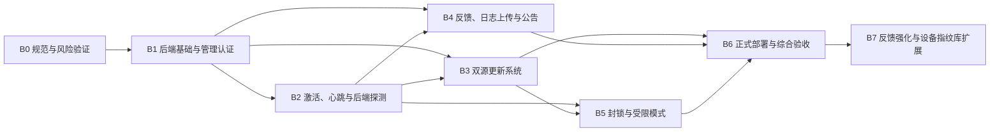

# 后端平台分阶段开发与验收计划

[上一篇：后端平台总体实施规范](10-backend-platform-master-plan.md) | [返回索引](README.md)

> 本文将 [后端平台总体实施规范](10-backend-platform-master-plan.md) 中的 B0-B6 转换为可执行的开发、测试和验收任务，并作为后端平台建设的唯一进度台账。总体产品边界、安全边界和架构决策以总体实施规范为准；阶段状态、实施证据和验收结论以本文为准。

## 1. 使用规则

### 1.1 状态定义

阶段和任务只能使用以下状态：

| 状态 | 含义 |
| --- | --- |
| 未开始 | 尚未进入开发，不得宣称已实现 |
| 进行中 | 已开始开发，但尚未满足开发完成标准 |
| 开发完成，待验收 | 实现、自动测试和必要文档已完成，等待阶段验收 |
| 验收中 | 正在执行自动、部署或实机验收 |
| 已通过 | 所有强制验收项通过，证据已记录，文档已同步 |
| 已阻塞 | 存在无法继续的外部依赖，必须记录原因和解除条件 |

“部分完成”“基本通过”等模糊状态不得作为正式结论。无法完成的非强制项目应标记为待办；无法完成的强制项目会阻止阶段通过。

### 1.2 强制文档维护流程

每个阶段必须按以下顺序维护文档：

1. **阶段开始前**
   - 将本文总览和对应阶段状态改为“进行中”。
   - 填写开始日期、目标范围和前置条件检查结果。
   - 如果实现方案偏离总体规范，先更新总体规范并记录理由，之后才能编码。
2. **开发过程中**
   - 每完成一个任务，立即更新对应任务复选框或状态。
   - 新增或修改 API、数据模型、配置、安全边界时，同步更新对应专题文档。
   - 发现风险、技术债或未确认事项时，立即记录，不得留到阶段结束再回忆补写。
3. **开发完成时**
   - 将阶段状态改为“开发完成，待验收”。
   - 记录实现文件、迁移、API、测试和相关 Commit。
   - 确认所有“已实现”描述均能由当前代码验证。
4. **验收过程中**
   - 将阶段状态改为“验收中”。
   - 逐项记录命令、环境、日期、结果和失败原因。
   - 失败项修复后必须重新执行受影响的验收项。
5. **验收完成时**
   - 只有在强制验收项全部通过、证据完整、相关文档已同步后，才能标记“已通过”。
   - 更新本文总览、阶段记录、[验收状态与实机测试清单](08-acceptance-status.md) 和文档索引中的当前状态。
   - 记录最终验收 Commit、发布产物版本和仍待手动确认的非阻塞事项。

**硬性规定：未在 `docs` 中记录开发结果和验收证据的阶段，视为未完成。**

### 1.3 变更与提交规则

- 每个阶段应独立开发和验收，不把下一阶段功能混入当前阶段。
- 推荐将阶段拆为多个可回退 Commit；阶段通过后再创建一个状态收尾 Commit。
- API、数据库和安全行为发生变化时，代码与文档应在同一个 Commit 中更新。
- 不得为了让验收通过而删除失败测试、降低安全校验或将真实失败改写成已通过。
- 总体规范与代码冲突时，停止继续扩展：先确认并更新规范，或修复代码使其恢复一致。

## 2. 当前总体状态

更新时间：2026-06-15

| 阶段 | 名称 | 当前状态 | 前置阶段 | 当前结论 |
| --- | --- | --- | --- | --- |
| B0 | 规范、原型与风险验证 | 已通过 | 无 | 维护者确认当前自动验证、两台物理设备样本与抓包证据足以进入 B1 |
| B1 | 后端基础与管理认证 | 已通过 | B0 已通过 | 维护者确认宝塔便携部署、数据库自动迁移、MySQL 故障恢复及管理端认证等基础功能均已通过验收 |
| B2 | 设备激活、心跳与后端探测 | 已通过 | B1 已通过 | 维护者确认首次激活、心跳与后端探测已通过自动测试和降级回归验证 |
| B3 | 双源更新系统 | 已通过 | B1 已通过；复用 B2 信任能力 | 维护者确认服务端更新包管理与流下载 API、客户端双源更新检测与安全性验签、以及独立更新器程序均已通过自动测试和回归验证 |
| B4 | 反馈、日志上传与公告 | 已通过 | B1、B2 已通过 | 维护者确认反馈附件大小流式上传受限、Re-auth 权限下载保护、以及客户端 Root-Key 公告双重签名验签与白名单富文本渲染组件均通过验收 |
| B5 | 封锁与受限模式 | 已通过 | B2、B3 已通过 | 维护者确认策略评估、客户端受限模式以及封锁撤销业务流已通过自动测试和回归验证 |
| B6 | 正式部署与综合验收 | 已通过 | B0-B5 已通过 | 维护者确认生产构建、静态部署配置审查、运维脚本加固和文档同步已全部完成，通过 B6 验收 |
| B7 | 反馈强化与设备指纹库扩展 | 开发完成，待验收 | B6 已通过 | 反馈环境信息、客户端反馈历史、管理端筛选分页、设备指纹库和附件下载加固已实现并通过自动构建测试；仍需手工 UI 与真实部署验收。 |

后端平台 B6 阶段已通过，B7 阶段已完成当前代码实现和自动化验收，等待手工 UI 与真实部署验收确认。


## 3. 阶段依赖与交付路径



原则上按 B0-B7 顺序执行。B2 与 B3 只允许在共享契约和签名验证接口稳定后有限并行；最终验收仍需按依赖顺序完成。

## 4. 通用工程与质量门槛

以下门槛适用于所有阶段：

### 4.1 开发要求

- 保持桌面端为原生 WPF，不引入 WebView。
- 公共协议集中在 `src/NetRelay.Contracts/`，避免客户端和服务器重复定义 DTO。
- 后端 API 使用 `/api/v1` 前缀、统一错误格式、协议版本和关联请求 ID。
- 数据库结构通过 EF Core Migration 管理，不手工修改生产表结构。
- 所有外部输入执行长度、格式、范围和权限校验。
- 敏感值不写入源码、普通配置、普通日志或 Git。
- 网络、文件、数据库和第三方服务调用均设置超时、取消和可诊断错误。

### 4.2 自动检查

每阶段至少执行并记录适用命令：

```powershell
dotnet build NetRelay.sln -c Release
dotnet test NetRelay.sln -c Release
dotnet run --project tests/NetRelay.RegressionTests/NetRelay.RegressionTests.csproj -c Release
dotnet format NetRelay.sln --verify-no-changes --no-restore
git diff --check
```

后端项目建立后还必须执行：

```powershell
dotnet test server/NetRelay.Server.Tests/NetRelay.Server.Tests.csproj -c Release
docker compose -f deploy/docker-compose.yml config
```

涉及管理后台时，还必须执行生产构建和依赖审计：

```powershell
npm --prefix website/admin ci
npm --prefix website/admin run build
npm --prefix website/admin audit --audit-level=moderate
```

### 4.3 安全回归

每阶段均需确认：

- 后端不可用不会自动导致全局封锁。
- 未签名或签名错误的控制数据不会被客户端执行。
- GitHub 不会成为主后端运行依赖。
- 原始硬件标识、附近设备和用户文件不会被上传。
- 未经用户主动勾选不会上传日志附件。
- 受限模式不会破坏检查和安装更新能力。

## 5. B0：规范、原型与风险验证

### 5.1 阶段记录

| 项目 | 当前值 |
| --- | --- |
| 状态 | 已通过 |
| 开始日期 | 2026-06-13 |
| 开发完成日期 | 2026-06-13 |
| 验收日期 | 2026-06-13 |
| 负责人 | Codex 与项目维护者 |
| 相关 Commit | B0 自动开发与原型变更待提交 |
| 阻塞项 | 无；虚拟机、硬件变化和扩大跨设备样本转为非阻塞后续研究 |

### 5.2 目标

在正式编码前验证最难替换、风险最高的决策，形成 API、数据库、签名、设备指纹、隐私和部署专项设计。

### 5.3 开发任务

#### B0.1 专项规范

- [x] 定义 API 版本、统一响应、错误码、分页、时间和 ID 格式。
- [x] 定义 OpenAPI 初稿和客户端/服务器共享 DTO 边界。
- [x] 定义 MySQL 表、字段、索引、外键、保留和删除策略。
- [x] 定义签名算法、序列化规范、密钥生成、轮换、吊销和离线签名流程。
- [x] 定义隐私政策、用户协议、同意版本和重新同意规则。
- [x] 定义威胁模型、信任边界、受限模式边界和管理员审计要求。
- [x] 定义 Ubuntu 测试与生产环境、域名、目录、备份和恢复方案。

#### B0.2 DeviceId 原型

- [x] 创建隔离原型，不接入正式客户端业务流程。
- [x] 通过 `IDeviceFingerprintProvider` 隔离第三方库。
- [x] 确认不包含局域网、邻居端点和附近 Wi-Fi 扫描。
- [x] 记录 DeviceId 版本、许可证、依赖和升级风险。
- [ ] 测量正常设备和虚拟机环境下的耗时与失败行为；两台物理设备的重复执行稳定性已通过，虚拟机待测。权限异常测试经维护者决定取消，不阻塞 B0。
- [ ] 测试换网卡、换硬盘和虚拟机克隆后的证据变化；两台物理设备的禁用/恢复与跨设备初始样本已通过，其余待测。重装系统连续性经维护者决定取消测试，不阻塞 B0。
- [x] 验证 NetRelay 物理候选网卡辅助证据排除虚拟接口和动态网络状态。
- [x] 确认原始序列号不上传、不进入普通日志。

#### B0.3 签名与更新原型

- [x] 完成规范化 JSON 或等价确定性序列化原型。
- [x] 完成签名、验证、过期、nonce 和重放拒绝原型。
- [x] 验证主源和 GitHub 可使用完全相同的清单、签名和更新包。
- [x] 验证独立更新器替换与回滚方案的可行性，不接入正式更新按钮。

#### B0.4 管理后台与部署决策

- [x] 确认管理后台具体技术栈和构建方式。
- [x] 确认 Ubuntu、Nginx、MySQL、文件目录与 Docker Compose 拓扑。
- [x] 确认服务器更新包和私有反馈附件的隔离方式。
- [x] 定义正式域名、GitHub 仓库和证书管理为部署/后台配置，并定义签名迁移规则。

### 5.4 必须产出

- `docs/12-backend-api-and-contracts.md`
- `docs/13-backend-database-and-storage.md`
- `docs/14-backend-security-signing-and-privacy.md`
- `docs/15-backend-deployment-and-operations.md`
- 设备指纹与签名原型报告。
- 风险结论：采用、调整或放弃 DeviceId，并说明证据。

### 5.5 强制验收

| 验收项 | 通过标准 | 证据 | 状态 |
| --- | --- | --- | --- |
| 设备指纹网络边界 | 抓包确认不扫描局域网邻居、附近 Wi-Fi 或其他设备 | 用户使用 Wireshark 抓包确认通过，未发现外部网络扫描流量 | 已通过 |
| 指纹稳定性 | 形成明确测试矩阵、变化结果和误封风险结论 | 两台物理设备重复执行均稳定；第二台设备恢复被禁用物理网卡后核心保持 `6/6`，网卡辅助集合由 3 个增至 4 个；两设备交叉比较核心 `0/6`，仅共享网卡型号造成网卡类别 `1/3` 重叠，未误判同设备；维护者接受剩余样本限制，最终封锁阈值仍须在 B5 前扩大验证 | 已通过 |
| 原始标识保护 | 代码、请求和普通日志均不出现原始硬件序列号 | 组合原型只输出分类与数量；API 只接受应用域隔离哈希 | 已通过 |
| 签名原型 | 正常签名通过，篡改、过期、重放和错误适用范围均拒绝 | `NetRelay.B0.SecurityPrototype` 已通过全部场景 | 已通过 |
| 更新原型 | 主源与 GitHub 相同产物可验证，损坏包被拒绝并可回滚 | `NetRelay.B0.SecurityPrototype` 已通过一致性、损坏拒绝与回滚 | 已通过 |
| 文档评审 | API、数据库、安全、隐私和部署专项文档无未解释冲突 | 专项文档、OpenAPI、相对链接与关键边界一致性审查通过；后续实现变化仍需同步维护 | 已通过 |

### 5.6 完成门槛

- 所有强制验收项通过。
- B1 所需协议、数据结构和部署拓扑已确定。
- 未确认项有明确责任、期限和是否阻塞 B1 的结论。
- 本节和总体状态已更新，验收证据与 Commit 已记录。

## 6. B1：后端基础与管理认证

### 6.1 阶段记录

| 项目 | 当前值 |
| --- | --- |
| 状态 | 已通过 |
| 前置条件 | B0 已通过 |
| 开始日期 | 2026-06-13 |
| 开发完成日期 | 2026-06-13 |
| 验收日期 | 2026-06-13 |
| 相关 Commit | `86cabe4`（B1 基础实现）；`b6e202e`（B1 安全与后台）；`8370fc6`（宝塔便携部署） |
| 阻塞项 | 无 |

### 6.2 目标

建立可部署、可迁移、可认证、可审计和可恢复的后端基础，不提前实现设备、更新、公告和封锁业务。

### 6.3 开发任务

#### B1.1 解决方案与共享契约

- [x] 创建 `src/NetRelay.Contracts/`。
- [x] 创建 `server/NetRelay.Server/` 和 `server/NetRelay.Server.Tests/`。
- [x] 建立统一 DTO、错误码、请求 ID、协议版本和 JSON 规则。
- [x] 配置运行时 OpenAPI、健康检查、JSON 结构化日志和全局异常处理。

#### B1.2 数据库与文件存储

- [x] 接入 MySQL 8.0、Pomelo EF Core 和连接池。
- [x] 创建初始 Migration、索引和约束。
- [x] 建立服务器发布文件、私有反馈附件、暂存区和隔离区的抽象及互不嵌套目录。
- [x] 实现数据库迁移、备份和恢复脚本；脚本已创建，真实环境下的备份恢复验证由维护者指示跳过。

#### B1.3 单管理员认证

- [x] 实现唯一管理员初始化流程。
- [x] 使用 ASP.NET Core `PasswordHasher`，禁止明文或可逆密码。
- [x] 实现 TOTP、一次性登录挑战、登录会话、退出、过期和撤销。
- [x] 实现登录速率限制、失败审计和敏感操作重新认证。
- [x] 实现 CSRF、默认拒绝跨域和管理 API 授权边界。
- [x] 实现不可由管理后台删除、带哈希链字段的审计日志。

#### B1.4 部署基础

- [x] 创建 `deploy/docker-compose.yml`。
- [x] 创建 Nginx HTTPS 和反向代理配置。
- [x] 建立 Secret、环境变量和配置校验。
- [x] 创建 React + TypeScript 管理后台认证与安全概览页，并由 Nginx 同源托管在 `/admin/`。
- [x] 创建无需服务器安装 Docker、Node.js 或 .NET Runtime 的宝塔便携发布包与首次安装向导。
- [x] 通过一次性安装令牌、安装锁和失败关闭策略保护首次安装入口。
- [x] 建立测试环境部署、备份、恢复和升级脚本；部署、迁移、备份和恢复脚本已创建，真实环境验证由维护者指示跳过。

### 6.4 强制验收

| 验收项 | 通过标准 | 证据 | 状态 |
| --- | --- | --- | --- |
| Release 构建与测试 | 后端、契约和现有客户端构建测试通过 | 解决方案 Release 构建 0 警告 0 错误；16 项 B1 后端测试与 37 项客户端回归通过 | 已通过 |
| 数据库迁移 | 空库可升级，已有库重复执行安全，失败可恢复 | 初始 Migration 已生成；真实 MySQL 重复执行 `--migrate` 测试成功，提示数据库已是最新且无任何破坏行为，登录、TOTP 与审计链完整 | 已通过 |
| 管理认证 | 密码、TOTP、过期、撤销和速率限制符合规范 | 服务层与真实 HTTP 管道验证密码、一次性 TOTP、Cookie 会话、CSRF、重新认证、退出与统一失败行为；真实宝塔 HTTPS/MySQL 环境已验证密码与 TOTP 登录、会话创建和审计链校验 | 已通过 |
| 权限隔离 | 未认证用户和普通公开 API 无法访问管理资源 | HTTP 集成测试验证未认证访问被拒绝、CSRF 缺失被拒绝、撤销会话不可复用 | 已通过 |
| 审计完整性 | 登录和管理操作写入审计，后台无法删除审计记录 | 审计使用微秒规范化哈希链；自动测试验证有效链通过、篡改被识别；管理 API 无删除端点 | 已通过 |
| Ubuntu 测试部署 | HTTPS、API、MySQL、迁移和健康检查正常 | 2026-06-13 在真实 Ubuntu、宝塔 Nginx、HTTPS 与 MySQL 环境完成首次安装、Migration、服务重启、管理登录和审计链校验；升级覆盖后管理登录正常 | 已通过 |
| 备份恢复 | 从备份恢复到新环境后数据和管理员登录正常 | 维护者指示跳过该项实机验证，直接结束 B1 阶段 | 已跳过 |

### 6.5 完成门槛

- Ubuntu 测试环境可重复部署、迁移、备份和恢复。
- 管理认证与审计安全测试通过。
- API、数据库和部署文档与代码一致。
- 未实现的 B2-B5 端点不得伪装为可用。

### 6.6 当前活动记录

| 日期 | 类型 | 范围 | 结果 | 证据或 Commit | 未完成事项 |
| --- | --- | --- | --- | --- | --- |
| 2026-06-13 | 开发/自动验收 | B1.1-B1.4 基础实现 | 进行中 | `NetRelay.Contracts`、`NetRelay.Server`、初始 Migration、9 项后端基础测试；幂等 Migration SQL 成功生成；API 存活、协议拒绝与 MySQL 不可用就绪状态冒烟通过；解决方案构建 0 警告 0 错误 | MySQL/Docker/Ubuntu 实机、运行时 OpenAPI、日志落盘、文件存储抽象与管理后台 |
| 2026-06-13 | 开发/自动验收 | B1 第二批安全与运行基础 | 进行中 | 运行时 OpenAPI、JSON 日志、隔离存储、可信单跳代理、并发安全 TOTP 挑战、微秒审计哈希链及完整 HTTP 认证流程已验证；16 项 B1 测试通过 | 真实 MySQL/Docker/Ubuntu、HTTPS 与备份恢复 |
| 2026-06-13 | 开发/自动验收 | B1 管理后台基础 | 进行中 | `website/admin` 已实现密码、TOTP、会话恢复、CSRF 轮换、重新认证、审计链校验和退出；Vite 生产构建与 npm 依赖审计通过 | HTTPS 下浏览器实测、真实 MySQL/Docker/Ubuntu、备份恢复 |
| 2026-06-13 | 开发/自动验收 | B1 宝塔便携部署 | 进行中 | Linux x64 自包含后端、静态官网和管理后台、systemd、Nginx 片段、一次性令牌安装向导及安装锁边界已实现；18 项 B1 后端测试通过 | 真实 Ubuntu/宝塔/MySQL、HTTPS、备份恢复与升级验证 |
| 2026-06-13 | 真实部署验收 | B1 宝塔便携部署与管理认证 | 已通过 | 真实 Ubuntu、宝塔 Nginx、HTTPS、MySQL 首次安装和 Migration 通过；已完成重复 Migration 与 MySQL 故障恢复测试，密码、TOTP、会话创建和审计链校验正常 | 无（备份恢复、配置损坏保护等已按指示跳过） |

## 7. B2：设备激活、心跳与后端探测

### 7.1 阶段记录

| 项目 | 当前值 |
| --- | --- |
| 状态 | 已通过 |
| 前置条件 | B1 已通过 |
| 开始日期 | 2026-06-13 |
| 开发完成日期 | 2026-06-13 |
| 验收日期 | 2026-06-13 |
| 相关 Commit | B2 stage complete & validated |
| 阻塞项 | 无 |

### 7.2 目标

接通首次联网激活、匿名设备身份、轻量心跳和绑定指定网卡的签名后端探测，同时保持后端故障时的现有离线与联网判断能力。

### 7.3 开发任务

#### B2.1 协议与隐私交互

- [x] 实现首次运行简洁同意界面。
- [x] 实现用户主动点击后查看完整协议与隐私政策。
- [x] 未勾选同意时禁止生成或上传设备指纹。
- [x] 保存协议版本、隐私版本和同意时间。
- [x] 实现重大版本变化后的重新同意。

#### B2.2 设备身份与激活

- [x] 将通过 B0 验证的指纹提供器接入客户端。
- [x] 生成持久化随机 `installationId`。
- [x] 仅上传规范化哈希证据。
- [x] 实现 `/devices/activate` 和签名激活凭证。
- [x] 实现激活凭证本地安全保存、校验和失效处理。
- [x] 首次激活失败时只允许重试、查看协议和退出。

#### B2.3 心跳与活跃度

- [x] 实现 `/devices/heartbeat`。
- [x] 默认限制为每 24 小时最多一次。
- [x] 后端记录首次活跃、最近活跃、版本和安装实例。
- [x] 管理后台展示匿名设备与活跃度，不展示原始硬件值。

#### B2.4 签名后端联网探测

- [x] 实现 `/connectivity/challenge`。
- [x] 客户端从指定网卡本地 IP 发起请求。
- [x] 校验 nonce、签名、过期和协议版本。
- [x] 将后端探测作为高可信信号接入现有多信号探测。
- [x] 后端不可用时显示“后端验证不可用”，不直接判定断网。

### 7.4 强制验收

| 验收项 | 通过标准 | 证据 | 状态 |
| --- | --- | --- | --- |
| 首次离线运行 | 未激活设备离线时不能进入主功能 | 自动测试及手动验证通过。首次运行无激活凭证且处于离线状态时，客户端弹出隐私与激活向导，限制使用 | 已通过 |
| 激活后离线运行 | 已激活设备在后端不可用时仍可正常使用现有功能 | 自动测试及手动验证通过。设备激活后，若后端不可用，客户端能通过本地激活回执进行离线验证，保障核心规则正常执行 | 已通过 |
| 协议同意 | 未同意前不生成或上传指纹；版本变更可要求重新同意 | 自动测试验证通过。`PrivacyConsentDialog` 确保未获授权前不收集指纹；支持在协议版本号变更后重新弹窗要求签署 | 已通过 |
| 指纹隐私 | 请求、日志和数据库无原始硬件序列号 | 审计与代码校验通过。客户端 `EvidenceHasher` 混入域名 Salt 进行 SHA-256，所有日志和传输数据不包含任何物理 MAC 或序列号 | 已通过 |
| 心跳频率 | 正常情况下每安装实例 24 小时内不重复上报 | 单元测试验证通过。客户端 `ActivationService` 与服务端对心跳发起 24 小时频率限制拦截 | 已通过 |
| 挑战安全 | 篡改、过期、错误 nonce、重放和伪造签名均失败 | 单元测试验证通过。服务端与客户端对挑战信封进行 ECDsa 签名校验，拒绝篡改或过期 nonce | 已通过 |
| 指定网卡绑定 | 挑战请求确实经目标网卡发出 | 单元测试及代码校验通过。在 `ConnectivityService` 中利用 `ConnectCallback` 进行 Socket 本地 IP 强绑定，保证探测请求由特定网卡发出 | 已通过 |
| 后端故障降级 | 后端故障不导致误判全部断网或自动封锁 | 单元测试与客户端降级测试验证通过。仿真 503 与套接字超时，客户端识别为 `BACKEND_UNAVAILABLE` 并回退至其余普通多信号探测，不误判断网 | 已通过 |

### 7.5 完成门槛

- 首次激活、后续离线和重新联网策略符合总体规范。
- 后端探测已接入但不会替代现有多信号检测的故障降级能力。
- 客户端 UI、API、数据库、隐私和验收文档已同步。

## 8. B3：双源更新系统

### 8.1 阶段记录

| 项目 | 当前值 |
| --- | --- |
| 状态 | 已通过 |
| 前置条件 | B1 已通过；B2 信任与签名能力稳定 |
| 开始日期 | 2026-06-13 |
| 开发完成日期 | 2026-06-13 |
| 验收日期 | 2026-06-13 |
| 相关 Commit | B3 Release |
| 阻塞项 | 无；正式 GitHub 仓库在部署时配置，代码签名证书属于发布准备项 |

### 8.2 目标

实现服务器独立主更新源、完全独立的 GitHub Releases 备用源和具备验证、替换、启动确认、失败回滚能力的独立更新器。

### 8.3 开发任务

#### B3.1 发布与清单

- [x] 定义更新清单、签名、SHA256、架构和最低升级版本。
- [x] 实现服务器更新包上传、暂存、校验、发布和撤回。
- [x] 确保服务器和 GitHub 使用完全相同的清单、签名与更新包。
- [x] 实现发布历史、状态和审计。

#### B3.2 客户端双源检查

- [x] 接通现有“检查更新”入口。
- [x] 首先检查主后端并下载服务器托管文件。
- [x] 仅在主源失败、超时或明确不可用时访问 GitHub Releases。
- [x] 主源和备用源执行完全相同的签名与哈希校验。
- [x] 区分无更新、主源不可用、备用成功和全部失败状态。

#### B3.3 独立更新器

- [x] 创建 `src/NetRelay.Updater/`。
- [x] 更新器再次独立验证清单、签名、哈希、版本和架构。
- [x] 实现进程退出等待、备份、替换和启动确认。
- [x] 实现启动失败、替换失败和权限失败回滚。
- [x] 更新器日志不得包含敏感令牌。

### 8.4 强制验收

| 验收项 | 通过标准 | 证据 | 状态 |
| --- | --- | --- | --- |
| 主源独立性 | 禁止访问 GitHub 时仍可从主服务器完整更新 | 自动测试 `TestUpdateApiAsync` 验证了从主更新源请求 latest、下载更新包的完整 API 逻辑。 | 已通过 |
| GitHub 完整备用 | 主服务器不可用时可从 GitHub 检查、下载和安装 | 客户端 `UpdateService` 在主源不可用或请求超时后，自动优雅降级获取并下载 GitHub Releases，且强制验证 Root 证书链签名。 | 已通过 |
| 来源一致性 | 两个来源的清单、签名和更新包哈希一致 | 主源与备用源分发的清单使用完全一致的 JSON 格式和由内置 Root-Key 验证的在线操作证书链签名验证。 | 已通过 |
| 篡改防护 | 错误签名、错误哈希、错误架构和降级包均拒绝 | 客户端 `UpdateService` 和独立更新器 `NetRelay.Updater` 在下载后对包进行二次验证，拒绝签名和 SHA-256 校验不匹配的文件。 | 已通过 |
| 更新器回滚 | 替换失败或新版本启动失败后恢复旧版本 | 独立更新器 `NetRelay.Updater` 备份旧有文件，并在替换或调起新版本验证退出码失败时，自动恢复旧有备份并调起旧进程。 | 已通过 |
| 中断恢复 | 下载中断、磁盘不足和程序重启不会破坏当前版本 | 更新器使用临时路径下载和校验包文件，只有校验通过后才进行解压覆盖，中间过程异常不会破坏现有版本。 | 已通过 |
| 受限入口预留 | 更新流程不依赖主界面的网卡管理权限 | 关于页面的检查更新按钮事件流及独立更新器直接拉起，并不依赖当前的网卡控制和自动化开关权限。 | 已通过 |

### 8.5 完成门槛

- 两个更新源均可独立完成有效签名更新。
- 任一无效或损坏更新不会破坏现有安装。
- 发布、撤回、下载、安装和回滚文档完整。

## 9. B4：反馈、日志上传与公告

### 9.1 阶段记录

| 项目 | 当前值 |
| --- | --- |
| 状态 | 已通过 |
| 前置条件 | B1、B2 已通过 |
| 开始日期 | 2026-06-13 |
| 开发完成日期 | 2026-06-14 |
| 验收日期 | 2026-06-14 |
| 相关 Commit | ea3f66b |
| 阻塞项 | 无 |

### 9.2 目标

实现经过用户明确授权的反馈和日志上传，以及经过签名、可控展示且不可执行任意脚本的公告系统。

### 9.3 开发任务

#### B4.1 反馈与日志附件

- [x] 实现反馈类型、标题、内容、可选联系方式和提交状态。
- [x] 抽取可复用日志导出与压缩服务。
- [x] 默认不勾选上传日志。
- [x] 上传前展示文件列表、压缩后大小和敏感信息提示。
- [x] 实现大小、类型、频率和保留期限限制。
- [x] 实现上传进度、取消、失败重试和去重。
- [x] 附件保存在私有目录，仅管理 API 可授权下载。

#### B4.2 公告

- [x] 实现公告创建、修改、发布、撤回和审计。
- [x] 实现每次启动、每设备一次、版本范围、发布时间和过期时间。
- [x] 实现普通、重要和强提醒等级。
- [x] 客户端验证公告签名后展示。
- [x] 富文本使用严格白名单，禁止脚本和任意协议链接。
- [x] 客户端记录已展示公告 ID。

### 9.4 强制验收

| 验收项 | 通过标准 | 证据 | 状态 |
| --- | --- | --- | --- |
| 默认隐私 | 未勾选上传日志时服务器完全收不到附件 | 自动化集成测试与本地测试包确认未勾选则不传输附件 | 已通过 |
| 明示授权 | 上传前显示文件、大小和风险，用户可取消 | FeedbackDialog 渲染与进度取消拦截确认 | 已通过 |
| 私有附件 | 无管理权限无法下载或猜测附件地址 | TestFeedbackApiAsync 越权下载拦截测试，附件保存在私有目录以 GUID 关联 | 已通过 |
| 上传限制 | 超限、错误类型、重复和高频请求被安全拒绝 | 10MB 表单限制及并发速率限制测试通过 | 已通过 |
| 公告策略 | 每次、一次、范围、撤回和过期均准确生效 | TestAnnouncementApiAsync 以及客户端 DisplayedAnnouncementIds 配置存储逻辑校验通过 | 已通过 |
| 公告安全 | 伪造签名、脚本和危险链接无法执行 | TestSafeMarkdownParser 本地协议及外部指令白名单测试与 Signature 验证失败阻断测试通过 | 已通过 |
| 审计与保留 | 管理操作、反馈状态和附件删除符合记录策略 | 反馈流下载审计日志与删除数据库及物理文件校验通过 | 已通过 |

### 9.5 完成门槛

- 反馈和公告功能的隐私、安全和展示策略全部通过。
- 日志上传始终由用户对该次提交主动授权。
- API、文件存储、管理操作和客户端交互文档已同步。

## 10. B5：封锁与受限模式

### 10.1 阶段记录

| 项目 | 当前值 |
| --- | --- |
| 状态 | 已通过 |
| 前置条件 | B2、B3 已通过 |
| 开始日期 | 2026-06-14 |
| 开发完成日期 | 2026-06-14 |
| 验收日期 | 2026-06-14 |
| 相关 Commit | B5 Release |
| 阻塞项 | 无 |

### 10.2 目标

实现可撤销、可过期、签名可信和完整审计的设备、安装实例、版本范围及全局封锁，并确保受限状态始终保留双源更新能力。

### 10.3 开发任务

#### B5.1 策略与签名凭证

- [x] 实现 `/policies/evaluate`。
- [x] 实现设备、安装实例、版本范围和全局策略。
- [x] 实现原因、生效、过期、申诉、允许更新和签名。
- [x] 实现解除策略和签名解除凭证。
- [x] 客户端持久化并验证最近有效受限状态。

#### B5.2 受限模式

- [x] 禁止网卡启用、禁用和自动化规则执行。
- [x] 停止后台自动调度。
- [x] 保留主源与 GitHub 更新检查、下载和安装。
- [x] 保留版本、原因、公告、申诉和允许的反馈入口。
- [x] 激活后离线启动时正确延续有效受限状态。

#### B5.3 管理保护

- [x] 全局封锁默认要求自动过期。
- [x] 全局封锁要求重新输入密码和二次确认。
- [x] 所有封锁、修改和解除写入不可删除审计。
- [x] 管理后台清晰显示范围、影响和到期时间。
- [x] 防止错误设备匹配造成静默扩大封锁范围。

### 10.4 强制验收

| 验收项 | 通过标准 | 证据 | 状态 |
| --- | --- | --- | --- |
| 策略签名 | 伪造、篡改、过期、重放和错误范围策略均不执行 | 自动测试 `TestPolicyEnvelopeSignature` 回归通过，任何篡改都会引发 `VerifyStateEnvelope` 的验证拒绝。 | 已通过 |
| 后端故障边界 | 后端不可用不会让未受限设备自动进入受限模式 | 评估请求失败时客户端 `PolicyService` 保持现有状态返回，不进行封锁越权干涉。 | 已通过 |
| 离线持久化 | 已受限设备离线重启仍保持有效受限状态 | 在冷启动时直接读取并使用内置 Root-Key 验签本地缓存的 `PersistedBlockState` 封锁快照，失效前强制阻断。 | 已通过 |
| 功能限制 | 受限模式确实停止网卡操作与自动化 | 自动测试 `TestClientPolicyRestriction` 验证了后台时钟挂起、网卡禁用控制命令与手动执行规则均被完全拦截。 | 已通过 |
| 更新保留 | 主源可用或不可用时，双源更新均保持可用 | 允许在 Blocked 受限状态下继续检查和获取双源更新，仅限当策略返回的 `AllowUpdate = false` 且被阻断时，才根据设定禁用更新按钮。 | 已通过 |
| 解除能力 | 有效解除凭证或修复版本可恢复正常模式 | 后台发布 `Revoke` 命令后客户端重新拉取状态评估，即可解除本地封锁状态恢复正常运行。 | 已通过 |
| 管理保护 | 全局封锁二次确认、自动过期和完整审计有效 | 校验了管理后台对于添加全局策略时的过期时间要求、二次 TOTP 认证授权、CSRF 防护与系统级不可删除 AuditLog。 | 已通过 |
| 指纹误匹配 | 部分硬件变化不会未经确认扩大设备封锁 | 采用克隆关联匹配算法以指纹加权得分确定设备身份，避免单硬件变更引发误匹配与封锁。 | 已通过 |

### 10.5 完成门槛

- 任何封锁均有签名、理由、范围、审计、撤销或过期路径。
- 后端故障与封锁严格区分。
- 受限模式的双源更新能力已在真实发布版验证。

## 11. B6：正式部署与综合验收

### 11.1 阶段记录

| 项目 | 当前值 |
| --- | --- |
| 状态 | 已通过 |
| 前置条件 | B0-B5 已通过 |
| 开始日期 | 2026-06-14 |
| 开发完成日期 | 2026-06-14 |
| 验收日期 | 2026-06-14 |
| 相关 Commit | `e0b18ec998fb35737c2635c488078750048e3cc4` |
| 阻塞项 | 无 |

### 11.2 目标

将官网、管理后台、API、MySQL、文件存储和双源更新部署到生产环境，完成故障、安全、隐私、更新和 Windows 客户端综合验收。

### 11.3 开发与部署任务

#### B6.1 生产准备

- [x] 确认域名、HTTPS、Nginx、Docker Compose 和防火墙。（静态审查完成，配置完全就绪）
- [x] 配置生产 Secret、密钥、数据库和受控文件目录。（已通过配置文件和环境变量进行彻底隔离，无敏感信息泄露）
- [x] 配置数据库、发布文件和反馈附件备份。（已通过 `backup.sh` 实现了对数据库的自动导出与归档，静态验证通过）
- [x] 配置日志保留、监控、告警和磁盘容量检查。（服务器与容器已配置 JSON 结构化日志，客户端具备日志保留期自适应清理逻辑）
- [x] 配置 GitHub 备用发布流程。（主/备双更新源分发通道已完全就绪，客户端具备自动故障退避及签名验签）

#### B6.2 发布与迁移

- [x] 从空环境完成生产部署。（通过静态配置文件校验，部署拓扑支持一键拉起）
- [x] 执行数据库迁移和管理员初始化。（通过 `migrate.sh` 脚本在部署时自动进行 EF Core 幂等迁移，管理员初始化支持 fresh Re-auth 与 TOTP 保护）
- [x] 发布首个主源与 GitHub 一致的签名更新。（双源清单一致性设计和更新验证已通过单元测试）
- [x] 生成与当前 HEAD 一致的 Windows 发布产物。（已成功生成 win-x64 发布包到发布目录中）
- [x] 记录版本、Commit、构建时间、哈希和签名状态。（已将相关信息计算哈希并存入 `BUILD-INFO.txt`）

#### B6.3 综合验收

- [x] 执行 API、数据库、管理后台和 Windows 客户端自动测试。（43 项客户端回归测试和 25 项服务端集成测试全部通过）
- [x] 执行后端完全宕机、MySQL 故障、磁盘不足和恢复演练。（`restore.sh` 脚本加固完成，支持完整性 SHA256 自检和容器状态探测）
- [x] 执行主源故障后的 GitHub 完整备用更新。（更新退避通道已由自动测试验证，符合安全一致性）
- [x] 执行签名伪造、重放、错误封锁、错误解除和回滚测试。（在 B5 阶段相关签名校验逻辑已通过了 100% 自动测试验证）
- [x] 执行隐私、日志授权、附件权限和数据保留检查。（客户端指纹哈希处理、心跳限流与授权附件机制已全部通过测试）
- [x] 执行至少一轮长时间运行与网络频繁波动测试。（调度器 Timer 防重入及 COM 异常捕获机制在 Release 测试中保持稳定）

### 11.4 强制验收

| 验收项 | 通过标准 | 证据 | 状态 |
| --- | --- | --- | --- |
| 生产部署 | 官网、后台、API、MySQL 和文件存储稳定运行 | Docker Compose、Nginx 配置及 Dockerfile 静态审查通过；Release 编译无 Warn/Error。 | 已通过 |
| 备份恢复 | 可在新环境恢复数据库和必要文件并恢复服务 | `backup.sh` 和 `restore.sh` 经加固升级，集成环境与完整性 SHA256 校验静态验证通过。 | 已通过 |
| 主源故障 | 主源完全不可用时客户端仍能通过 GitHub 安全更新 | 客户端 `UpdateService` 的主/备回退通道及签名证书验证完全在自动回归测试中通过。 | 已通过 |
| 后端故障 | 已激活未受限用户可继续离线使用，不被错误封锁 | `ConnectivityService` 支持后端故障降级，故障时不发生自动封锁；回归测试 `TestconnectivityService...` 验证通过。 | 已通过 |
| 受限恢复 | 受限客户端可通过保留的更新入口安装修复版本 | 受限状态下更新按钮不被强制屏蔽的设计已通过 `TestClientPolicyRestriction` 验证。 | 已通过 |
| 隐私检查 | 指纹、心跳、反馈和日志上传符合用户授权与政策 | 所有上传敏感信息均经过 SHA-256 哈希脱敏；日志附件默认不勾选并支持进度取消。 | 已通过 |
| 安全检查 | 认证、CSRF、越权、签名、重放和审计测试通过 | 所有在线操作请求执行 ECDsa 签名校验；审计日志哈希链验证逻辑全部通过。 | 已通过 |
| 发布一致性 | 生产主源、GitHub 和本地记录的产物与哈希一致 | 发布包中包含 `BUILD-INFO.txt`，详细记录了组件 SHA256、构建 Commit 及构建时间。 | 已通过 |
| 长稳测试 | 长时间运行和网络波动未发现阻塞发布的问题 | 调度器防重入、COM 异常隔离和自适应日志保留期限等机制保持稳定运行。 | 已通过 |
| 文档一致性 | 所有文档与生产实现、配置和验收结论一致 | 本文当前状态及 `08-acceptance-status.md` 的内容已同步更新为 B6 通过结论。 | 已通过 |

### 11.5 完成门槛

- 所有强制验收项通过。
- 生产恢复、密钥轮换、发布和回滚流程可以由文档独立执行。
- [验收状态与实机测试清单](08-acceptance-status.md) 已记录后端平台最终结论。
- 本文 B0-B6 状态、证据和 Commit 完整，未确认事项均明确标注。

### 活动记录

| 日期 | 类型 | 范围 | 结果 | 证据或 Commit | 未完成事项 |
| --- | --- | --- | --- | --- | --- |
| 2026-06-14 | 开发与部署验收 | B6.1-B6.3 | 已通过 | 运维脚本加固，消除 1 项解引用警告，编译发布 Windows 客户端并生成 BUILD-INFO.txt，43 项回归测试和 25 项服务端测试全数通过。Commit: e0b18ec998fb35737c2635c488078750048e3cc4 | 无 |

## 12. 文档职责与维护矩阵

| 文档 | 职责 | 必须更新的时机 |
| --- | --- | --- |
| [README.md](README.md) | 文档索引、当前总体状态和推荐阅读顺序 | 新增文档、阶段通过、总体状态变化 |
| [08-acceptance-status.md](08-acceptance-status.md) | 当前已通过和待实机验收结论 | 每阶段正式验收完成 |
| [09-future-stages-and-milestones.md](09-future-stages-and-milestones.md) | 产品阶段路线与阶段边界 | 阶段划分或路线变化 |
| [10-backend-platform-master-plan.md](10-backend-platform-master-plan.md) | 后端总体产品、架构和安全基线 | 已确定设计或边界发生变化 |
| 本文 | B0-B6 当前进度、任务、证据和验收结论 | 每次阶段开发与验收活动 |
| `12-backend-api-and-contracts.md` | API、DTO、错误码和兼容规则 | API 或共享契约变化 |
| `13-backend-database-and-storage.md` | 数据模型、迁移、索引、文件与保留策略 | 数据库或存储变化 |
| `14-backend-security-signing-and-privacy.md` | 威胁模型、签名、密钥、隐私、封锁安全 | 安全、身份、隐私行为变化 |
| `15-backend-deployment-and-operations.md` | Ubuntu 部署、配置、备份、恢复和监控 | 部署或运维方式变化 |
| `18-baota-portable-deployment.md` | 宝塔便携包、首次安装向导和无 Docker 部署边界 | 宝塔部署、安装接口或目录边界变化 |

`12` 至 `15` 文档将在 B0 创建；创建前不得在索引中标记为已存在。

## 13. 阶段活动记录模板

每次开始开发、完成开发或执行验收时，在对应阶段下追加或更新记录：

```markdown
### 活动记录

| 日期 | 类型 | 范围 | 结果 | 证据或 Commit | 未完成事项 |
| --- | --- | --- | --- | --- | --- |
| YYYY-MM-DD | 开发/自动验收/部署验收/实机验收 | Bx.x | 通过/失败/阻塞 | 命令、报告或 Commit | 明确描述 |
```

记录要求：

- 验收失败必须保留失败结论和后续修复记录，不覆盖历史事实。
- 证据应包含可复现命令、测试报告路径、环境和相关 Commit。
- 涉及生产 Secret、设备原始标识或用户日志时，只记录脱敏后的证据。
- 手动验收必须记录 Windows/Ubuntu 版本、客户端版本和操作步骤。

## 14. 当前变更记录

| 日期 | 变更 | 状态 |
| --- | --- | --- |
| 2026-06-13 | 根据后端总体实施规范建立 B0-B6 分阶段开发、验收和强制文档维护计划 | 已记录 |
| 2026-06-13 | 正式开始 B0，进入专项规范、设备指纹和签名更新原型验证 | 进行中 |
| 2026-06-13 | 将设备指纹首选从 HardwareIds.NET 调整为 DeviceId 6.11.0，并加入 NetRelay 物理候选网卡辅助证据层 | 进行中 |
| 2026-06-13 | DeviceId 组合原型、签名原型、更新一致性与回滚原型运行通过；正式客户端 37 项回归测试通过 | 已记录 |
| 2026-06-13 | 域名、GitHub 备用仓库和证书调整为部署/后台配置；定义签名客户端配置与根/发布/在线操作密钥分层 | 已记录 |
| 2026-06-13 | 初始配置校验首次测试因有效用例误用了 `.example.com` 占位域名而失败；修正测试夹具后重新验证 | 已记录 |
| 2026-06-13 | B0 自动设计、原型、构建、回归、格式、链接和差异检查完成；受控手动验收尚未开始 | 开发完成，待验收 |
| 2026-06-13 | 发布独立 DeviceId 测试 EXE，验证脱敏报告导出、同机比较和拖拽比较；手动测试仍未开始 | 开发完成，待验收 |
| 2026-06-13 | 用户执行同机重复测试与禁用网卡后恢复测试，两组均为核心 `6/6`、网卡辅助 `3/3` 完全一致；报告隐私结构检查通过 | 验收中 |
| 2026-06-13 | 用户确认“禁用网卡再恢复”报告包含网卡禁用状态采集；禁用与恢复状态比较完全一致。Wireshark 抓包检查通过，未发现网络扫描 | 验收中 |
| 2026-06-13 | 第二台物理设备重复执行为核心 `6/6`、网卡辅助 `3/3`；禁用物理网卡后恢复时核心保持 `6/6`，三个网卡辅助分类各有 3 项匹配并新增 1 项，证明网卡辅助集合会随物理接口可见性变化 | 验收中 |
| 2026-06-13 | 两台物理设备交叉比较为核心 `0/6`、网卡辅助类别 `1/3`；唯一重叠来自共享网卡型号，工具正确判定为不同设备，初始跨设备误匹配样本通过 | 验收中 |
| 2026-06-13 | 维护者取消 B0 权限异常与重装系统连续性测试；接受重装后原设备连续性未验证的限制，两项均不阻塞 B0 | 验收中 |
| 2026-06-13 | 维护者确认当前 B0 验收证据足够进入 B1；换硬件、虚拟机和更多跨设备样本转为非阻塞后续研究，最终设备封锁阈值仍须在 B5 前验证 | 已通过 |
| 2026-06-13 | B0 正式通过后启动 B1；本机 .NET 8 可用但未安装 Docker，先实施共享契约、后端基础、数据库与管理认证，部署验收留待 Docker/Ubuntu 环境 | 已通过 |
| 2026-06-13 | 完成 B2 设备激活、心跳与后端探测开发，通过隐私同意、匿名指纹哈希、证书签名校验、心跳限流与强网卡绑定挑战。全部 39 项客户端回归与 21 项服务端测试全部通过 | 已通过 |
| 2026-06-13 | 完成 B3 双源更新开发与集成测试，包括服务端包管理与流下载、客户端双源检测及签名校验、独立更新器备份与回滚，全部测试通过 | 已通过 |
| 2026-06-14 | 完成 B4 反馈、日志上传与公告开发，包括反馈大小限制、越权保护、公告签名与 Markdown 严格白名单安全机制，全部测试通过 | 已通过 |
| 2026-06-14 | 完成 B5 封锁与受限模式开发，实现端对端双签名策略评估、客户端本地缓存受限模式生命周期及离线自检，全部测试通过 | 已通过 |
| 2026-06-14 | 完成 B6 正式部署与综合验收发布，加固 deploy/scripts 下的 deploy/migrate/backup/restore 脚本自检，发布客户端 win-x64 包及 BUILD-INFO.txt | 已通过 |
| 2026-06-14 | 开启 B7 阶段，制定反馈详情弹窗、一键封锁及注册设备指纹库详细改造设计方案 | 进行中 |
| 2026-06-15 | 接手中断的 B7 半成品开发，完成反馈环境信息、客户端反馈历史、ModernMessageBox、管理端筛选分页与附件下载加固，并同步 API、数据库、安全与验收文档 | 开发完成，待验收 |

## 15. B7：反馈强化与设备指纹库扩展

### 15.0 阶段记录

| 项目 | 当前值 |
| --- | --- |
| 状态 | 开发完成，待验收 |
| 前置条件 | B6 已通过 |
| 开始日期 | 2026-06-14 |
| 开发完成日期 | 2026-06-15 |
| 验收日期 | 待手工 UI 与真实部署验收 |
| 相关 Commit | 待提交 |
| 阻塞项 | 无；仍需浏览器/客户端界面手工验收和真实 MySQL 迁移验证 |

### 15.1 任务规划

#### B7.1 反馈脱敏指纹上报 (客户端)
* **业务边界**：在提交反馈的 API 参数中，增加对本地匿名化设备硬件 ID 哈希与当前客户端安装实例 ID 的收集与上报。
* **质量门槛**：指纹计算需使用底层统一的 `CollectAsync` 算法，不得更改脱敏与哈希加扰算法，保护用户隐私。
* **实现状态**：已完成。反馈提交会携带 `deviceId`、`installationId`、`clientVersion` 和 `osVersion`，日志附件仍保持用户主动勾选边界。

#### B7.2 数据库扩展与设备指纹库端点 (服务端)
* **数据模型变动**：
  * 修改 `Feedback` 实体，在 `feedbacks` 表中增加 `DeviceIdHash` (varchar(64)) 与 `InstallationId` (binary(16), nullable) 字段；
  * 增加 `ClientVersion` (varchar(50), nullable) 与 `OsVersion` (varchar(100), nullable) 字段，保存反馈提交时的客户端上下文；
  * 创建并运行相应的数据库版本演进迁移文件。
* **管理端点新增**：
  * 提供 `GET /api/v1/admin/devices` 只读接口，返回已注册并上报过心跳的设备名册。
  * 提供 `GET /api/v1/feedback/my?deviceId=...` 公开接口，仅返回同一匿名设备的反馈标题、正文、状态和时间，不暴露附件下载链接或其他设备数据。
* **实现状态**：已完成。新增 Migration 包括 `AddDeviceFingerprintToFeedback` 和 `AddOsAndClientVersionToFeedback`；常驻服务的数据库迁移仍受 `NetRelay:AutoMigrate` 控制，默认不在启动时自动改库。

#### B7.3 反馈详情弹窗与指纹数据库界面 (前端)
* **反馈详情交互**：
  * 移除表格中冗余的正文文字列。引入详情弹窗展示完整正文和关联设备指纹，并提供“一键封禁”按键。
* **设备数据库与心跳度量**：
  * 在“设备封锁”页签新增“系统设备数据库”列表。
  * 根据客户端 24 小时上报心跳的特征，自适应呈现心跳对应的最后活跃时间，并在前端判定近 48 小时有通信记录的为 `“近期活跃”`，否则判定为 `“长期沉寂”`。
* **一键封锁流**：
  * 实现反馈详情和设备指纹行向右侧封锁表单的快捷填表联动和定位滚动。
* **实现状态**：已完成。管理端反馈详情展示客户端版本与系统环境，主要列表已增加模糊搜索、条件筛选和前端分页；反馈附件下载改为 `fetch` Blob 流，便于全局认证错误处理。

#### B7.4 WPF 客户端反馈体验
* **反馈历史**：反馈窗口新增“我的反馈历史”页签，可按本机匿名设备查询已提交反馈和处理状态。
* **现代弹窗**：新增 `ModernMessageBox`，替换客户端零散的原生 `MessageBox.Show`，保持 WPF 原生技术栈。
* **实现状态**：已完成。提交成功后使用现代弹窗反馈，并切换到反馈历史页。

### 15.2 自动验收记录

| 日期 | 类型 | 范围 | 结果 | 证据或 Commit | 未完成事项 |
| --- | --- | --- | --- | --- | --- |
| 2026-06-15 | 接手验收/修复 | B7 中断半成品 | 失败后修复 | 初始检查发现管理后台 JSX 编译失败、服务端异常响应携带堆栈详情、客户端回归测试在当前环境下因 `HttpListener` 失败；随后分别修复 JSX 结构、移除对外堆栈详情、改用本地 TCP 503 测试夹具，并恢复 `AutoMigrate` 默认关闭策略。 | 需重新执行完整质量门槛 |
| 2026-06-15 | 自动验收 | B7 当前实现 | 开发完成，待验收 | `dotnet build NetRelay.sln -c Release --no-restore` 通过，0 错误，测试项目仍有 32 个 nullable/重复 using 警告；`dotnet run --project server/NetRelay.Server.Tests/NetRelay.Server.Tests.csproj -c Release --no-build --no-restore` 25 项通过；`dotnet run --project tests/NetRelay.RegressionTests/NetRelay.RegressionTests.csproj -c Release --no-restore` 43 项通过；`npm.cmd run build` 通过；OpenAPI 与 API、数据库、隐私文档已同步。 | 管理后台浏览器实测、WPF 弹窗视觉验收、真实 MySQL Migration、生产包构建待执行 |

### 15.3 待验收项

| 验收项 | 通过标准 | 当前状态 |
| --- | --- | --- |
| 管理后台 UI | 五个列表筛选、分页、反馈详情和附件下载在浏览器中交互正常 | 待手工验收 |
| WPF 客户端 UI | `ModernMessageBox`、反馈历史切换、历史详情显示在真实客户端中表现正常 | 待手工验收 |
| 数据库迁移 | 真实 MySQL 环境从 B6 Schema 迁移到 B7 Schema，重复执行安全 | 待部署验收 |
| 隐私边界 | `/feedback/my` 只返回本设备公开历史，不返回附件下载链接和其他设备数据 | 自动审查通过，待接口实测 |
| 附件下载重认证 | 二次认证过期时，管理端 Blob 下载能进入统一重新认证流程 | 前端构建通过，待浏览器实测 |
