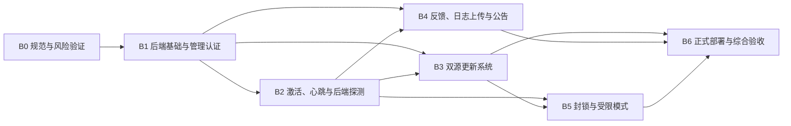

# 后端平台分阶段开发与验收计划

[上一篇：后端平台总体实施规范](10-backend-platform-master-plan.md) | [返回索引](README.md)

> 本文将 [后端平台总体实施规范](10-backend-platform-master-plan.md) 中的 B0-B6 转换为可执行的开发、测试和验收任务，并作为后端平台建设的唯一进度台账。总体产品边界、安全边界和架构决策以总体实施规范为准；阶段状态、实施证据和验收结论以本文为准。

## 1. 使用规则

### 1.1 状态定义

阶段和任务只能使用以下状态：

| 状态 | 含义 |
| --- | --- |
| 未开始 | 尚未进入开发，不得宣称已实现 |
| 进行中 | 已开始开发，但尚未满足开发完成标准 |
| 开发完成，待验收 | 实现、自动测试和必要文档已完成，等待阶段验收 |
| 验收中 | 正在执行自动、部署或实机验收 |
| 已通过 | 所有强制验收项通过，证据已记录，文档已同步 |
| 已阻塞 | 存在无法继续的外部依赖，必须记录原因和解除条件 |

“部分完成”“基本通过”等模糊状态不得作为正式结论。无法完成的非强制项目应标记为待办；无法完成的强制项目会阻止阶段通过。

### 1.2 强制文档维护流程

每个阶段必须按以下顺序维护文档：

1. **阶段开始前**
   - 将本文总览和对应阶段状态改为“进行中”。
   - 填写开始日期、目标范围和前置条件检查结果。
   - 如果实现方案偏离总体规范，先更新总体规范并记录理由，之后才能编码。
2. **开发过程中**
   - 每完成一个任务，立即更新对应任务复选框或状态。
   - 新增或修改 API、数据模型、配置、安全边界时，同步更新对应专题文档。
   - 发现风险、技术债或未确认事项时，立即记录，不得留到阶段结束再回忆补写。
3. **开发完成时**
   - 将阶段状态改为“开发完成，待验收”。
   - 记录实现文件、迁移、API、测试和相关 Commit。
   - 确认所有“已实现”描述均能由当前代码验证。
4. **验收过程中**
   - 将阶段状态改为“验收中”。
   - 逐项记录命令、环境、日期、结果和失败原因。
   - 失败项修复后必须重新执行受影响的验收项。
5. **验收完成时**
   - 只有在强制验收项全部通过、证据完整、相关文档已同步后，才能标记“已通过”。
   - 更新本文总览、阶段记录、[验收状态与实机测试清单](08-acceptance-status.md) 和文档索引中的当前状态。
   - 记录最终验收 Commit、发布产物版本和仍待手动确认的非阻塞事项。

**硬性规定：未在 `docs` 中记录开发结果和验收证据的阶段，视为未完成。**

### 1.3 变更与提交规则

- 每个阶段应独立开发和验收，不把下一阶段功能混入当前阶段。
- 推荐将阶段拆为多个可回退 Commit；阶段通过后再创建一个状态收尾 Commit。
- API、数据库和安全行为发生变化时，代码与文档应在同一个 Commit 中更新。
- 不得为了让验收通过而删除失败测试、降低安全校验或将真实失败改写成已通过。
- 总体规范与代码冲突时，停止继续扩展：先确认并更新规范，或修复代码使其恢复一致。

## 2. 当前总体状态

更新时间：2026-06-13

| 阶段 | 名称 | 当前状态 | 前置阶段 | 当前结论 |
| --- | --- | --- | --- | --- |
| B0 | 规范、原型与风险验证 | 开发完成，待验收 | 无 | 自动设计与原型验证已完成，受控手动风险测试尚未开始 |
| B1 | 后端基础与管理认证 | 未开始 | B0 已通过 | 尚未创建后端、共享契约和部署项目 |
| B2 | 设备激活、心跳与后端探测 | 未开始 | B1 已通过 | 尚未实现 |
| B3 | 双源更新系统 | 未开始 | B1 已通过；复用 B2 信任能力 | 尚未实现 |
| B4 | 反馈、日志上传与公告 | 未开始 | B1、B2 已通过 | 尚未实现 |
| B5 | 封锁与受限模式 | 未开始 | B2、B3 已通过 | 尚未实现 |
| B6 | 正式部署与综合验收 | 未开始 | B0-B5 已通过 | 尚未实现 |

后端平台当前尚未进入编码阶段。现有 WPF 客户端功能和第八阶段交付打包不因本计划自动变更状态。

## 3. 阶段依赖与交付路径



原则上按 B0-B6 顺序执行。B2 与 B3 只允许在共享契约和签名验证接口稳定后有限并行；最终验收仍需按依赖顺序完成。

## 4. 通用工程与质量门槛

以下门槛适用于所有阶段：

### 4.1 开发要求

- 保持桌面端为原生 WPF，不引入 WebView。
- 公共协议集中在 `src/NetRelay.Contracts/`，避免客户端和服务器重复定义 DTO。
- 后端 API 使用 `/api/v1` 前缀、统一错误格式、协议版本和关联请求 ID。
- 数据库结构通过 EF Core Migration 管理，不手工修改生产表结构。
- 所有外部输入执行长度、格式、范围和权限校验。
- 敏感值不写入源码、普通配置、普通日志或 Git。
- 网络、文件、数据库和第三方服务调用均设置超时、取消和可诊断错误。

### 4.2 自动检查

每阶段至少执行并记录适用命令：

```powershell
dotnet build NetRelay.sln -c Release
dotnet test NetRelay.sln -c Release
dotnet run --project tests/NetRelay.RegressionTests/NetRelay.RegressionTests.csproj -c Release
dotnet format NetRelay.sln --verify-no-changes --no-restore
git diff --check
```

后端项目建立后还必须执行：

```powershell
dotnet test server/NetRelay.Server.Tests/NetRelay.Server.Tests.csproj -c Release
docker compose -f deploy/docker-compose.yml config
```

涉及管理后台时，还必须执行其格式、静态检查、测试和生产构建命令。具体命令在确定管理后台技术栈后补入本文。

### 4.3 安全回归

每阶段均需确认：

- 后端不可用不会自动导致全局封锁。
- 未签名或签名错误的控制数据不会被客户端执行。
- GitHub 不会成为主后端运行依赖。
- 原始硬件标识、附近设备和用户文件不会被上传。
- 未经用户主动勾选不会上传日志附件。
- 受限模式不会破坏检查和安装更新能力。

## 5. B0：规范、原型与风险验证

### 5.1 阶段记录

| 项目 | 当前值 |
| --- | --- |
| 状态 | 开发完成，待验收 |
| 开始日期 | 2026-06-13 |
| 开发完成日期 | 2026-06-13 |
| 验收日期 | 未填写 |
| 负责人 | Codex 与项目维护者 |
| 相关 Commit | B0 自动开发与原型变更待提交 |
| 阻塞项 | 无；剩余项目均为抓包、虚拟机、硬件变化和权限异常受控验收 |

### 5.2 目标

在正式编码前验证最难替换、风险最高的决策，形成 API、数据库、签名、设备指纹、隐私和部署专项设计。

### 5.3 开发任务

#### B0.1 专项规范

- [x] 定义 API 版本、统一响应、错误码、分页、时间和 ID 格式。
- [x] 定义 OpenAPI 初稿和客户端/服务器共享 DTO 边界。
- [x] 定义 MySQL 表、字段、索引、外键、保留和删除策略。
- [x] 定义签名算法、序列化规范、密钥生成、轮换、吊销和离线签名流程。
- [x] 定义隐私政策、用户协议、同意版本和重新同意规则。
- [x] 定义威胁模型、信任边界、受限模式边界和管理员审计要求。
- [x] 定义 Ubuntu 测试与生产环境、域名、目录、备份和恢复方案。

#### B0.2 DeviceId 原型

- [x] 创建隔离原型，不接入正式客户端业务流程。
- [x] 通过 `IDeviceFingerprintProvider` 隔离第三方库。
- [ ] 确认不包含局域网、邻居端点和附近 Wi-Fi 扫描。
- [x] 记录 DeviceId 版本、许可证、依赖和升级风险。
- [ ] 测量正常设备、虚拟机和权限异常环境下的耗时与失败行为。
- [ ] 测试换网卡、换硬盘、重装和虚拟机克隆后的证据变化。
- [x] 验证 NetRelay 物理候选网卡辅助证据排除虚拟接口和动态网络状态。
- [x] 确认原始序列号不上传、不进入普通日志。

#### B0.3 签名与更新原型

- [x] 完成规范化 JSON 或等价确定性序列化原型。
- [x] 完成签名、验证、过期、nonce 和重放拒绝原型。
- [x] 验证主源和 GitHub 可使用完全相同的清单、签名和更新包。
- [x] 验证独立更新器替换与回滚方案的可行性，不接入正式更新按钮。

#### B0.4 管理后台与部署决策

- [x] 确认管理后台具体技术栈和构建方式。
- [x] 确认 Ubuntu、Nginx、MySQL、文件目录与 Docker Compose 拓扑。
- [x] 确认服务器更新包和私有反馈附件的隔离方式。
- [x] 定义正式域名、GitHub 仓库和证书管理为部署/后台配置，并定义签名迁移规则。

### 5.4 必须产出

- `docs/12-backend-api-and-contracts.md`
- `docs/13-backend-database-and-storage.md`
- `docs/14-backend-security-signing-and-privacy.md`
- `docs/15-backend-deployment-and-operations.md`
- 设备指纹与签名原型报告。
- 风险结论：采用、调整或放弃 DeviceId，并说明证据。

### 5.5 强制验收

| 验收项 | 通过标准 | 证据 | 状态 |
| --- | --- | --- | --- |
| 设备指纹网络边界 | 抓包确认不扫描局域网邻居、附近 Wi-Fi 或其他设备 | 未填写 | 未开始 |
| 指纹稳定性 | 形成明确测试矩阵、变化结果和误封风险结论 | 同机连续运行稳定；换硬件、重装和虚拟机测试待执行 | 未开始 |
| 原始标识保护 | 代码、请求和普通日志均不出现原始硬件序列号 | 组合原型只输出分类与数量；API 只接受应用域隔离哈希 | 已通过 |
| 签名原型 | 正常签名通过，篡改、过期、重放和错误适用范围均拒绝 | `NetRelay.B0.SecurityPrototype` 已通过全部场景 | 已通过 |
| 更新原型 | 主源与 GitHub 相同产物可验证，损坏包被拒绝并可回滚 | `NetRelay.B0.SecurityPrototype` 已通过一致性、损坏拒绝与回滚 | 已通过 |
| 文档评审 | API、数据库、安全、隐私和部署专项文档无未解释冲突 | 专项文档、OpenAPI、相对链接与关键边界一致性审查通过；后续实现变化仍需同步维护 | 已通过 |

### 5.6 完成门槛

- 所有强制验收项通过。
- B1 所需协议、数据结构和部署拓扑已确定。
- 未确认项有明确责任、期限和是否阻塞 B1 的结论。
- 本节和总体状态已更新，验收证据与 Commit 已记录。

## 6. B1：后端基础与管理认证

### 6.1 阶段记录

| 项目 | 当前值 |
| --- | --- |
| 状态 | 未开始 |
| 前置条件 | B0 已通过 |
| 开始日期 | 未填写 |
| 开发完成日期 | 未填写 |
| 验收日期 | 未填写 |
| 相关 Commit | 未填写 |
| 阻塞项 | 无 |

### 6.2 目标

建立可部署、可迁移、可认证、可审计和可恢复的后端基础，不提前实现设备、更新、公告和封锁业务。

### 6.3 开发任务

#### B1.1 解决方案与共享契约

- [ ] 创建 `src/NetRelay.Contracts/`。
- [ ] 创建 `server/NetRelay.Server/` 和 `server/NetRelay.Server.Tests/`。
- [ ] 建立统一 DTO、错误码、请求 ID、协议版本和 JSON 规则。
- [ ] 配置 OpenAPI、健康检查、结构化日志和全局异常处理。

#### B1.2 数据库与文件存储

- [ ] 接入 MySQL 8.0、Pomelo EF Core 和连接池。
- [ ] 创建初始 Migration、索引和约束。
- [ ] 建立服务器发布文件与私有反馈附件的抽象和隔离目录。
- [ ] 实现数据库迁移、备份和恢复脚本。

#### B1.3 单管理员认证

- [ ] 实现唯一管理员初始化流程。
- [ ] 使用成熟密码哈希方案，禁止明文或可逆密码。
- [ ] 实现 TOTP、登录会话、退出、过期和撤销。
- [ ] 实现登录速率限制、失败审计和敏感操作重新认证。
- [ ] 实现 CSRF、CORS 和管理 API 授权边界。
- [ ] 实现不可由管理后台删除的审计日志。

#### B1.4 部署基础

- [ ] 创建 `deploy/docker-compose.yml`。
- [ ] 创建 Nginx HTTPS 和反向代理配置。
- [ ] 建立 Secret、环境变量和配置校验。
- [ ] 建立测试环境部署、备份、恢复和升级脚本。

### 6.4 强制验收

| 验收项 | 通过标准 | 证据 | 状态 |
| --- | --- | --- | --- |
| Release 构建与测试 | 后端、契约和现有客户端构建测试通过 | 未填写 | 未开始 |
| 数据库迁移 | 空库可升级，已有库重复执行安全，失败可恢复 | 未填写 | 未开始 |
| 管理认证 | 密码、TOTP、过期、撤销和速率限制符合规范 | 未填写 | 未开始 |
| 权限隔离 | 未认证用户和普通公开 API 无法访问管理资源 | 未填写 | 未开始 |
| 审计完整性 | 登录和管理操作写入审计，后台无法删除审计记录 | 未填写 | 未开始 |
| Ubuntu 测试部署 | HTTPS、API、MySQL、迁移和健康检查正常 | 未填写 | 未开始 |
| 备份恢复 | 从备份恢复到新环境后数据和管理员登录正常 | 未填写 | 未开始 |

### 6.5 完成门槛

- Ubuntu 测试环境可重复部署、迁移、备份和恢复。
- 管理认证与审计安全测试通过。
- API、数据库和部署文档与代码一致。
- 未实现的 B2-B5 端点不得伪装为可用。

## 7. B2：设备激活、心跳与后端探测

### 7.1 阶段记录

| 项目 | 当前值 |
| --- | --- |
| 状态 | 未开始 |
| 前置条件 | B1 已通过 |
| 开始日期 | 未填写 |
| 开发完成日期 | 未填写 |
| 验收日期 | 未填写 |
| 相关 Commit | 未填写 |
| 阻塞项 | 无 |

### 7.2 目标

接通首次联网激活、匿名设备身份、轻量心跳和绑定指定网卡的签名后端探测，同时保持后端故障时的现有离线与联网判断能力。

### 7.3 开发任务

#### B2.1 协议与隐私交互

- [ ] 实现首次运行简洁同意界面。
- [ ] 实现用户主动点击后查看完整协议与隐私政策。
- [ ] 未勾选同意时禁止生成或上传设备指纹。
- [ ] 保存协议版本、隐私版本和同意时间。
- [ ] 实现重大版本变化后的重新同意。

#### B2.2 设备身份与激活

- [ ] 将通过 B0 验证的指纹提供器接入客户端。
- [ ] 生成持久化随机 `installationId`。
- [ ] 仅上传规范化哈希证据。
- [ ] 实现 `/devices/activate` 和签名激活凭证。
- [ ] 实现激活凭证本地安全保存、校验和失效处理。
- [ ] 首次激活失败时只允许重试、查看协议和退出。

#### B2.3 心跳与活跃度

- [ ] 实现 `/devices/heartbeat`。
- [ ] 默认限制为每 24 小时最多一次。
- [ ] 后端记录首次活跃、最近活跃、版本和安装实例。
- [ ] 管理后台展示匿名设备与活跃度，不展示原始硬件值。

#### B2.4 签名后端联网探测

- [ ] 实现 `/connectivity/challenge`。
- [ ] 客户端从指定网卡本地 IP 发起请求。
- [ ] 校验 nonce、签名、过期和协议版本。
- [ ] 将后端探测作为高可信信号接入现有多信号探测。
- [ ] 后端不可用时显示“后端验证不可用”，不直接判定断网。

### 7.4 强制验收

| 验收项 | 通过标准 | 证据 | 状态 |
| --- | --- | --- | --- |
| 首次离线运行 | 未激活设备离线时不能进入主功能 | 未填写 | 未开始 |
| 激活后离线运行 | 已激活设备在后端不可用时仍可正常使用现有功能 | 未填写 | 未开始 |
| 协议同意 | 未同意前不生成或上传指纹；版本变更可要求重新同意 | 未填写 | 未开始 |
| 指纹隐私 | 请求、日志和数据库无原始硬件序列号 | 未填写 | 未开始 |
| 心跳频率 | 正常情况下每安装实例 24 小时内不重复上报 | 未填写 | 未开始 |
| 挑战安全 | 篡改、过期、错误 nonce、重放和伪造签名均失败 | 未填写 | 未开始 |
| 指定网卡绑定 | 挑战请求确实经目标网卡发出 | 未填写 | 未开始 |
| 后端故障降级 | 后端故障不导致误判全部断网或自动封锁 | 未填写 | 未开始 |

### 7.5 完成门槛

- 首次激活、后续离线和重新联网策略符合总体规范。
- 后端探测已接入但不会替代现有多信号检测的故障降级能力。
- 客户端 UI、API、数据库、隐私和验收文档已同步。

## 8. B3：双源更新系统

### 8.1 阶段记录

| 项目 | 当前值 |
| --- | --- |
| 状态 | 未开始 |
| 前置条件 | B1 已通过；B2 信任与签名能力稳定 |
| 开始日期 | 未填写 |
| 开发完成日期 | 未填写 |
| 验收日期 | 未填写 |
| 相关 Commit | 未填写 |
| 阻塞项 | 无；正式 GitHub 仓库在部署时配置，代码签名证书属于发布准备项 |

### 8.2 目标

实现服务器独立主更新源、完全独立的 GitHub Releases 备用源和具备验证、替换、启动确认、失败回滚能力的独立更新器。

### 8.3 开发任务

#### B3.1 发布与清单

- [ ] 定义更新清单、签名、SHA256、架构和最低升级版本。
- [ ] 实现服务器更新包上传、暂存、校验、发布和撤回。
- [ ] 确保服务器和 GitHub 使用完全相同的清单、签名与更新包。
- [ ] 实现发布历史、状态和审计。

#### B3.2 客户端双源检查

- [ ] 接通现有“检查更新”入口。
- [ ] 首先检查主后端并下载服务器托管文件。
- [ ] 仅在主源失败、超时或明确不可用时访问 GitHub Releases。
- [ ] 主源和备用源执行完全相同的签名与哈希校验。
- [ ] 区分无更新、主源不可用、备用成功和全部失败状态。

#### B3.3 独立更新器

- [ ] 创建 `src/NetRelay.Updater/`。
- [ ] 更新器再次独立验证清单、签名、哈希、版本和架构。
- [ ] 实现进程退出等待、备份、替换和启动确认。
- [ ] 实现启动失败、替换失败和权限失败回滚。
- [ ] 更新器日志不得包含敏感令牌。

### 8.4 强制验收

| 验收项 | 通过标准 | 证据 | 状态 |
| --- | --- | --- | --- |
| 主源独立性 | 禁止访问 GitHub 时仍可从主服务器完整更新 | 未填写 | 未开始 |
| GitHub 完整备用 | 主服务器不可用时可从 GitHub 检查、下载和安装 | 未填写 | 未开始 |
| 来源一致性 | 两个来源的清单、签名和更新包哈希一致 | 未填写 | 未开始 |
| 篡改防护 | 错误签名、错误哈希、错误架构和降级包均拒绝 | 未填写 | 未开始 |
| 更新器回滚 | 替换失败或新版本启动失败后恢复旧版本 | 未填写 | 未开始 |
| 中断恢复 | 下载中断、磁盘不足和程序重启不会破坏当前版本 | 未填写 | 未开始 |
| 受限入口预留 | 更新流程不依赖主界面的网卡管理权限 | 未填写 | 未开始 |

### 8.5 完成门槛

- 两个更新源均可独立完成有效签名更新。
- 任一无效或损坏更新不会破坏现有安装。
- 发布、撤回、下载、安装和回滚文档完整。

## 9. B4：反馈、日志上传与公告

### 9.1 阶段记录

| 项目 | 当前值 |
| --- | --- |
| 状态 | 未开始 |
| 前置条件 | B1、B2 已通过 |
| 开始日期 | 未填写 |
| 开发完成日期 | 未填写 |
| 验收日期 | 未填写 |
| 相关 Commit | 未填写 |
| 阻塞项 | 无 |

### 9.2 目标

实现经过用户明确授权的反馈和日志上传，以及经过签名、可控展示且不可执行任意脚本的公告系统。

### 9.3 开发任务

#### B4.1 反馈与日志附件

- [ ] 实现反馈类型、标题、内容、可选联系方式和提交状态。
- [ ] 抽取可复用日志导出与压缩服务。
- [ ] 默认不勾选上传日志。
- [ ] 上传前展示文件列表、压缩后大小和敏感信息提示。
- [ ] 实现大小、类型、频率和保留期限限制。
- [ ] 实现上传进度、取消、失败重试和去重。
- [ ] 附件保存在私有目录，仅管理 API 可授权下载。

#### B4.2 公告

- [ ] 实现公告创建、修改、发布、撤回和审计。
- [ ] 实现每次启动、每设备一次、版本范围、发布时间和过期时间。
- [ ] 实现普通、重要和强提醒等级。
- [ ] 客户端验证公告签名后展示。
- [ ] 富文本使用严格白名单，禁止脚本和任意协议链接。
- [ ] 客户端记录已展示公告 ID。

### 9.4 强制验收

| 验收项 | 通过标准 | 证据 | 状态 |
| --- | --- | --- | --- |
| 默认隐私 | 未勾选上传日志时服务器完全收不到附件 | 未填写 | 未开始 |
| 明示授权 | 上传前显示文件、大小和风险，用户可取消 | 未填写 | 未开始 |
| 私有附件 | 无管理权限无法下载或猜测附件地址 | 未填写 | 未开始 |
| 上传限制 | 超限、错误类型、重复和高频请求被安全拒绝 | 未填写 | 未开始 |
| 公告策略 | 每次、一次、范围、撤回和过期均准确生效 | 未填写 | 未开始 |
| 公告安全 | 伪造签名、脚本和危险链接无法执行 | 未填写 | 未开始 |
| 审计与保留 | 管理操作、反馈状态和附件删除符合记录策略 | 未填写 | 未开始 |

### 9.5 完成门槛

- 反馈和公告功能的隐私、安全和展示策略全部通过。
- 日志上传始终由用户对该次提交主动授权。
- API、文件存储、管理操作和客户端交互文档已同步。

## 10. B5：封锁与受限模式

### 10.1 阶段记录

| 项目 | 当前值 |
| --- | --- |
| 状态 | 未开始 |
| 前置条件 | B2、B3 已通过 |
| 开始日期 | 未填写 |
| 开发完成日期 | 未填写 |
| 验收日期 | 未填写 |
| 相关 Commit | 未填写 |
| 阻塞项 | 无 |

### 10.2 目标

实现可撤销、可过期、签名可信和完整审计的设备、安装实例、版本范围及全局封锁，并确保受限状态始终保留双源更新能力。

### 10.3 开发任务

#### B5.1 策略与签名凭证

- [ ] 实现 `/policies/evaluate`。
- [ ] 实现设备、安装实例、版本范围和全局策略。
- [ ] 实现原因、生效、过期、申诉、允许更新和签名。
- [ ] 实现解除策略和签名解除凭证。
- [ ] 客户端持久化并验证最近有效受限状态。

#### B5.2 受限模式

- [ ] 禁止网卡启用、禁用和自动化规则执行。
- [ ] 停止后台自动调度。
- [ ] 保留主源与 GitHub 更新检查、下载和安装。
- [ ] 保留版本、原因、公告、申诉和允许的反馈入口。
- [ ] 激活后离线启动时正确延续有效受限状态。

#### B5.3 管理保护

- [ ] 全局封锁默认要求自动过期。
- [ ] 全局封锁要求重新输入密码和二次确认。
- [ ] 所有封锁、修改和解除写入不可删除审计。
- [ ] 管理后台清晰显示范围、影响和到期时间。
- [ ] 防止错误设备匹配造成静默扩大封锁范围。

### 10.4 强制验收

| 验收项 | 通过标准 | 证据 | 状态 |
| --- | --- | --- | --- |
| 策略签名 | 伪造、篡改、过期、重放和错误范围策略均不执行 | 未填写 | 未开始 |
| 后端故障边界 | 后端不可用不会让未受限设备自动进入受限模式 | 未填写 | 未开始 |
| 离线持久化 | 已受限设备离线重启仍保持有效受限状态 | 未填写 | 未开始 |
| 功能限制 | 受限模式确实停止网卡操作与自动化 | 未填写 | 未开始 |
| 更新保留 | 主源可用或不可用时，双源更新均保持可用 | 未填写 | 未开始 |
| 解除能力 | 有效解除凭证或修复版本可恢复正常模式 | 未填写 | 未开始 |
| 管理保护 | 全局封锁二次确认、自动过期和完整审计有效 | 未填写 | 未开始 |
| 指纹误匹配 | 部分硬件变化不会未经确认扩大设备封锁 | 未填写 | 未开始 |

### 10.5 完成门槛

- 任何封锁均有签名、理由、范围、审计、撤销或过期路径。
- 后端故障与封锁严格区分。
- 受限模式的双源更新能力已在真实发布版验证。

## 11. B6：正式部署与综合验收

### 11.1 阶段记录

| 项目 | 当前值 |
| --- | --- |
| 状态 | 未开始 |
| 前置条件 | B0-B5 已通过 |
| 开始日期 | 未填写 |
| 开发完成日期 | 未填写 |
| 验收日期 | 未填写 |
| 相关 Commit | 未填写 |
| 阻塞项 | 正式服务器、域名、证书和发布凭据待准备 |

### 11.2 目标

将官网、管理后台、API、MySQL、文件存储和双源更新部署到生产环境，完成故障、安全、隐私、更新和 Windows 客户端综合验收。

### 11.3 开发与部署任务

#### B6.1 生产准备

- [ ] 确认域名、HTTPS、Nginx、Docker Compose 和防火墙。
- [ ] 配置生产 Secret、密钥、数据库和受控文件目录。
- [ ] 配置数据库、发布文件和反馈附件备份。
- [ ] 配置日志保留、监控、告警和磁盘容量检查。
- [ ] 配置 GitHub 备用发布流程。

#### B6.2 发布与迁移

- [ ] 从空环境完成生产部署。
- [ ] 执行数据库迁移和管理员初始化。
- [ ] 发布首个主源与 GitHub 一致的签名更新。
- [ ] 生成与当前 HEAD 一致的 Windows 发布产物。
- [ ] 记录版本、Commit、构建时间、哈希和签名状态。

#### B6.3 综合验收

- [ ] 执行 API、数据库、管理后台和 Windows 客户端自动测试。
- [ ] 执行后端完全宕机、MySQL 故障、磁盘不足和恢复演练。
- [ ] 执行主源故障后的 GitHub 完整备用更新。
- [ ] 执行签名伪造、重放、错误封锁、错误解除和回滚测试。
- [ ] 执行隐私、日志授权、附件权限和数据保留检查。
- [ ] 执行至少一轮长时间运行与网络频繁波动测试。

### 11.4 强制验收

| 验收项 | 通过标准 | 证据 | 状态 |
| --- | --- | --- | --- |
| 生产部署 | 官网、后台、API、MySQL 和文件存储稳定运行 | 未填写 | 未开始 |
| 备份恢复 | 可在新环境恢复数据库和必要文件并恢复服务 | 未填写 | 未开始 |
| 主源故障 | 主源完全不可用时客户端仍能通过 GitHub 安全更新 | 未填写 | 未开始 |
| 后端故障 | 已激活未受限用户可继续离线使用，不被错误封锁 | 未填写 | 未开始 |
| 受限恢复 | 受限客户端可通过保留的更新入口安装修复版本 | 未填写 | 未开始 |
| 隐私检查 | 指纹、心跳、反馈和日志上传符合用户授权与政策 | 未填写 | 未开始 |
| 安全检查 | 认证、CSRF、越权、签名、重放和审计测试通过 | 未填写 | 未开始 |
| 发布一致性 | 生产主源、GitHub 和本地记录的产物与哈希一致 | 未填写 | 未开始 |
| 长稳测试 | 长时间运行和网络波动未发现阻塞发布的问题 | 未填写 | 未开始 |
| 文档一致性 | 所有文档与生产实现、配置和验收结论一致 | 未填写 | 未开始 |

### 11.5 完成门槛

- 所有强制验收项通过。
- 生产恢复、密钥轮换、发布和回滚流程可以由文档独立执行。
- [验收状态与实机测试清单](08-acceptance-status.md) 已记录后端平台最终结论。
- 本文 B0-B6 状态、证据和 Commit 完整，未确认事项均明确标注。

## 12. 文档职责与维护矩阵

| 文档 | 职责 | 必须更新的时机 |
| --- | --- | --- |
| [README.md](README.md) | 文档索引、当前总体状态和推荐阅读顺序 | 新增文档、阶段通过、总体状态变化 |
| [08-acceptance-status.md](08-acceptance-status.md) | 当前已通过和待实机验收结论 | 每阶段正式验收完成 |
| [09-future-stages-and-milestones.md](09-future-stages-and-milestones.md) | 产品阶段路线与阶段边界 | 阶段划分或路线变化 |
| [10-backend-platform-master-plan.md](10-backend-platform-master-plan.md) | 后端总体产品、架构和安全基线 | 已确定设计或边界发生变化 |
| 本文 | B0-B6 当前进度、任务、证据和验收结论 | 每次阶段开发与验收活动 |
| `12-backend-api-and-contracts.md` | API、DTO、错误码和兼容规则 | API 或共享契约变化 |
| `13-backend-database-and-storage.md` | 数据模型、迁移、索引、文件与保留策略 | 数据库或存储变化 |
| `14-backend-security-signing-and-privacy.md` | 威胁模型、签名、密钥、隐私、封锁安全 | 安全、身份、隐私行为变化 |
| `15-backend-deployment-and-operations.md` | Ubuntu 部署、配置、备份、恢复和监控 | 部署或运维方式变化 |

`12` 至 `15` 文档将在 B0 创建；创建前不得在索引中标记为已存在。

## 13. 阶段活动记录模板

每次开始开发、完成开发或执行验收时，在对应阶段下追加或更新记录：

```markdown
### 活动记录

| 日期 | 类型 | 范围 | 结果 | 证据或 Commit | 未完成事项 |
| --- | --- | --- | --- | --- | --- |
| YYYY-MM-DD | 开发/自动验收/部署验收/实机验收 | Bx.x | 通过/失败/阻塞 | 命令、报告或 Commit | 明确描述 |
```

记录要求：

- 验收失败必须保留失败结论和后续修复记录，不覆盖历史事实。
- 证据应包含可复现命令、测试报告路径、环境和相关 Commit。
- 涉及生产 Secret、设备原始标识或用户日志时，只记录脱敏后的证据。
- 手动验收必须记录 Windows/Ubuntu 版本、客户端版本和操作步骤。

## 14. 当前变更记录

| 日期 | 变更 | 状态 |
| --- | --- | --- |
| 2026-06-13 | 根据后端总体实施规范建立 B0-B6 分阶段开发、验收和强制文档维护计划 | 已记录 |
| 2026-06-13 | 正式开始 B0，进入专项规范、设备指纹和签名更新原型验证 | 进行中 |
| 2026-06-13 | 将设备指纹首选从 HardwareIds.NET 调整为 DeviceId 6.11.0，并加入 NetRelay 物理候选网卡辅助证据层 | 进行中 |
| 2026-06-13 | DeviceId 组合原型、签名原型、更新一致性与回滚原型运行通过；正式客户端 37 项回归测试通过 | 已记录 |
| 2026-06-13 | 域名、GitHub 备用仓库和证书调整为部署/后台配置；定义签名客户端配置与根/发布/在线操作密钥分层 | 已记录 |
| 2026-06-13 | 初始配置校验首次测试因有效用例误用了 `.example.com` 占位域名而失败；修正测试夹具后重新验证 | 已记录 |
| 2026-06-13 | B0 自动设计、原型、构建、回归、格式、链接和差异检查完成；受控手动验收尚未开始 | 开发完成，待验收 |
