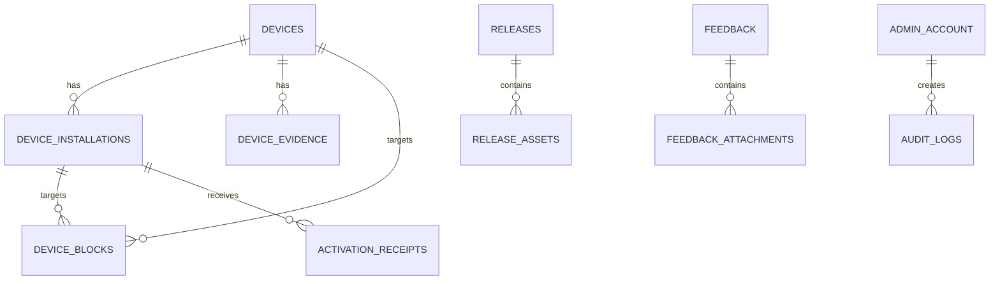

# 后端数据库与存储规范

[上一篇：后端 API 与共享契约规范](12-backend-api-and-contracts.md) | [返回索引](README.md)

> 状态：B7 已通过。数据库以 MySQL 8.0、EF Core 与 Pomelo 为确定方案；实体、上下文和 Migration 持续随阶段演进维护。

当前已实现的初始 Migration 位于 `server/NetRelay.Server/Data/Migrations/`，只创建 B1 管理认证基础表：

| 已实现表 | 当前职责 |
| --- | --- |
| `admin_accounts` | 唯一管理员、密码哈希、受 Data Protection 保护的 TOTP Secret、失败次数与锁定 |
| `admin_login_challenges` | 短时一次性 TOTP 登录挑战，消费后不可复用 |
| `admin_sessions` | 会话与 CSRF Token 哈希、过期、重新认证窗口和撤销 |
| `audit_logs` | 管理认证审计与哈希链字段，不提供后台删除 API |

上述 UUID 字段通过显式大端转换保存为 `binary(16)`。其余本文所列业务表属于后续阶段设计，尚未创建。

B1 已实现 `ManagedFileStorage`：

- 四个根目录必须是绝对路径、彼此不同且互不嵌套。
- 所有受管路径必须在对应根目录内，拒绝绝对子路径与 `..` 路径穿越。
- 暂存文件可原子移动到发布、反馈或隔离区，不允许把目标仍设为暂存区。
- 服务启动时创建受管目录；具体上传、类型检查和下载授权属于 B3/B4。

## 1. 数据原则

- 数据库只保存业务元数据，不保存更新包和反馈附件二进制正文。
- 原始硬件序列号不得进入数据库、日志或备份。
- 删除、保留和审计策略必须可执行，不只写在隐私政策中。
- 生产结构只能通过已审查的 EF Core Migration 变更。
- 所有 UTC 时间使用 `datetime(6)`，由应用按 UTC 读写。
- 主键计划使用 UUID v7，MySQL 中存为 `binary(16)`；B1 验证映射实现。

## 2. 关系概览



## 3. 核心表

### 3.1 设备与激活

| 表 | 关键字段 | 索引与约束 |
| --- | --- | --- |
| `devices` | `id`、`machine_code`、`device_id_hash`、`fingerprint_version`、`first_seen_at`、`last_seen_at`、`match_confidence` | `machine_code` 唯一；`device_id_hash` 索引；`last_seen_at` 索引 |
| `device_installations` | `id`、`device_id`、`installation_id`、`client_version`、`os_version`、协议版本、首次/最近活跃 | `installation_id` 唯一；`device_id,last_seen_at` 索引 |
| `device_evidence` | `id`、`device_id`、`category`、`evidence_hash`、`first_seen_at`、`last_seen_at` | `device_id,category,evidence_hash` 唯一 |
| `activation_receipts` | `id`、`installation_id`、`receipt_id`、`issued_at`、`expires_at`、`key_id`、`revoked_at` | `receipt_id` 唯一；过期索引 |

设备证据只保存分类哈希。核心硬件证据和网卡辅助证据使用不同分类与权重；设备匹配权重不是表结构常量，必须版本化并记录匹配算法版本。

`machine_code` 是后端生成的随机、不可枚举公开标识，不从硬件证据直接派生。`device_id_hash` 允许随指纹算法升级产生多个历史版本，因此不能长期作为唯一键。

### 3.2 策略与封锁

| 表 | 关键字段 | 索引与约束 |
| --- | --- | --- |
| `device_blocks` | 设备或安装实例目标、原因、申诉信息、生效/过期、撤销、签名载荷引用 | 目标与有效期索引；必须恰好一个目标 |
| `global_policies` | 类型、最低/最高版本、原因、生效/过期、允许更新、撤销 | 类型与有效期索引 |
| `signed_artifacts` | `purpose`、`payload_hash`、`key_id`、签名、发布时间 | `purpose,payload_hash` 唯一 |

全局封锁默认必须有过期时间。删除策略采用撤销而非物理删除，以保留审计链。

### 3.3 更新与公告

| 表 | 关键字段 | 索引与约束 |
| --- | --- | --- |
| `releases` | 版本、通道、架构、最低升级版本、状态、清单哈希、签名、发布/撤回时间 | `version,channel,architecture` 唯一 |
| `release_assets` | 发布 ID、文件名、受控路径、大小、SHA256、内容类型 | `release_id,file_name` 唯一 |
| `announcements` | 标题、正文、等级、展示策略、版本范围、发布时间、过期、撤回、签名 | 有效期与状态索引 |

更新文件允许通过受控下载端点公开下载；数据库中的路径不得直接作为 URL。

`releases` 使用 `(version, channel, architecture)` 唯一约束，并保存 `is_mandatory` 强制更新标志。当前公开发布只接受 `stable / win-x64`，数据库仍保留 `channel` 与 `architecture` 字段以兼容未来扩展。该组合一旦创建即不可覆盖；撤回更新时保留数据库记录、审计记录和发布文件，但不允许恢复为草稿或替换原文件。修复更新内容必须提升版本号重新发布，确保固定下载 URL 对应的二进制内容不可变。

旧版本占用空间时，管理后台可以清理旧更新包的物理 ZIP 文件，但不得把历史记录从数据库删除。清理后 `package_deleted_at` 记录物理包删除时间，版本仍可在更新历史中展示，客户端下载端点会拒绝下载已清理的旧包。清理策略必须至少保留每个通道/架构最新 1 个仍可下载的已发布包；当前实现只清理 `stable / win-x64`，默认保留最新 3 个。

### 3.4 反馈、管理和审计

| 表 | 关键字段 | 索引与约束 |
| --- | --- | --- |
| `feedback` | 类型、标题、正文、可选联系方式、匿名设备指纹、安装实例、客户端版本、系统版本、状态、创建时间 | 状态与创建时间索引；B7 新增 `device_id_hash`、`installation_id`、`client_version`、`os_version` |
| `feedback_attachments` | 反馈 ID、私有路径、文件名、大小、SHA256、内容类型、删除时间 | `feedback_id` 索引 |
| `admin_accounts` | 唯一管理员、密码哈希、TOTP 密文、失败次数、锁定与更新时间 | 首版强制最多一条有效账号 |
| `admin_login_challenges` | 管理员、创建、过期与消费时间 | 挑战 UUID 主键；过期索引 |
| `admin_sessions` | 会话哈希、创建、过期、撤销、最近活动 | 会话哈希唯一；过期索引 |
| `audit_logs` | 操作、目标、结果、请求 ID、脱敏详情、发生时间、链式完整性字段 | 时间、操作和目标索引 |
| `idempotency_records` | 作用域、键、请求哈希、响应引用、过期时间 | `scope,key` 唯一 |

管理后台不得提供删除 `audit_logs` 的 API。保留期结束后的清理只能由受控运维任务执行并记录。

## 4. 文件存储

Ubuntu 计划目录：

```text
/var/lib/netrelay/
├── releases/                  # 可通过受控端点下载
│   └── {version}/{channel}/{architecture}/
├── feedback-attachments/      # 私有，禁止 Nginx 直接公开
│   └── {feedback-id}/
├── staging/                   # 上传暂存，验证后原子移动
└── quarantine/                # 拒绝或待检查附件
```

宝塔标准部署的更新包实际路径为：

```text
/www/server/netrelay/data/releases/{channel}/{version}/{architecture}.zip
```

上传文件先进入 `staging/`，计算大小和 SHA256 后再原子移动到 `releases/`。`releases/` 不由 Nginx 直接公开，客户端必须通过后端的已发布版本下载端点访问。

要求：

- 数据库只存相对受控路径。
- 服务端使用固定根目录和安全路径拼接，拒绝路径穿越。
- 上传先进入 `staging`，完成大小、类型和哈希验证后再原子移动。
- 更新包不可执行上传目录中的任意内容。
- 反馈附件下载必须经过管理 API 鉴权和审计。

## 5. 保留与删除基线

| 数据 | 初始保留策略 |
| --- | --- |
| 设备与安装实例 | 最近活跃后 24 个月；最终期限在隐私政策发布前确认 |
| 分类证据哈希 | 随设备记录保留；删除设备时同步删除 |
| 心跳明细 | 首版不保存逐次明细，只更新聚合时间 |
| 反馈 | 处理完成后 12 个月；可由管理员提前删除正文 |
| 反馈附件 | 处理完成后 90 天；删除写入审计 |
| 发布文件与清单 | 正式发布长期保留，至少保留可回滚版本 |
| 公告 | 撤回后保留元数据与审计 |
| 审计日志 | 至少 24 个月；最终期限在 B1 确认 |
| 管理会话与幂等记录 | 过期后定期清理 |

这些期限属于 B0 初始值，发布隐私政策前必须确认。备份中的删除按备份轮换自然到期，并在政策中说明。

## 6. Migration 与恢复

- 每个结构变化创建独立 Migration，并在 PR/Commit 中附迁移影响。
- 生产迁移前必须完成数据库备份。
- 破坏性迁移分为“先兼容新增、应用切换、最后清理”多个发布。
- Migration 不负责下载大文件或长时间业务数据修复。
- 恢复演练必须验证数据库、更新清单、发布文件和私有附件引用一致。

## 7. B0 未确认项

- UUID v7 的 EF Core 值转换器与索引性能。
- 设备匹配可信度算法及是否需要单独的匹配事件表。
- 生产容量、备份介质和附件最终大小限制。
- 审计日志链式完整性采用数据库哈希链还是外部只追加存储。

## 8. B1 当前完整性边界

- 审计记录使用前序哈希形成链，当前 API 进程内串行写入，可检测记录内容篡改、插入、删除中间记录和断链。
- 当前设计假定只有一个 API 写入实例；扩展到多副本前必须增加数据库级串行化或外部只追加审计存储。
- 仅依赖数据库内哈希链无法检测管理员删除完整尾部。生产部署需要定期将最新链头锚定到数据库外的受控日志或监控系统。
- `ManagedFileStorage` 拒绝绝对子路径、路径穿越及嵌套存储根目录。生产文件根目录仍必须由服务账号独占，禁止不受控用户创建符号链接。
