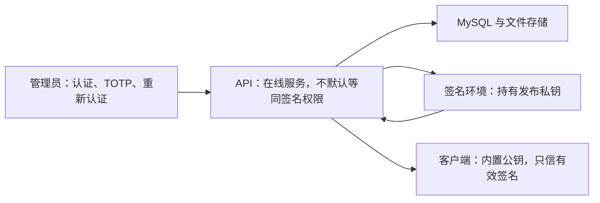

# 后端安全、签名与隐私规范

[上一篇：后端数据库与存储规范](13-backend-database-and-storage.md) | [返回索引](README.md)

> 状态：B0 已通过的设计基线与原型结论。本文定义不可绕过的信任和隐私边界；正式算法库、密钥设施和设备指纹供应器将在后续阶段实现。

## 1. 威胁模型

需要防范：

- 校园网登录页、透明代理或恶意网络伪造联网响应。
- 更新下载被替换、降级或投放错误架构。
- 伪造、篡改、过期或重放封锁、公告和客户端配置迁移指令。
- 管理员账号暴力破解、CSRF、会话窃取和越权。
- 反馈附件路径穿越、公开访问和资源耗尽。
- 设备指纹过度采集、原始标识泄露和误封。
- 后端故障被错误解释为全局封锁。

无法承诺：

- 阻止拥有本机管理员权限的用户修改客户端。
- 在没有可信硬件根或代码完整性服务时实现绝对不可绕过封锁。
- 仅凭硬件证据实现零误判设备识别。

## 2. 信任边界



生产根私钥和发布私钥不得放入管理后台浏览器、客户端、Git 或普通 API 配置。服务器只持有由离线根密钥签发、短期有效且限制用途的在线操作密钥。

## 3. 签名方案

### 3.1 B0 原型结论

B0 隔离原型使用 ECDSA P-256 + SHA-256 验证以下能力：

- 固定字节签名与验证。
- purpose、nonce、签发和过期时间参与签名。
- 篡改、错误 key、错误 purpose、错误 nonce、过期和重放拒绝。
- 主源与备用源相同字节和 SHA256 验证。

ECDSA P-256 在 .NET 8 和常见基础设施中支持成熟，暂定为正式候选。最终签名格式在跨平台测试向量通过后确定。

### 3.2 正式要求

- 载荷采用 RFC 8785 JSON Canonicalization Scheme 或经评审的等价确定性格式。
- 签名信封包含 `protocolVersion`、`keyId`、`purpose`、nonce、时间和载荷。
- 更新清单、策略、公告、客户端配置迁移和挑战响应使用不同 `purpose`。
- 客户端内置离线根公钥，并缓存由根密钥签发的用途受限公钥证书。
- 根密钥离线保存，只用于签发、轮换和吊销发布/操作公钥。
- 发布私钥离线保存，只签名更新清单和更新包。
- 在线操作私钥部署到服务器，用于动态挑战、公告、策略和客户端配置，证书建议不超过 30 天。
- 密钥轮换和吊销指令必须由离线根密钥签名。
- 私钥泄露时发布吊销与替换证书；后端不可要求客户端信任未签名新密钥。
- 签名客户端配置只能迁移到 HTTPS 主地址，且不得关闭 TLS 或签名校验。
- GitHub 备用仓库修改必须签名、版本递增并保留最后有效配置，防止后端故障时失去备用更新源。

### 3.3 密钥用途

| 密钥 | 保存位置 | 允许用途 |
| --- | --- | --- |
| 离线根密钥 | 加密离线介质，至少两份备份 | 签发、轮换、吊销发布和在线操作公钥证书 |
| 离线发布密钥 | 受控离线发布环境 | 更新清单、更新包 |
| 在线操作密钥 | Ubuntu Secret，短期证书 | 联网挑战、公告、设备/版本/全局策略、客户端配置 |

在线操作密钥不能签名更新包。客户端验证时必须同时检查签名、证书链、用途和有效期。

## 4. 设备指纹供应器评估

### 4.1 DeviceId 当前事实

截至 2026-06-13：

- DeviceId 6.11.0 提供原生 .NET 8 目标，采用 MIT 许可证。
- NuGet 主包累计约 300 万下载，Windows WMI 包累计约 98.9 万下载。
- GitHub 仓库约 870 个 Star、248 个 Commit，最新包发布于 2026-03-12。
- 项目将核心、Windows、WMI、WmiLight 和 MMI 能力拆分为独立包。
- 可按需选择 Windows Device ID、Machine GUID、System UUID、主板、CPU 和系统盘证据。
- 项目不提供局域网邻居、附近 Wi-Fi 或其他设备扫描能力。
- 支持自定义哈希格式与多个版本构建器，适合指纹算法版本化。

结论：**DeviceId 6.11.0 替代 HardwareIds.NET，成为 NetRelay 的 B0 首选候选。** 它更成熟、维护更活跃、采集范围更可控，但正式接入前仍必须通过稳定性、虚拟机克隆、性能和原始标识泄露测试。

### 4.2 候选对比

| 维度 | DeviceId 6.11.0 | HardwareIds.NET 1.1.9 | 结论 |
| --- | --- | --- | --- |
| 维护与采用 | 约 300 万 NuGet 下载，2026 年仍发布版本 | 公开采用量较低 | DeviceId 更可靠 |
| .NET 8 | 原生目标 | 兼容目标 | 均可用 |
| 采集控制 | 按组件显式选择 | 返回较完整硬件集合 | DeviceId 更符合最小化采集 |
| 网络扫描 | 不提供邻居扫描 | 支持邻居与局域网设备扫描，需主动关闭 | DeviceId 风险更低 |
| 算法版本化 | 提供多个构建器和格式化扩展 | 需要自行包裹 | DeviceId 更便利 |
| 单项证据 | 可分别生成并哈希 | 可枚举较多硬件信息 | DeviceId 更适合后端可信度匹配 |

DeviceId 的库名不能被误解为“返回值可以直接永久代表一台物理设备”。最终设计仍采用分类证据、随机安装实例 ID、版本化算法和后端可信度匹配。

### 4.3 强制隔离

正式代码必须通过：

```csharp
public interface IDeviceFingerprintProvider
{
    Task<DeviceFingerprintEvidence> CollectAsync(CancellationToken cancellationToken);
}
```

第三方库只负责明确选择的本地标识读取。适配器负责：

1. 只启用经过评审的 DeviceId 组件。
2. 禁止用户名、机器名、Windows Product ID 和任何网络发现数据。
3. 为每类证据分别生成版本化哈希。
4. 在内存中使用应用级 salt 再哈希。
5. 只返回分类哈希，不返回原始值。

NetRelay 可将本机物理候选网卡的接口 GUID、MAC 和硬件型号作为独立哈希后的辅助证据。网络适配器证据不作为高权重稳定证据；不得收集 IP、流量、链路状态、附近 Wi-Fi、路由器、邻居端点、局域网其他设备或公网 IP。

### 4.4 设备匹配

- `installationId` 是随机安装实例 ID，不是设备指纹。
- `machineCode` 是后端分配的稳定匿名引用，不是硬件哈希、秘密或授权凭据。
- `deviceId` 是版本化聚合哈希，不应单独决定封锁。
- 分类证据用于后端计算可信度。
- DeviceId 核心硬件证据与 NetRelay 网卡辅助证据分层计权；网卡证据不得单独决定封锁。
- 设备发生部分硬件变化时，不得静默把低可信匹配用于封锁。
- 虚拟机克隆、模板系统和批量相同硬件属于重点误封场景。

初始权重方向：

| 证据 | 建议层级 | 原因 |
| --- | --- | --- |
| System UUID、主板 | 高 | 通常代表整机核心，但虚拟机克隆和厂商默认值会降低可信度 |
| Windows Device ID、Machine GUID | 中高 | 重装系统、克隆或人工修改时可能变化 |
| CPU ID、系统盘 | 中 | CPU 型号/ID 可能不唯一，系统盘可正常更换 |
| 物理候选接口 GUID | 中低 | 驱动重装或重新枚举可能变化 |
| 物理候选 MAC | 中低 | 可更换、可伪造，Wi-Fi 可能随机化 |
| 物理候选网卡型号 | 低 | 只能辅助识别硬件组合，无法唯一标识设备 |

最终阈值必须通过多设备样本验证。任何单个低/中权重证据均不得触发既有设备封锁。

## 5. 用户同意和隐私

- 首次运行只显示简洁同意界面，详细协议由用户点击查看。
- 未勾选同意前，不生成、不保存、不上传设备指纹。
- 重大隐私变化通过版本号要求重新同意。
- 心跳默认每 24 小时最多一次。
- 日志默认不上传；每次反馈需用户主动勾选。
- 上传前显示附件列表、大小和可能包含的信息。
- 原始硬件序列号、用户文件、附近设备和校园网凭据不得上传。

服务器访问日志自然产生的 IP 应最小化保留，不作为设备稳定标识。

## 6. 封锁安全

- 后端不可用、签名无效和策略解析失败均不等于封锁。
- 封锁必须有有效签名、范围、原因、生效时间和撤销或过期路径。
- 全局封锁默认有自动过期，要求管理员重新认证和二次确认。
- 受限模式停止网卡操作与自动化，但保留双源更新。
- 客户端离线延续的是最近有效签名受限凭证，不是最近一次网络错误。

## 7. 管理安全

- 首版唯一管理员使用强密码哈希、TOTP 和安全会话。
- 登录、TOTP 和敏感操作均限流。
- 管理 Cookie 使用 `Secure`、`HttpOnly` 和适当 `SameSite`。
- 状态变更要求 CSRF 防护。
- 发布更新、全局封锁、密钥轮换要求短时重新认证。
- 管理操作和结果写入不可由后台删除的审计日志。

## 8. B0 验收状态

| 项目 | 当前结论 |
| --- | --- |
| DeviceId API、维护度与采集范围 | 已确认更适合作为首选；运行和 Wireshark 抓包验证通过 |
| DeviceId + NetRelay 网卡组合原型 | 两台物理设备样本通过；核心与网卡辅助证据分层有效，未输出原始值 |
| 原始标识不上传设计 | 已确定；正式实现待 B2 |
| 签名与重放原型 | 已运行验证通过 |
| 更新一致性与回滚原型 | 已运行验证通过 |
| 生产私钥隔离 | 已确定根/发布密钥离线、操作密钥在线短期证书；具体介质和轮换脚本在 B1/B6 实现 |
| 设备匹配阈值 | 已确认，权重计算模型和误匹配阈值已实现并随 B5 验收通过 |

## 9. 参考资料

- [DeviceId NuGet 包](https://www.nuget.org/packages/DeviceId/6.11.0)
- [DeviceId.Windows.Wmi NuGet 包](https://www.nuget.org/packages/DeviceId.Windows.Wmi/6.11.0)
- [DeviceId 源码仓库](https://github.com/MatthewKing/DeviceId)
