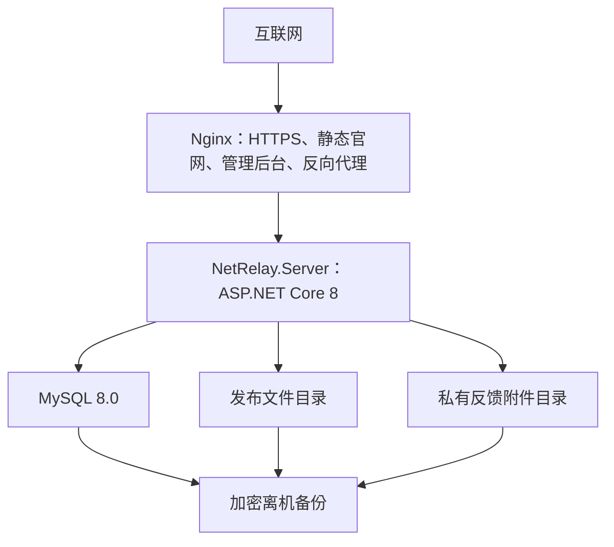

# 后端部署与运维规范

[上一篇：后端安全、签名与隐私规范](14-backend-security-signing-and-privacy.md) | [返回索引](README.md)

> 状态：B1 实现中。目标平台为用户自有 Ubuntu 服务器；Dockerfile、Compose、Nginx 与运维脚本已创建，当前本机未安装 Docker，真实部署、备份与恢复仍待验收。

## 1. 已确定拓扑



管理后台确定采用 React + TypeScript + Vite，构建后作为 `website/admin/` 静态资源由 Nginx 托管。该选择只用于浏览器管理后台，不改变 WPF 客户端原生技术栈。

当前 `deploy/scripts/deploy.sh` 会在 Compose 部署前执行 `npm ci` 和管理后台生产构建，因此执行部署脚本的受控 Ubuntu 主机需要安装 Node.js 22.12 或更高版本及对应 npm。构建产物不提交 Git，由 Nginx 只读挂载到 `/usr/share/nginx/html/admin`。

## 2. 计划目录

仓库：

```text
deploy/
├── docker-compose.yml
├── .env.example
├── nginx/
│   └── netrelay.conf
└── scripts/
    ├── deploy.sh
    ├── backup.sh
    ├── restore.sh
    └── migrate.sh
```

Ubuntu：

```text
/opt/netrelay/                    # Compose、部署配置与脚本
/var/lib/netrelay/releases/       # 主源更新文件
/var/lib/netrelay/feedback-attachments/
/var/lib/netrelay/staging/
/var/log/netrelay/                # 受控应用日志
/var/backups/netrelay/            # 本机短期备份，另需离机副本
```

## 3. 容器与网络

首版 Compose 服务：

| 服务 | 职责 | 公网暴露 |
| --- | --- | --- |
| `netrelay-api` | ASP.NET Core API、管理 API、签名协调 | 否，仅内部网络 |
| `mysql` | MySQL 8.0 | 否 |
| `nginx` | HTTPS、官网、后台和 API 反向代理 | 仅 80/443 |

B1 当前固定采用容器化 Nginx。`deploy/docker-compose.yml` 只将 Nginx 的 80/443 暴露到宿主机；MySQL 与 API 只在内部网络通信。

API 按单跳反向代理处理 `X-Forwarded-For` 与 `X-Forwarded-Proto`，用于正确识别登录限流来源和 HTTPS。该信任模型依赖 API 不直接暴露公网；若改变网络拓扑，必须同步收紧可信代理配置。

API 日志使用 JSON Console 输出，包含 UTC 时间、类别、级别、请求路径、请求 ID 和 Trace ID，由 Docker/宿主日志系统负责采集与保留。请求正文、密码、TOTP、会话令牌和原始硬件标识不得写入日志。

当前实现文件：

- `server/NetRelay.Server/Dockerfile`
- `deploy/docker-compose.yml`
- `deploy/.env.example`
- `deploy/nginx/netrelay.conf`
- `deploy/scripts/deploy.sh`
- `deploy/scripts/migrate.sh`
- `deploy/scripts/backup.sh`
- `deploy/scripts/restore.sh`
- `website/admin/`

这些文件尚未在 Docker/Ubuntu 环境运行，不得视为部署验收通过。

## 4. 域名和路由

正式域名在部署时通过 `NETRELAY_PUBLIC_BASE_URL` 配置，不需要在 B0 固定。建议单域名路径分区：

```text
https://netrelay.example/              官网
https://netrelay.example/admin/        管理后台
https://netrelay.example/api/v1/...    API
```

优点是证书与部署简单。管理后台不得仅依赖隐藏 URL，仍必须完整认证和授权。

GitHub 备用仓库通过 `NETRELAY_GITHUB_REPOSITORY=owner/repository` 提供初始部署值，并可由管理后台发布新的签名客户端配置。后端不可用时客户端使用最后有效签名值或安装包内置初始值，不临时依赖后端查询。

首次正式发布前，部署流程必须将 `NETRELAY_PUBLIC_BASE_URL`、`NETRELAY_GITHUB_REPOSITORY` 和更新通道写入客户端编译资源 `bootstrap-config.json`。服务器部署配置与客户端初始配置必须来自同一受控发布参数，避免地址漂移。

## 5. Secret 与配置

不得提交 Git：

- MySQL 密码。
- 管理员初始密码和 TOTP Secret。
- Cookie/Data Protection 密钥。
- 签名私钥。
- GitHub 发布凭据。
- GitHub 发布凭据属于 Secret；域名和公开 GitHub 仓库地址不是 Secret，但仍通过环境配置管理。

仓库只提交 `.env.example` 和变量说明。生产 Secret 由权限受控文件、Docker Secret 或后续确定的 Secret 管理方案提供。

启动时必须校验关键配置，缺失或使用示例默认值时拒绝启动。

初始公开配置：

| 环境变量 | 用途 | 是否 Secret |
| --- | --- | --- |
| `NETRELAY_PUBLIC_BASE_URL` | 官网与 API 的公开 HTTPS 基础地址 | 否 |
| `NETRELAY_GITHUB_REPOSITORY` | GitHub 完整备用源仓库 `owner/repository` | 否 |
| `NETRELAY_UPDATE_CHANNEL` | 初始更新通道 | 否 |
| `NetRelay__ReleasesRoot` | 主源更新文件目录；Compose 当前固定为 `/var/lib/netrelay/releases` | 否 |
| `NetRelay__FeedbackRoot` | 私有反馈附件目录；Compose 当前固定为 `/var/lib/netrelay/feedback-attachments` | 否 |
| `NetRelay__StagingRoot` | 上传暂存目录 | 否 |
| `NetRelay__QuarantineRoot` | 拒绝或待检查附件隔离目录 | 否 |
| `DataProtection__KeysPath` | 管理会话与 TOTP Secret 保护密钥的持久化绝对目录 | 是，目录内容属于 Secret |

当前 B1 将 Data Protection 密钥持久化到受控 Docker Volume，但尚未配置证书或外部密钥管理系统对密钥文件二次加密。部署时必须限制卷权限和备份访问；生产上线前需决定是否接入证书或 Secret/KMS 保护器。

管理后台修改公开客户端配置时，后端必须生成可审计的签名 `client-configuration`，而不是直接修改客户端本地配置。

签名密钥部署：

- 离线根私钥和离线发布私钥不部署到 Ubuntu 服务器。
- Ubuntu 只保存短期在线操作私钥及其根签名证书。
- 在线操作证书到期前由受控运维流程轮换，建议有效期不超过 30 天。
- 更新清单和更新包在离线发布环境签名后再上传服务器与 GitHub。

## 6. HTTPS、代理和静态文件

- HTTP 只用于跳转 HTTPS。
- HTTPS 证书由 Nginx 配合 Certbot 或等价 ACME 客户端管理和自动续期。
- 开启 HSTS，初次部署确认后再逐步增加期限。
- API 限制请求体、上传大小和超时。
- 反馈附件目录禁止 Nginx 静态映射。
- 发布文件通过 API 或明确受控下载路径提供。
- 管理后台设置 CSP、禁止内联脚本并限制连接源。
- 保留真实客户端 IP 时只信任受控 Nginx 代理头。

## 7. 发布流程

1. 在 CI 或受控构建机生成服务器与管理后台产物。
2. 执行测试、格式和依赖检查。
3. 备份数据库和必要文件。
4. 上传新镜像或产物。
5. 通过一次性 `--migrate` 进程运行兼容 Migration；常驻 API 默认关闭自动迁移。
6. 滚动启动 API 并检查健康端点。
7. 发布静态官网和管理后台。
8. 执行公开 API、管理登录和下载冒烟测试。
9. 记录 Commit、镜像摘要、Migration 和发布时间。

管理后台生产构建命令：

```bash
npm --prefix website/admin ci
npm --prefix website/admin run build
npm --prefix website/admin audit --audit-level=moderate
```

Nginx 将 `/admin` 重定向到 `/admin/`，管理后台使用同源 `/api/v1`。管理页面响应设置 CSP、禁止嵌入、禁止 MIME 嗅探和 `no-store`；完整登录流程必须通过 HTTPS 验证，因为管理会话 Cookie 强制标记为 `Secure`。

客户端 Release 发布额外执行：

1. 从受控发布参数生成 `bootstrap-config.json`。
2. 拒绝空值、示例域名、非 HTTPS 主地址和无效 GitHub `owner/repository`。
3. 构建客户端并确认初始后端可访问。
4. 模拟主后端不可用，确认客户端可直接找到 GitHub 备用源。

更新包发布与服务器部署是不同流程。更新包必须在上传主服务器和 GitHub 前完成签名。

## 8. 备份与恢复

初始策略：

- 每日 MySQL 逻辑备份。
- 每日备份发布清单、签名和反馈附件元数据。
- 更新包可由构建产物和 GitHub 恢复，但仍保留服务器备份。
- 备份加密并至少保留一份离机副本。
- 每月至少执行一次恢复演练。

恢复顺序：

1. 部署相同或兼容版本 API。
2. 恢复 MySQL。
3. 恢复发布文件与私有附件。
4. 校验数据库路径、文件哈希和权限。
5. 启动服务并执行健康、登录、更新和附件权限测试。

## 9. 日志、监控和告警

必须监控：

- API 健康、错误率、延迟和 429。
- MySQL 连接、容量和备份结果。
- 发布与附件磁盘容量。
- 管理登录失败和敏感操作。
- 更新下载失败、签名错误和回滚报告。
- 激活、策略和挑战异常峰值。

日志使用结构化字段和请求 ID。不得记录密码、TOTP、签名私钥、会话令牌、原始硬件标识或反馈附件正文。

## 10. 故障降级

| 故障 | 客户端预期行为 |
| --- | --- |
| API 完全不可用 | 已激活未受限客户端继续本地运行；更新切换 GitHub |
| MySQL 不可用 | API 返回可重试错误，不生成封锁策略 |
| 发布文件不可用 | 主源更新失败，客户端切换 GitHub |
| 签名服务不可用 | 停止发布新控制数据，不发送未签名替代内容 |
| 管理后台不可用 | 不影响客户端公开 API |
| 磁盘接近满 | 停止附件上传并告警，不影响策略验证与更新检查 |

## 11. B1 部署验收清单

- Ubuntu 测试环境从空机可重复部署。
- MySQL 不暴露公网端口。
- HTTPS、健康检查和反向代理正常。
- 管理登录、TOTP、CSRF 和限流正常。
- 数据库 Migration 可执行和回退。
- 备份可以恢复到新环境。
- 反馈附件无法通过静态 URL 获取。
- Secret 未进入 Git、镜像层和普通日志。

## 12. B0 未确认项

- 正式 Ubuntu 版本、服务器规格和存储容量。
- Nginx 最终运行于宿主机还是容器。
- 生产私钥托管与离线签名工作流。
- 监控和告警具体产品。
- GitHub 发布凭据管理方式。
