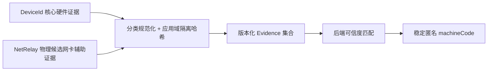

# B0 设备指纹与安全原型报告

[上一篇：后端部署与运维规范](15-backend-deployment-and-operations.md) | [返回索引](README.md)

> 报告日期：2026-06-13。状态：B0 开发完成，待验收。本报告只记录隔离原型和当前机器测试结果，不代表正式客户端已经接入设备指纹、后端或更新功能；受控手动测试尚未开始。

## 1. 结论摘要

- 设备指纹首选从 HardwareIds.NET 调整为 **DeviceId 6.11.0**。
- 采用“DeviceId 核心硬件证据 + NetRelay 物理候选网卡辅助证据”的组合方案。
- 证据均在本地执行 NetRelay 应用域隔离哈希，不输出或上传原始硬件值。
- 对用户展示的机器码由后端随机分配，不直接由全部证据拼接生成。
- ECDSA P-256 签名、过期、nonce、重放拒绝、双源包一致性和更新失败回滚原型已通过。
- DeviceId 与网卡组合原型在当前机器运行通过；换硬件、重装、虚拟机克隆、权限异常和抓包测试仍未完成。
- 正式域名、GitHub 备用仓库和 HTTPS 证书已定义为部署/后台配置，不再作为 B0 阻塞项；客户端通过内置初始配置和最后有效签名配置避免后端故障循环依赖。
- 发布版客户端必须先内置真实主后端地址与 GitHub 备用仓库；Release 构建将拒绝示例和占位地址。

## 2. 候选库研究

### 2.1 DeviceId 6.11.0

| 项目 | 结论 |
| --- | --- |
| 许可证 | MIT |
| .NET 8 | 提供原生 .NET 8 目标 |
| 维护状态 | 最新包发布于 2026-03-12 |
| 公开采用 | NuGet 主包累计约 300 万下载 |
| Windows 能力 | `DeviceId.Windows`、`DeviceId.Windows.Wmi`、WmiLight、MMI 按需拆分 |
| 原型直接依赖 | `DeviceId`、`DeviceId.Windows`、`DeviceId.Windows.Wmi` 6.11.0 |
| 原型传递依赖 | `System.Management`、`System.CodeDom` 10.0.3 |
| 网络扫描 | 不提供局域网邻居或附近设备扫描 |
| 可选证据 | Windows Device ID、Machine GUID、System UUID、主板、CPU、系统盘等 |
| 扩展能力 | 支持自定义哈希格式与多个版本构建器 |

### 2.2 HardwareIds.NET

HardwareIds.NET 能枚举较丰富的硬件信息，但公开采用量较低，并包含局域网设备与邻居端点扫描能力。即使可以通过配置关闭，这仍扩大了隐私审计面和误配置风险。

### 2.3 选择结论

DeviceId 的维护度、采用量、组件化设计和最小化采集能力更符合 NetRelay。HardwareIds.NET 不再作为首选原型依赖。

## 3. 组合设备身份设计



### 3.1 核心硬件证据

- Windows Device ID。
- Machine GUID。
- System UUID。
- 主板序列证据。
- CPU 证据。
- 系统盘证据。

### 3.2 NetRelay 网卡辅助证据

复用当前客户端 [NetworkAdapterService.cs](../src/NetRelay/Services/NetworkAdapterService.cs) 的物理候选分类思路：

- 物理候选网卡接口 GUID。
- 物理候选网卡 MAC。
- 物理候选网卡描述与接口类型组合。

默认排除 Virtual、VMware、Hyper-V、vEthernet、VirtualBox、VPN、Tunnel、Loopback、WSL、Docker、Mihomo、Clash、ZeroTier 和 Tailscale 等虚拟或隧道接口。

不采集：

- IP 地址、默认路由和 DNS。
- 网速、流量、链路状态和联网状态。
- 用户自定义接口名称。
- 附近 Wi-Fi、邻居端点或局域网其他设备。

### 3.3 标识分层

| 标识 | 生成方 | 用途 |
| --- | --- | --- |
| `machineCode` | 后端随机生成 | 稳定展示、管理和申诉引用 |
| `installationId` | 客户端随机生成 | 区分安装实例 |
| `deviceId` | 客户端版本化聚合哈希 | 快速匹配候选，不单独决定封锁 |
| 分类 `evidence` | 客户端逐项哈希 | 后端解释变化并计算可信度 |

## 4. 隔离原型

### 4.1 DeviceId 与网卡组合原型

位置：

```text
prototypes/NetRelay.B0.DeviceIdPrototype/
```

特性：

- 通过 `IDeviceFingerprintProvider` 隔离第三方库。
- 通过独立 evidence source 组合 DeviceId 和 NetRelay 网卡证据。
- 使用 `netrelay:fingerprint:v1` 应用域执行二次 SHA-256。
- 输出只显示分类名和哈希数量，不显示原始值或最终哈希。

当前机器结果：

| 项目 | 结果 |
| --- | --- |
| 核心硬件分类 | 6 类 |
| 网卡辅助分类 | 3 类 |
| 物理候选网卡 | 2 个 |
| 首次组合运行耗时 | 约 349 ms |
| 第二次组合运行耗时 | 约 343 ms |
| 连续运行稳定性 | 分类和数量一致 |
| 原始标识输出 | 未输出 |

### 4.2 安全与更新原型

位置：

```text
prototypes/NetRelay.B0.SecurityPrototype/
```

已验证：

- 有效 ECDSA P-256 + SHA-256 签名通过。
- 离线根密钥签发短期在线操作密钥证书；用途限制、过期和错误根密钥均能拒绝。
- 客户端初始配置校验可拒绝非 HTTPS、示例域名、占位或无效 GitHub 仓库。
- 篡改载荷、错误 key、错误 purpose、错误 nonce、过期和重放均拒绝。
- 主服务器与 GitHub 使用相同字节时 SHA256 一致。
- 损坏更新包被哈希检测拒绝。
- 模拟新版本启动失败后可恢复旧安装目录。
- 分层匹配安全不变量：全部网卡变化但核心证据稳定时仍可匹配；只有网卡相同或仅一个核心证据相同时不能匹配。

该原型证明方案可行，不是正式更新器或最终匹配算法实现。正式序列化仍需 RFC 8785 跨实现测试向量，最终匹配权重仍需多设备样本。

## 5. 已执行命令与结果

```powershell
dotnet run --project prototypes/NetRelay.B0.DeviceIdPrototype/NetRelay.B0.DeviceIdPrototype.csproj -c Release --no-restore
dotnet run --project prototypes/NetRelay.B0.SecurityPrototype/NetRelay.B0.SecurityPrototype.csproj -c Release --no-restore
dotnet build NetRelay.sln -c Release --no-restore
dotnet run --project tests/NetRelay.RegressionTests/NetRelay.RegressionTests.csproj -c Release --no-build --no-restore
```

结果：

- DeviceId 与网卡组合原型通过。
- 安全、密钥分层与更新原型通过。
- 正式客户端 Release 构建通过，0 警告、0 错误。
- 现有 37 项回归测试全部通过。
- Markdown 相对链接与 Git 空白检查通过。
- 正式域名、GitHub 仓库和证书配置规则已完成一致性审查。

## 6. 尚未通过的强制验收

| 验收项 | 当前状态 | 需要的环境 |
| --- | --- | --- |
| 指纹采集网络抓包 | 未执行 | Wireshark 或等价抓包工具 |
| 换网卡 | 未执行 | 可替换或临时禁用的物理/USB 网卡 |
| 换硬盘 | 未执行 | 测试机或虚拟机 |
| 重装系统 | 未执行 | 测试机或虚拟机快照 |
| 虚拟机克隆 | 未执行 | VMware/Hyper-V 测试环境 |
| 权限异常 | 未执行 | 非管理员或受限 WMI 环境 |
| 多设备误匹配样本 | 未执行 | 多台物理设备与虚拟机 |

在这些项目完成前，不得确定最终匹配阈值，也不得将设备指纹接入正式封锁流程。

## 7. 后续建议

1. 使用 Wireshark 验证组合原型运行期间没有邻居发现或局域网扫描流量。
2. 在 VMware 克隆和变更虚拟硬件后记录每类证据变化。
3. 为物理网卡替换、驱动重装和 Wi-Fi MAC 随机化建立单独样本。
4. B2 正式接入时将证据采集放在协议同意之后。
5. B5 前使用多设备样本确定匹配权重和误封保护阈值。

## 8. 参考资料

- [DeviceId NuGet](https://www.nuget.org/packages/DeviceId/6.11.0)
- [DeviceId.Windows NuGet](https://www.nuget.org/packages/DeviceId.Windows/6.11.0)
- [DeviceId.Windows.Wmi NuGet](https://www.nuget.org/packages/DeviceId.Windows.Wmi/6.11.0)
- [DeviceId GitHub](https://github.com/MatthewKing/DeviceId)
- [HardwareIds.NET NuGet](https://www.nuget.org/packages/HardwareIds.NET/1.1.9)
