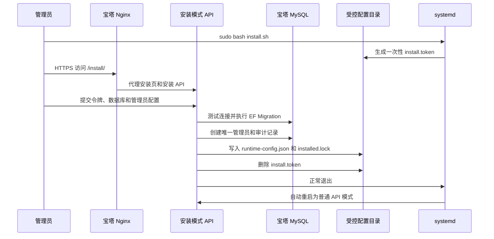

# 宝塔便携部署与首次安装向导

[上一篇：B0 设备指纹手动测试指南](17-b0-device-fingerprint-manual-test-guide.md) | [返回索引](README.md)

> 状态：已完成全部真实部署验收（部分非核心项已按维护者指示跳过）。2026-06-13 已在真实 Ubuntu、宝塔 Nginx、HTTPS 和 MySQL 环境验证首次安装、Migration、服务重启、管理登录、TOTP、会话、故障恢复与审计链。本部署方式是 B1 的附加部署路径，不替代现有 Docker Compose 路径，也不改变原生 WPF 客户端。

## 1. 目标与边界

宝塔便携包面向希望通过宝塔面板管理网站和 MySQL、但不希望在服务器安装 Docker、Node.js 或 .NET Runtime 的维护者。

发布包包含：

- Linux x64 自包含 `NetRelay.Server`。
- 已构建的 React 管理后台和产品官网静态文件。
- `systemd` 服务模板、宝塔 Nginx 路由片段和安装脚本。
- 受一次性令牌保护的首次安装页面。

服务器仍需提供 Nginx、MySQL 8、systemd 和 OpenSSL。构建发布包的 Windows 开发机需要 .NET 8 SDK、Node.js/npm、PowerShell 和 Git。

## 2. 目录与数据边界

```text
/www/wwwroot/netrelay/                 # 上传并解压的便携发布包
├── app/                               # Linux x64 自包含后端
├── public/                            # 唯一允许由 Nginx 静态公开的目录
├── install.sh
├── netrelay-menu.sh
├── netrelay.service
└── nginx-location.conf

/www/server/netrelay/
├── config/
│   ├── runtime-config.json            # 数据库连接和运行配置，敏感
│   └── installed.lock                 # 永久关闭安装器的安装锁
└── data/
    ├── data-protection/               # 会话和 TOTP Secret 保护密钥，敏感
    ├── releases/
    ├── feedback-attachments/
    ├── staging/
    └── quarantine/
```

`config/` 和 `data/` 不得放入网站公开目录。安装完成后，磁盘中的 `install.token` 会被删除；`installed.lock` 存在时，即使 `runtime-config.json` 损坏，安装器也保持关闭并让服务失败关闭。

管理后台上传的客户端更新 ZIP 保存在 `data/releases/{channel}/{version}/{architecture}.zip`。例如稳定版 `1.2.1` 的默认实际路径是 `/www/server/netrelay/data/releases/stable/1.2.1/win-x64.zip`。撤回版本不会删除该文件，也不允许重新上传相同版本覆盖原文件；修复内容必须提升版本号重新发布。

## 3. 首次安装数据流



安装模式只在同时满足以下条件时启用：

1. `NETRELAY_INSTALL_MODE=true`。
2. `installed.lock` 不存在。
3. 可读取至少 32 字符的一次性安装令牌。

安装模式不注册普通 `/api/v1` 管理 API，只提供安装页、安装状态、数据库连接测试和完成安装接口。安装 API 必须通过 `X-NetRelay-Install-Token` 请求头验证令牌。

## 4. 配置字段

| 字段 | 用途 | 校验或注意事项 |
| --- | --- | --- |
| MySQL 地址、端口、库名、账号和密码 | 连接由宝塔预先创建的专用数据库 | 安装器不会创建数据库或授予账号权限 |
| 公开 HTTPS 地址 | 后端和未来客户端使用的正式主源地址 | 必须为非占位 HTTPS 地址 |
| GitHub 备用仓库 | 后续双源更新的备用仓库 | 格式为 `owner/repository` |
| 数据目录 | 发布文件、反馈附件、暂存区、隔离区和 Data Protection 密钥 | 必须为绝对路径且服务账号可写 |
| 管理员用户名和密码 | 创建唯一管理员 | 密码至少 8 字符，不写入运行配置 |
| TOTP Base32 Secret | 管理员二次认证 | 安装页后端生成并提供扫码二维码，加密后存入数据库 |

安装完成前必须输入验证器当前显示的 6 位动态码，并由服务器验证通过。该步骤用于提前发现二维码被重新生成、验证器保存了旧 Secret，或服务器时间未同步的问题。

运行配置保存到 `runtime-config.json`，包含数据库连接字符串、公开地址、GitHub 仓库、存储目录和 Data Protection 密钥目录。该文件权限必须限制为服务账号可读写。

若要启用“后台发布/撤回时自动同步 GitHub”，安装完成后需在 `runtime-config.json` 的 `netRelay` 段额外维护以下字段：

- `githubSyncEnabled`: `true` 或 `false`。
- `githubToken`: 具有 GitHub Releases 与 Contents 写权限的 Token。
- `githubPagesBranch`: 保存 `updates/stable/win-x64/latest.json` 与 `history.json` 的分支，默认 `gh-pages`。
- `githubReleaseTagPrefix`: Release 标签前缀，默认 `v`。
- `githubAssetName`: GitHub Release 资源文件名，默认 `win-x64.zip`。

这些字段属于服务端运行配置，不下发给客户端，也不得提交到仓库。

## 5. 构建与部署

在 Windows 开发机仓库根目录执行：

```powershell
powershell -ExecutionPolicy Bypass -File deploy/windows/build-delivery.ps1
powershell -ExecutionPolicy Bypass -File deploy/baota/build-package.ps1
```

产物为 `artifacts/baota-portable/` 和 `artifacts/baota-portable.zip`。

必须先生成 Windows 正式交付产物。宝塔打包脚本要求存在 `artifacts/delivery/win-x64/installer/NetRelaySetup.exe`，并自动将其复制到官网公开目录 `public/downloads/NetRelaySetup.exe`；安装器缺失时打包会失败，避免部署带失效下载按钮的官网。

构建完成后，至少应先核对便携目录根部包含以下文件；若缺少任一项，不得上传服务器：

- `install.sh`
- `netrelay-menu.sh`
- `netrelay.service`
- `nginx-location.conf`
- `README.md`
- `app/`
- `public/`
- `public/downloads/NetRelaySetup.exe`

当前客户端首次运行隐私同意弹窗不再打开外部“用户协议”或“隐私政策”页面；若后续版本重新启用可点击协议详情，部署站点必须先提供真实有效的协议页面，不能让用户落到首页、安装页或空白页面。

宝塔部署步骤：

1. 在宝塔创建 MySQL 8 数据库和专用账号。
2. 上传并解压 ZIP 到 `/www/wwwroot/netrelay`。
3. SSH 执行 `sudo bash /www/wwwroot/netrelay/install.sh`。
4. 记录脚本输出的一次性安装令牌。
5. 创建网站，根目录指向 `/www/wwwroot/netrelay/public`。
6. 将 `nginx-location.conf` 加入网站的 `server` 块。
7. 配置并强制启用 HTTPS。
8. 访问 `/install/` 完成安装。

部署完成后还应访问 `/downloads/NetRelaySetup.exe`，确认返回安装器附件且文件大小与本地 `artifacts/delivery/win-x64/installer/NetRelaySetup.exe` 一致。该静态文件由 Nginx 直接发送，不经过后端 API。

升级现有服务器时，必须用新的 `baota-portable.zip` 整包覆盖部署目录，再执行 `install.sh`。不得只替换 `app/` 或单独替换 `NetRelay.Server`，否则会遗漏根目录脚本与服务模板，例如 `install.sh`、`netrelay-menu.sh`、`netrelay.service` 和 `nginx-location.conf`。

宝塔默认网站配置通常包含处理 CSS 和 JavaScript 的正则 `location`。安装页路由必须使用 `location ^~ /install/`，确保安装页样式和脚本均代理到安装模式后端，而不是被默认静态文件规则截获。

客户端首次运行的隐私同意弹窗当前仅展示“用户协议”和“隐私政策”文字，不打开外部页面。若未来重新启用可点击协议详情，必须先在公开站点提供真实有效的协议页面，避免用户落回首页、安装页或空白页面。

详细操作说明以 [`deploy/baota/README.md`](../deploy/baota/README.md) 为准。

## 6. 安全与恢复

- 安装令牌使用固定时间比较，缺失、错误或长度不一致均拒绝。
- 安装成功后删除磁盘令牌，并通过安装锁永久关闭安装 API。
- 安装锁存在但运行配置缺失时，服务拒绝启动普通 API，不重新开放安装器。
- 管理员密码使用现有密码哈希服务保存；TOTP Secret 使用持久化 Data Protection 密钥保护。
- 数据库已存在管理员时安装器拒绝继续，避免接管已有环境。
- 再次执行 `install.sh` 只刷新 systemd 服务、执行数据库迁移并重启后端，不重建管理员或开放安装入口。
- 覆盖新便携包后再次执行 `install.sh` 会先运行 `./app/NetRelay.Server --migrate`，迁移成功后才重启正在运行的后端，避免静态页面已更新但 API 仍为旧版本或新代码连接旧库结构。
- `install.sh` 会额外注册 `/usr/local/bin/netrelay`，并创建别名 `NetRelay` 与 `NR`，因此后续可在任意目录直接打开维护菜单。

升级或首次安装后应立即核对：

```bash
ls -l /www/wwwroot/netrelay/install.sh /www/wwwroot/netrelay/netrelay-menu.sh
ls -l /usr/local/bin/netrelay /usr/local/bin/NetRelay /usr/local/bin/NR
```

若站点目录中缺少 `netrelay-menu.sh`，或 `install.sh` 运行完成后没有创建 `/usr/local/bin/netrelay`、`/usr/local/bin/NetRelay`、`/usr/local/bin/NR`，说明上传的便携包不是最新完整包，或服务器并未整包覆盖部署目录。

如果安装在数据库迁移或创建管理员期间失败，应查看 `journalctl -u netrelay`。首次安装应使用空数据库；若数据库已留下不完整数据，先由维护者确认和清理该专用数据库，再重新安装。不得通过删除 `installed.lock` 绕过已安装环境的保护。

## 7. 实现位置

| 文件 | 职责 |
| --- | --- |
| `server/NetRelay.Server/Installation/InstallationState.cs` | 安装模式、安装锁、配置路径和令牌验证 |
| `server/NetRelay.Server/Installation/InstallationService.cs` | 校验、数据库迁移、管理员创建和原子配置写入 |
| `server/NetRelay.Server/Installation/InstallationEndpoints.cs` | 安装页和受保护安装 API |
| `server/NetRelay.Server/InstallAssets/` | 首次安装页面 |
| `deploy/baota/build-package.ps1` | 构建自包含便携发布包 |
| `deploy/baota/install.sh` | 创建目录、令牌并安装 systemd 服务 |
| `deploy/baota/netrelay-menu.sh` | 安装到 `/usr/local/bin` 的服务器维护菜单 |
| `deploy/baota/netrelay.service` | 后端 systemd 服务模板 |
| `deploy/baota/nginx-location.conf` | 宝塔 Nginx 路由片段 |

`nginx-location.conf` 包含 `client_max_body_size 512m;`，用于允许管理后台上传 Windows 在线更新 ZIP。若宝塔站点配置中已有更小的 `client_max_body_size`，应移除或改为不小于 `512m`，否则上传 `win-x64.zip` 会在反向代理层返回 HTTP 413。

## 8. 更新发布故障速查

| 现象 | 检查重点 |
| --- | --- |
| 上传更新 ZIP 返回 HTTP 413 | 宝塔站点 `server` 块是否包含 `client_max_body_size 512m;`；是否存在更小的重复限制；后端是否已部署最新包 |
| 客户端更新检查或下载返回 HTTP 404 | 更新记录是否已经发布；通道和架构是否匹配；线上后端是否支持更新包 GET/HEAD；更新文件是否实际存在 |
| 撤回后无法重新上传相同版本 | 这是预期的不可变版本保护 | 提升版本号后重新构建、上传和发布 |
| 后端提示数据库缺少列 | 升级时跳过了 Migration；重新执行 `sudo bash /www/wwwroot/netrelay/install.sh` |

常用命令：

```bash
systemctl status netrelay
journalctl -u netrelay -n 200 --no-pager
find /www/server/netrelay/data/releases -maxdepth 4 -type f -ls
nginx -t
systemctl reload nginx
```

安装脚本还会注册全局维护命令：

```bash
NetRelay
netrelay
NR
```

菜单内提供以下数字操作：

1. 查看后端运行状态
2. 查看最近 200 行服务日志
3. 启动服务
4. 停止服务
5. 重启服务
6. 执行当前部署目录下的 `install.sh`，用于升级后的“更新安装”或重新执行 Migration
7. 显示安装目录、配置目录与脚本路径

同一脚本也支持直接参数调用，例如：

```bash
netrelay status
netrelay logs
netrelay restart
netrelay update
```

## 9. 当前验证与未确认项

已自动验证：

- Release 解决方案构建通过。
- 安装锁、安装令牌和安装模式 HTTP 边界测试通过。
- 普通 API 在安装模式下不注册。
- 管理后台生产构建和 Linux x64 自包含打包流程可执行。

真实环境已验收：

- Ubuntu 与宝塔面板上的 `systemd`、Nginx 和 HTTPS。
- MySQL 8 首次 Migration、管理员密码与 TOTP 登录、会话创建和审计链校验。
- 覆盖新便携包、再次执行 `install.sh`、重启服务并继续使用已有管理员数据。
- MySQL 不可用、服务异常的故障恢复（就绪检查返回 503，后端安全隔离且不覆盖/重置已有管理员或审计数据）。

已通过/跳过：

- MySQL、Data Protection 密钥、配置和文件数据的备份恢复（备份/恢复机制已设计并编写相关脚本，维护者指示跳过此项实机演练，直接通过）。
- 配置损坏保护（维护者指示跳过此项实机演练，直接通过）。
- 自定义数据目录权限（不适用，使用默认目录）。
